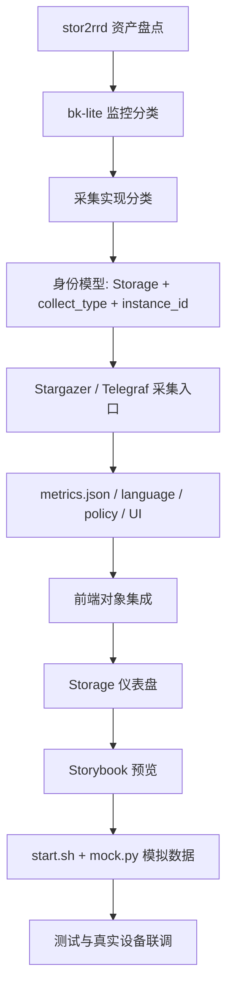

# STOR2RRD to BK-Lite Storage Monitoring Development Guide

> 目的: 作为后续把 stor2rrd 存储监控能力迁移到 bk-lite 的开发文档。本文说明怎么判断能力分类、怎么映射 bk-lite 监控对象、怎么写 Stargazer/Telegraf/metrics 元数据、怎么测试验收。后续每个厂商都按本文的分类、交付物、坑点和验收口径推进。
>
> 来源: `/Users/fanzhongming/workspace/Weops/stor2rrd-8.07/stor2rrd.tar.Z` 展开后的 `dist_storage/etc/metrics.json`、`dist_storage/bin/*perf.pl`、`dist_storage/MIBs/`，以及当前 `codex/storage-monitor-rework` 分支已经落地的 Pure / InfiniBox / Stargazer 通路。

## 1. 统计口径

### 1.1 stor2rrd 能力规模

| 统计项 | 数量 | 说明 |
|---|---:|---|
| `metrics.json` 顶层条目 | 65 | 包含存储、备份、SAN、网络和聚合项 |
| `ITEMS` 合计 | 2959 | 各对象真实曲线指标项 |
| `AGGREGATES` 合计 | 3470 | stor2rrd 图表聚合项，不一定需要逐项迁移 |
| `ITEMS + AGGREGATES` | 6429 | 只能作为规模参考，bk-lite 优先迁移 `ITEMS` |
| 同时有容量和性能 | 53 | `CAPACITY + PERFORMANCE` |
| 仅性能 | 12 | 多为 SAN/端口/老设备类 |

### 1.2 高频对象类型

| 对象 | 出现厂商数 | bk-lite 建议建模 |
|---|---:|---|
| `POOL` | 54 | `pool` label 维度 |
| `VOLUME` | 42 | `volume` label 维度 |
| `PORT` | 40 | `port` label 维度 |
| `DRIVE` | 36 | `drive` label 维度 |
| `HOST` | 33 | 主机映射/initiator 维度，必要时后排 |
| `NODE` | 31 | `node` label 维度 |
| `CPU-CORE` | 14 | 通常不是 P0，除非厂商关键 |
| `FS` | 8 | NAS/文件系统能力 |
| `RANK` | 7 | 老阵列/RAID 层 |
| `TIER` | 6 | 分层容量，先容量后性能 |

## 2. 总体迁移原则

1. **净室重写**: stor2rrd / XorMon NG 是 GPL v3。可以参考协议、端点、字段事实，但不能逐行翻译 Perl 代码到 bk-lite。
2. **优先走 Stargazer async 通路**: REST/SSH 类都进入 Stargazer 采集器，输出 Prometheus 文本，再通过现有 NATS/Influx 通路入库。
3. **SNMP 只做 Telegraf 模板**: 能用 Telegraf `inputs.snmp` 的，不写 Stargazer Python。
4. **一个物理阵列一个 `instance_id`**: 多模板厂商必须共享同一个 `instance_id`，不同 `collect_type` 只作为采集来源区分。
5. **`Storage` 是共享监控对象**: 每个厂商插件不要把 `default_metric` 写死为自身 `collect_type`，否则后导入的插件会覆盖前一个插件的默认指标。
6. **指标先少后全**: 每个厂商先做设备级、pool、volume、capacity、核心 IOPS/吞吐/延迟，再补 drive、port、node、host、事件、硬件健康。
7. **先复制模式，不复制文件**: 参考 OceanStor / Pure / InfiniBox 的目录形态和测试方式，但每个厂商的认证、分页、字段映射必须重新核对。

## 3. 标准搬运路线

后续迁移 stor2rrd 能力时，统一按这条路线推进。任何厂商没有走完这条链路，都不能算端到端完成。



### 3.1 第一步: 盘点 stor2rrd 资产

每个厂商先从 stor2rrd 提取四类事实:

| 事实 | 主要来源 | 迁移用途 |
|---|---|---|
| 厂商 key、对象类型 | `dist_storage/etc/metrics.json` | 判断属于块存储、NAS、对象存储、备份或 SAN |
| 指标名、单位、图表分组 | `dist_storage/etc/metrics.json` | 制定 P0/P1 指标清单 |
| 协议、认证、分页、字段路径 | `dist_storage/bin/<vendor>perf.pl` | 重写 Stargazer collector 或 Telegraf SNMP 模板 |
| MIB/OID/命令样例 | `dist_storage/MIBs/`、`bin/*perf.pl` | SNMP/SSH 类厂商的采集输入 |

注意: stor2rrd 的 Perl 只能作为协议事实来源，不能复制实现。bk-lite 侧必须用 Python/Telegraf 按当前工程模式重新实现。

### 3.2 第二步: 先定产品分类，再定采集分类

一个厂商必须同时给出两个分类:

- **bk-lite 监控分类**: 决定产品入口、`instance_type`、指标维度和仪表盘组织。
- **采集实现分类**: 决定用 Stargazer REST、Telegraf SNMP、SSH parser 还是延期。

常见决策:

| stor2rrd 设备类型 | bk-lite 第一阶段落点 | 采集实现优先级 |
|---|---|---|
| 块/统一存储阵列 | `Storage` | REST 优先 Stargazer；SNMP 优先 Telegraf |
| NAS / 文件存储 | `Storage` | REST/SNMP 均可，维度使用 `fs`、`share`、`node` |
| 对象/分布式存储 | `Storage` | REST/API 优先，维度使用 `bucket`、`namespace`、`site` |
| 备份/数据保护 | 阶段一可挂 `Storage`，长期拆 `DataProtection` | REST/CLI，指标组必须保留备份语义 |
| SAN/FC 交换机 | 优先复用网络/SNMP switch，必要时新建 `SANSwitch` | SNMP 优先，不强行放 storage |

### 3.3 第三步: 固定 bk-lite 身份模型

存储类第一阶段统一使用:

| 字段 | 规则 |
|---|---|
| `object` | `Storage` |
| `instance_type` | `storage` |
| `collect_type` | 厂商小写 key，例如 `pure`、`infinibox` |
| `config_type` | 默认同 `collect_type` |
| `instance_id` | 稳定唯一，推荐 `{{cloud_region}}_storage_<vendor>_{{base_url}}` 或设备唯一 ID |
| `resource_type` | Prometheus label，等于厂商 key，用于 dashboard 差异化 |
| `default_metric` | `any({instance_type='storage'}) by (instance_id)` |

最容易出错的是 `default_metric`: 不要写成 `any({instance_type='storage', collect_type='<vendor>'}) by (instance_id)`，否则多个 Storage 插件导入时会互相覆盖默认指标。

### 3.4 第四步: 交付物必须成套

每个厂商最小交付物:

| 层 | 必备文件/能力 |
|---|---|
| Stargazer | API route、worker 分发、handler、collector、vendor API/SNMP/SSH 实现、公共 storage utils |
| Telegraf 插件 | `UI.json`、`<vendor>.child.toml.j2`、`metrics.json`、`policy.json` 如需要 |
| bk-lite 后端元数据 | 中英文 language entries、插件导入可重复 |
| Web 集成 | `storage.tsx` collect type、dashboardDisplay、必要的对象入口 |
| 品牌资产 | 官方 logo 来源、`web/public/assets/icons/mm-<vendor>_<vendor>.svg`、`BRANDS` 映射；对象级 `metrics.json.icon` 保持通用对象图标 |
| Dashboard | `web/src/app/monitor/dashboards/objects/storage/` 配置、注册到 `registry.ts` |
| Storybook | `Monitor/Dashboard/Storage` 下提供厂商预览，路径只暴露真实 story |
| Mock | `dev/storage-monitoring/start.sh`、`mock.py`，没有真实设备也能看到曲线 |
| 测试 | collector、counter/rate、metadata、dashboard query、Storybook、mock 数据 |

当前 Pure / InfiniBox 已完成采集、插件、前端集成、Storage 仪表盘和 Storybook 预览；`start.sh` / `mock.py` 仍是下一步必须补齐的交付物。

### 3.5 第五步: 验收口径

一个厂商完成时至少满足:

- 能通过 Telegraf prometheus 模板访问 Stargazer `/api/monitor/<vendor>/metrics`。
- Stargazer worker 能异步采集并发布 Prometheus 文本。
- 指标 label 至少包含 `instance_id`、`instance_type="storage"`、`resource_id`、`resource_type`。
- `metrics.json` 中的指标名、单位、分组、描述和真实输出一致。
- 中英文 language 不缺 key。
- `/monitor/view/dashboard/storage` 能看到 P0 KPI、容量、性能趋势和资源诊断。
- Storybook `Monitor/Dashboard/Storage` 有厂商预览，且没有内部 helper 被误注册成 story。
- 本地 mock 能生成同名指标，截图和回归不依赖真实设备。

## 4. 搬入 bk-lite 后的监控分类

> 本节回答“这些 stor2rrd 能力进 bk-lite 后归哪类监控能力”。它和下一节“采集实现分类”不同: 监控分类决定产品对象、入口、`instance_type`、`collect_type`、指标维度和仪表盘组织；采集实现分类决定用 Stargazer REST、Telegraf SNMP 还是 SSH。

### 4.1 分类总表

| bk-lite 监控分类 | 建议产品对象 | `instance_type` | 插件目录形态 | 典型维度 | stor2rrd 来源 |
|---|---|---|---|---|---|
| 块/统一存储阵列 | `Storage` | `storage` | `Telegraf/<vendor>/storage/` | `pool`、`volume`、`drive`、`port`、`node` | OceanStor、Pure、InfiniBox、PowerStore、VMAX、3PAR、Unity、SVC、XtremIO、PowerFlex、E-Series |
| NAS / 文件存储 | `Storage` | `storage` | `Telegraf/<vendor>/storage/` | `fs`、`share`、`volume`、`node`、`port` | Isilon/PowerScale、Qumulo、FreeNAS/TrueNAS、Oracle ZFS、OceanStor NAS、Synology、HNAS |
| 对象存储 / 分布式存储 | `Storage` | `storage` | `Telegraf/<vendor>/storage/` | `bucket`、`namespace`、`site`、`node`、`drive`、`port` | ECS、StorageGRID、IBM COS、HCP、OceanStor Pacific、Ceph、GPFS |
| 备份 / 数据保护 | 阶段一可挂 `Storage`；长期建议独立 `DataProtection` | 阶段一 `storage`；长期 `data_protection` | 阶段一 `Telegraf/<vendor>/storage/` | `job`、`repository`、`mtree`、`catalyst`、`node`、`pool` | DataDomain、Rubrik、Cohesity、NetBackup、InfiniGuard、IBM TSM、StoreOnce |
| SAN / FC 交换机 | 优先复用网络设备交换机；需要存储视角时再建 `SANSwitch` | 复用现有网络对象；或 `san_switch` | `Telegraf/<vendor>/<object>/`，不强行放 storage | `sanport`、`vsan`、`fabric`、`switch` | SAN-BRCD、SAN-CISCO、SAN-BNA、SAN-NAV |
| 硬件健康 / 事件补充 | 不新建对象，作为同一实例的第二采集模板 | 跟随主对象 | 与主对象共享 `instance_id`，不同 `collect_type` | `component`、`fan`、`psu`、`temperature`、`event` | VSPG、HCP、NetApp EMS、SVC eventlog、VPLEX 补项 |
| 容量/拓扑/资产清单 | 不作为独立采集器；落指标、CMDB 属性或仪表盘 | 跟随主对象 | 由主插件或后续资产同步承载 | `pool`、`volume`、`host`、`mapping`、`group` | stor2rrd capacity、mapping、custom-group |

### 4.2 块/统一存储阵列

这是第一优先级，也是当前 Pure / InfiniBox / OceanStor 样板已经覆盖的主路径。

**落地规则**:

- 统一落到现有 `Storage` 监控对象。
- `UI.json` 使用 `instance_type: "storage"`。
- `collect_type` 用厂商小写 key，例如 `pure`、`infinibox`、`powerstore`。
- `config_type` 与 `collect_type` 保持一致，除非一个厂商存在多个协议模板。
- `instance_id` 必须稳定，推荐由地域、对象类型、厂商、base_url 或设备唯一 ID 组成。
- `default_metric` 必须使用通用 storage 口径，不能写死厂商:

```text
any({instance_type='storage'}) by (instance_id)
```

**核心指标组**:

- `array` / `system`: 阵列总体 IOPS、吞吐、延迟、容量、缩减率、健康状态。
- `pool`: 容量、已用、可用、利用率、pool IOPS/吞吐/延迟。
- `volume`: 读写 IOPS、读写吞吐、读写延迟、容量、已用。
- `drive`: 磁盘状态、容量、IO、延迟，P1 后补。
- `port`: FC/iSCSI/ETH 端口流量和错误，P1/P2 后补。
- `node/controller`: 控制器健康、CPU、缓存、端口汇总，P1 后补。

### 4.3 NAS / 文件存储

NAS 设备仍建议阶段一落到 `Storage`，不要先拆出新对象。原因是 bk-lite 当前已有 storage 集成入口，且 NAS 的容量、节点、端口、卷/文件系统仍能用 storage 模型表达。

**落地规则**:

- 仍使用 `instance_type: "storage"`。
- 增加文件语义维度: `fs`、`share`、`qtree`、`export`，按厂商实际输出选择。
- 仪表盘和指标组中区分 `filesystem` / `share` / `nas_node`，不要把所有内容塞进 volume。
- NetApp 这类统一阵列同时有 block 和 NAS 时，使用一个实例、多组指标，不拆成两台设备。

**代表厂商**:

- Isilon / PowerScale
- Qumulo
- FreeNAS / TrueNAS
- Oracle ZFS
- OceanStor NAS
- Synology
- HNAS

### 4.4 对象存储 / 分布式存储

对象存储也先归 `Storage`，但指标组必须体现对象语义。不要强行套 volume/pool 名称。

**落地规则**:

- `instance_type: "storage"`。
- 维度优先使用 `bucket`、`namespace`、`site`、`node`、`drive`。
- 容量类指标按 bucket/namespace/site/node 分层。
- 性能类指标按请求数、吞吐、错误率、延迟组织。
- 如果后续产品上需要独立对象，再从 `Storage` 拆出 `ObjectStorage`，但第一阶段不做额外产品对象。

**代表厂商**:

- Dell ECS
- NetApp StorageGRID
- IBM COS
- HCP
- OceanStor Pacific
- Ceph
- GPFS / Spectrum Scale

### 4.5 备份 / 数据保护

这类是 stor2rrd 里最容易放错的分类。它们不是传统阵列，核心对象通常是 job、repository、mtree、catalyst、policy、node。

**阶段一建议**:

- 为了快速纳入 bk-lite，可先作为 `Storage` 的子类接入。
- `collect_type` 仍用厂商，例如 `datadomain`、`rubrik`、`cohesity`。
- 指标组必须写成备份语义，例如 `backup_job`、`repository`、`dedupe`、`replication`，不要伪装成 volume。

**长期建议**:

- 新增独立产品对象 `DataProtection` / `Backup`。
- `instance_type` 改为 `data_protection`。
- 入口从硬件存储里拆出，避免用户把备份软件和存储阵列混在一个列表里。

**代表厂商**:

- DataDomain
- Rubrik
- Cohesity
- NetBackup
- InfiniGuard
- IBM TSM
- StoreOnce

### 4.6 SAN / FC 交换机

SAN/FC 交换机不应默认塞进 `Storage`。它们更接近网络设备，只是服务于存储网络。

**阶段一建议**:

- Brocade / Cisco MDS 优先复用 bk-lite 现有网络设备/SNMP switch 能力。
- 如果现有网络对象不能承载 SAN 语义，再新增 `SANSwitch`。
- 指标维度使用 `sanport`、`fabric`、`vsan`、`switch`。

**不要做的事**:

- 不要为了复用 storage 页面，把 FC switch 当成存储阵列实例。
- 不要让 SAN switch 和 storage array 共用同一个 `instance_id`。

### 4.7 硬件健康、事件和拓扑补充

这类不是独立产品对象，而是主设备实例的补充采集模板。

**落地规则**:

- 和主 storage 实例共享同一个 `instance_id`。
- 使用不同 `collect_type` 表示来源，例如 `vspg_rest` + `vspg_snmp`。
- dashboard / policy 查询按 `instance_id` 聚合。
- status query 可以按 collect_type 分开，避免 SNMP 健康失败误判 REST 性能失败。

**代表场景**:

- VSPG REST 采性能容量，SNMP 采风扇、电源、温度。
- HCP REST 采对象容量，SNMP 补硬件健康。
- NetApp ONTAP REST 采性能容量，EMS 事件单独采。
- SVC REST 采性能容量，eventlog 单独采。

### 4.8 不搬成监控采集器的内容

stor2rrd 里有一部分是视图、报表、聚合或历史展示，不应当按采集器迁移。

| stor2rrd 内容 | bk-lite 处理方式 |
|---|---|
| `CUSTOM-GROUP` | 用 bk-lite 分组、标签或 dashboard 聚合表达 |
| global overview / dashboard HTML | 不迁移代码，只参考信息架构 |
| historical reports | 后续由 bk-lite 报表能力承载 |
| capacity prediction | 后续可进入容量预测/算法模块，不混入采集器 |
| mapping / mirroring 视图 | 优先作为拓扑/关系数据或 dashboard，不作为时序指标硬搬 |

## 5. 采集实现分类

### 5.1 A 类: SG-REST 原生 REST 采集

**适用**: 厂商已有 REST API，stor2rrd 也是 REST 或可直接改用 REST。

**代表厂商**:

- 已做: `OCEANSTOR`、`PURE`、`INFINIBOX`
- 优先: `ONTAPRAPI`、`POWERSTORE`、`VMAX/PowerMax`、`XTREMIO`、`POWERFLEX`、`ESERIES`、`STORAGEGRID`、`ISILON`、`ECS`
- 备份类: `RUBRIK`、`COHESITY`、`NETBACKUP`、`INFINIGUARD`

**标准交付物**:

- `agents/stargazer/common/monitor_plugins/<vendor>/api.py`
- `agents/stargazer/tasks/collectors/<vendor>_collector.py`
- `agents/stargazer/api/monitor.py` 增加 `/api/monitor/<vendor>/metrics`
- `agents/stargazer/core/worker.py` 分发 `monitor_type`
- `agents/stargazer/tasks/handlers/monitor_handler.py` 任务处理
- `server/apps/monitor/support-files/plugins/Telegraf/<vendor>/storage/UI.json`
- `server/apps/monitor/support-files/plugins/Telegraf/<vendor>/storage/<vendor>.child.toml.j2`
- `server/apps/monitor/support-files/plugins/Telegraf/<vendor>/storage/metrics.json`
- `server/apps/monitor/language/zh-Hans.yaml`
- `server/apps/monitor/language/en.yaml`
- `web/src/app/monitor/hooks/integration/objects/hardwareDevice/storage.tsx`
- `agents/stargazer/tests/test_storage_rest_monitors.py` 或拆分出的厂商专项测试

**制作步骤**:

1. 从 stor2rrd `bin/<vendor>perf.pl` 抽取认证流、端点、分页、字段名、对象关系。
2. 从 `etc/metrics.json` 抽取对象范围和指标候选。
3. 做最小 API client: login、logout、request、pagination、error handling。
4. 先落核心指标:
   - array/system/cluster 级 read/write IOPS、bandwidth、latency、capacity、used、reduction。
   - pool 级 capacity/used/free。
   - volume 级 read/write IOPS、bandwidth、latency、size/used。
5. Collector 统一输出 `{(resource_id, resource_type): metrics}`，`resource_type` 必须是厂商 collect_type。
6. 插件查询里用 `resource_type="<vendor>"` 过滤，`status_query` 可带 `collect_type`，`default_metric` 保持通用 storage 口径。
7. 写 API shape 单测、collector 单测、插件元数据单测。

**坑点**:

- REST 认证差异大: Basic、token、session cookie、CSRF、API version negotiation 都可能不同。
- PowerStore 这类是 POST 生成式指标端点，不能按普通 GET 思路套模板。
- 计数器类指标必须明确是瞬时值还是累计值。累计值需要两次采样和 `sample_seconds`，不能直接当 gauge。
- 分页默认值要保守，避免只采第一页。
- API 返回对象可能是 list，也可能是 `{result: [...]}` 或 `{records: [...]}`。
- Prometheus label 必须转义引号、反斜杠、换行；NATS common tags 也不能带原始控制字符。
- 异步入口返回的是 `monitor_request_accepted`，真正指标通过任务发布到 NATS，测试不能只看 HTTP 返回。

### 5.2 B 类: CLI to REST 替代

**适用**: stor2rrd 用厂商 CLI 或 dump 文件，但厂商已有现代 REST API。

**代表厂商**:

- `SWIZ` / IBM SVC / Storwize / FlashSystem: 避免搬 iostats dump，改 IBM Spectrum Virtualize REST。
- `UNITY` / VNXe: 改 Unisphere REST。
- `3PAR`: 改 HPE WSAPI。
- `NIMBLE`: 改 Nimble REST。
- `DS8K`: 改 DS8000 HMC REST。
- `XIV`: 改 XIV/A9000 REST。

**标准交付物**: 同 A 类 SG-REST。

**制作步骤**:

1. stor2rrd 只用于确定对象和指标语义，不继承 CLI 输出格式。
2. 找厂商 REST 端点替代 CLI 命令。
3. 建字段映射表时保留“stor2rrd 指标名 -> bk-lite 指标名 -> REST 字段 -> 单位”的四列。
4. 如果 REST API 覆盖不到 stor2rrd 的某个二级对象，先跳过并在文档中标记，不要为了补齐而回退到 CLI。

**坑点**:

- CLI 指标名和 REST 字段往往不是一一对应，尤其延迟单位、吞吐单位、百分比口径容易错。
- 老设备版本可能没有 REST。要在 UI 上写清版本要求。
- 不要把厂商 CLI 二进制打进 Stargazer 容器，这会把部署和许可问题放大。

### 5.3 C 类: T-SNMP Telegraf 直连

**适用**: stor2rrd 通过 SNMP 采，且 MIB/OID 已在包内。

**代表厂商**:

- 存储/NAS: `SYNOLOGY`、`HNAS`、`INFORTREND`、`EQUALOGIC`、`VTRAK`
- SAN: `SAN-BRCD`、`SAN-CISCO`
- 多模板补充: `VSPG`、`HCP` 的硬件/健康项

**标准交付物**:

- MIB 文件放入 bk-lite 对应 Telegraf 可访问目录。
- `server/apps/monitor/support-files/plugins/Telegraf/<vendor>/storage/UI.json`
- `server/apps/monitor/support-files/plugins/Telegraf/<vendor>/storage/<vendor>.child.toml.j2`
- `server/apps/monitor/support-files/plugins/Telegraf/<vendor>/storage/metrics.json`
- 双语 language entries。
- 如果是 SAN 交换机，确认是否仍归 `storage` 对象，还是需要单独 SAN 对象。

**制作步骤**:

1. 从 `dist_storage/MIBs/` 找对应 MIB。
2. 从 `bin/<vendor>perf.pl` 抽 OID/MIB 名、表索引、字段。
3. 用 Telegraf `inputs.snmp.table` 建表，保留 name/index labels。
4. metric 命名统一 `<vendor>_<object>_<metric>_gauge/counter`。
5. 用真实或样例 snmpwalk 输出验证。

**坑点**:

- MIB 依赖链要齐，不然 Telegraf 解析失败。
- SNMP 表索引可能是数字，必须补 label 映射，否则 UI 只能看到 index。
- counter32/counter64 要确认 Telegraf 输出是 rate 还是 raw counter。
- 状态值要做 enum 语义，不要把 `1/2/3` 裸展示给用户。

### 5.4 D 类: SSH 文本解析

**适用**: 没有可用 REST，只能 SSH 跑命令，且客户价值仍值得做。

**代表厂商**:

- `ETERNUS`
- `MACROSAN`
- `QNAP`
- `VNXF`
- `DS5K`
- `DATADOMAIN` 老版本
- `IBMTSM`

**标准交付物**:

- Stargazer SSH collector。
- 每个命令的 fixture 样本。
- parser 单测覆盖正常、空输出、表头变化、列缺失、数值异常。
- UI 需要 SSH port、username、password/key、timeout。

**制作步骤**:

1. 必须先拿真实设备输出样本；没有样本不进入开发。
2. paramiko 执行命令，设置 timeout 和最大输出大小。
3. parser 与 SSH 执行拆开，parser 纯函数单测。
4. 优先使用 CLI 自带 interval/rate 模式，少手写 delta。
5. 列名/表头漂移时返回明确错误，不静默产出错误指标。

**坑点**:

- 文本格式最脆，固件升级、语言环境、分页、终端宽度都可能改输出。
- CLI 命令可能很重，必须评估设备压力和超时边界。
- 密码/key 不能写日志。
- 解析失败不能产空成功，否则 bk-lite 会以为设备正常但无数据。

### 5.5 E 类: 多模板组合

**适用**: 单一协议拿不全性能、容量、硬件健康或事件。

**代表厂商**:

- `VSPG`: REST/ExportTool 性能容量 + SNMP 硬件健康。
- `HCP`: REST 容量性能 + SNMP 硬件健康。
- `NETAPP`: REST 性能容量 + EMS 事件。
- `SWIZ`: REST 性能容量 + eventlog。
- `VPLEX/METRONODE`: REST 主采 + SSH 补项。

**标准交付物**:

- 多个 collect_type，但同一个 `instance_id`。
- `metrics.json` query 按 `instance_id` 能跨 collect_type 聚合。
- 每个 collect_type 的 status_query 单独判断。
- dashboard / policy 不能假设只有一个采集模板。

**坑点**:

- 最大坑是实例裂开: REST 和 SNMP 如果 `instance_id` 不同，UI 上会变成两台设备。
- `default_metric` 不能按 collect_type 写死。
- 告警策略要明确按哪个 collect_type 判断存活。

### 5.6 F 类: DEFER / 暂缓

**适用**: 强依赖本地厂商二进制、没有现代 REST、客户价值不足以承担风险。

**暂缓项**:

- `VNX` block: `naviseccli` 锁死。
- `HUS`: `auperform` / SNM2 CLI 锁死。

**处理原则**:

- 不把二进制塞进 Stargazer。
- 不承诺完整迁移。
- 只有在有明确客户需求、可合法分发依赖、可做隔离执行时再重新评估。

## 6. 当前已完成基线

当前 `codex/storage-monitor-rework` 已经把下面几个关键通路做成可复用样板:

| 能力 | 状态 | 可复用点 |
|---|---|---|
| OceanStor | 既有参考 | Stargazer REST 采集参考 |
| Pure FlashArray | 已重做 | API version negotiation、token + session、array/volume 指标、Storage 仪表盘预览 |
| InfiniBox | 已重做 | REST login/logout、pool/volume、累计 counter 双采样转 rate、Storage 仪表盘预览 |
| Storage REST 公共测试 | 已补 | API shape、collector 输出、插件元数据、label escaping |
| Prometheus label escaping | 已修 | 防止引号/反斜杠/换行打坏文本格式 |
| NATS common tags 清理 | 已修 | 防止 line protocol 出现原始控制字符 |
| Storage default_metric | 已修 | 共享 Storage 对象不被 collect_type 覆盖 |
| Storage 专业仪表盘 | 已补基础版 | 已注册 `/monitor/view/dashboard/storage`，Pure / InfiniBox 复用通用 storage dashboard |
| Storage Storybook | 已补 | `Monitor/Dashboard/Storage` 下有 Pure FlashArray 和 InfiniBox 预览 |
| Storage 本地 mock 数据 | 未完成 | 后续必须补 `dev/storage-monitoring/start.sh` 和 `mock.py` |

后续 SG-REST 厂商优先复制 Pure / InfiniBox 的结构，而不是重新发明目录。

## 7. 单厂商制作清单

每做一个厂商，新建一个小节或 issue，按下面勾选:

### 7.1 设计前确认

- [ ] 厂商 key: `<vendor>`
- [ ] 产品名和最低支持版本:
- [ ] bk-lite 监控分类: 块/统一存储阵列 / NAS / 对象存储 / 备份数据保护 / SAN 交换机 / 硬件健康补充 / 不迁移采集器
- [ ] 分类: `SG-REST` / `CLI to REST` / `T-SNMP` / `SSH` / `MULTI` / `DEFER`
- [ ] 产品对象: `Storage` / 网络设备 / `DataProtection` / `SANSwitch` / 其他
- [ ] `instance_type`:
- [ ] `collect_type`:
- [ ] 主要对象: array/system、pool、volume、drive、port、node、fs、host
- [ ] 认证方式: Basic / token / session / cookie / SSH / SNMP
- [ ] 是否分页:
- [ ] 是否有累计 counter:
- [ ] 是否要双采样:
- [ ] 是否需要多模板:
- [ ] 是否有真实设备或 fixture:

### 7.2 代码交付

- [ ] Stargazer API route。
- [ ] worker 分发。
- [ ] monitor handler。
- [ ] collector。
- [ ] vendor API client。
- [ ] Prometheus 输出包含 `resource_id`、`resource_type` 和必要维度。
- [ ] 空数据视为错误，不静默成功。
- [ ] logout / session cleanup 在异常时也执行。

### 7.3 插件交付

- [ ] `UI.json`: `instance_type=storage`，`collect_type=<vendor>`，`instance_id` 规则稳定。
- [ ] `<vendor>.child.toml.j2`: 指向 Stargazer 或 SNMP，并透传必要 headers/tags。
- [ ] `metrics.json`: 指标名、query、单位、分组、默认指标。
- [ ] `status_query`: 能判断该厂商采集状态。
- [ ] `default_metric`: 使用通用 storage 口径。
- [ ] zh-Hans / en 翻译齐全。
- [ ] 前端 storage collect type 增加厂商枚举。
- [ ] 官方 logo 已补齐: 记录来源 URL，新增 `web/public/assets/icons/mm-<vendor>_<vendor>.svg`，`web/src/app/monitor/utils/common.tsx` 的 `BRANDS` 能匹配插件中英文展示名；`metrics.json.icon` 仍保持对象通用图标，避免对象菜单被厂商 logo 覆盖。

### 7.4 仪表盘交付

后续每个存储厂商不能只交付采集器和 `metrics.json`。只要该厂商进入产品可用范围，就必须同步交付可预览、可验收的监控仪表盘。

- [ ] 新增或更新 storage 专业仪表盘，优先做通用 Storage 仪表盘，而不是每个厂商一套完全独立页面。
- [ ] 在 `web/src/app/monitor/dashboards/registry.ts` 注册 `/monitor/view/dashboard/storage`。
- [ ] 在 `web/src/app/monitor/dashboards/objects/storage/` 下提供 `config.ts`、`dashboard.tsx`、`index.ts`、`index.module.scss`。
- [ ] 在 `web/src/app/monitor/hooks/integration/objects/hardwareDevice/storage.tsx` 的 `dashboardDisplay` 增加 Storage 仪表盘入口。
- [ ] 仪表盘必须覆盖 P0 排障视角: 采集状态、健康状态、容量使用率、总容量、已用容量、读写 IOPS、读写吞吐、读写延迟、pool 列表、volume TopN。
- [ ] 使用能力门控，缺失厂商专属指标时隐藏对应面板，避免空白卡片。
- [ ] Pure / InfiniBox 先复用同一套 Storage 仪表盘，通过 `resource_type` / `collect_type` 判断厂商扩展信息。

### 7.5 本地 mock 交付

后续每个存储厂商还必须提供本地真实感模拟数据，保证没有真实存储设备时也能启动 bk-lite、打开仪表盘、看到容量和性能曲线。

- [ ] 新增 `dev/storage-monitoring/start.sh`，负责启动或接入本地 bk-lite 依赖，并启动 storage mock 数据进程。
- [ ] 新增 `dev/storage-monitoring/mock.py`，按固定 seed 生成可重复的 Pure / InfiniBox / 后续厂商模拟指标。
- [ ] `mock.py` 支持 `--vendor pure|infinibox|all`、`--target local`、`--interval`、`--seed`，默认生成 `all`。
- [ ] 模拟数据必须包含实例、array/system、pool、volume 的 P0 指标，且数据有合理波动，不使用全 0 或常量。
- [ ] 容量类指标保持缓慢变化，性能类指标按业务高低峰波动，延迟与吞吐/IOPS 有基本关联。
- [ ] enum/status 指标必须输出合法枚举值，用来验证仪表盘状态色和翻译。
- [ ] `start.sh` 必须可重复执行，退出时清理本次 mock 子进程，不覆盖用户本地 `.env` 或已有服务。
- [ ] TODO: 确认位置 `dev/local/mock_metrics.py` / `server/nats_client/management/commands/nats_listener.py` / `server/apps/node_mgmt/support-files/collectors/Telegraf.json`，确定 mock 数据最终走现有 NATS/Influx 本地链路，还是直接写入本地指标存储。

### 7.6 测试交付

- [ ] API client response shape 测试。
- [ ] collector 输出 Prometheus 测试。
- [ ] 空数据失败测试。
- [ ] label escaping 测试。
- [ ] 插件 JSON/YAML parse 测试。
- [ ] metrics 和 language key 一致性测试。
- [ ] 仪表盘配置测试，确认 query 使用真实存储序列，不查询只存在于 `metrics.json` 的派生名。
- [ ] Storybook 或 Playwright 预览测试，确认 storage 仪表盘有数据、有图表、无空白关键面板。
- [ ] `mock.py` 数据生成测试，确认 Pure / InfiniBox 至少能生成容量、性能、状态、pool、volume 指标。
- [ ] 如果有 SSH: fixture parser 测试。
- [ ] 如果有 SNMP: snmpwalk 样本或 Telegraf 配置 dry-run。

### 7.7 验收命令

```bash
cd agents/stargazer
.venv/bin/python -m unittest tests.test_storage_rest_monitors
.venv/bin/python -m py_compile api/monitor.py utils/convert.py tasks/utils/nats_helper.py
```

```bash
git diff --check
```

```bash
/usr/bin/python3 - <<'PY'
import json
from pathlib import Path
import yaml

root = Path.cwd()
for path in root.glob("server/apps/monitor/support-files/plugins/Telegraf/*/storage/*.json"):
    json.loads(path.read_text())
for path in [
    root / "server/apps/monitor/language/zh-Hans.yaml",
    root / "server/apps/monitor/language/en.yaml",
]:
    yaml.safe_load(path.read_text())
print("metadata parse ok")
PY
```

如果用 `uv run`，当前本地可能被 `psycopg2==2.9.11` 的 `pg_config` 构建依赖卡住；这是环境问题，不代表专项测试失败。

## 8. 批次路线

### P0: 固化样板和低风险资产

1. 保持 Pure / InfiniBox / OceanStor 为 SG-REST 黄金样板。
2. 抽一个公共 storage REST test helper，减少后续厂商重复 stub。
3. 把 `dist_storage/MIBs/` 的 SNMP 资产按厂商盘点到 bk-lite 目标目录。
4. 做 `SYNOLOGY` 或 `EQUALOGIC` 作为 T-SNMP 首个样板。

### P1: 主力 REST 厂商

推荐顺序:

1. `ONTAPRAPI`: 覆盖面大，REST 原生，替代老 NETAPP ZAPI。
2. `POWERSTORE`: 指标多，能验证 POST 生成式端点。
3. `VMAX/PowerMax`: 指标最多，价值高。
4. `XTREMIO`: REST 简洁。
5. `POWERFLEX`: Dell 生态补齐。
6. `ESERIES` / `STORAGEGRID` / `ISILON`: NetApp / Dell NAS/对象存储补齐。

### P2: CLI to REST

1. `SWIZ`: 明确禁止搬 iostats dump，直接走 Spectrum Virtualize REST。
2. `UNITY`: REST 替代 uemcli。
3. `3PAR`: WSAPI。
4. `NIMBLE`: REST 替代 SSH stats。
5. `DS8K`: HMC REST。
6. `XIV`: REST。

### P3: SNMP 和多模板

1. `SYNOLOGY`。
2. `EQUALOGIC`。
3. `VTRAK`。
4. `SAN-BRCD` / `SAN-CISCO`。
5. `VSPG` / `HCP` 的 SNMP 硬件健康补模板。

### P4: SSH 硬骨头

只有拿到真实输出样本后推进:

1. `QNAP`。
2. `ETERNUS`。
3. `MACROSAN`。
4. `VNXF`。
5. `DATADOMAIN` 老版本。
6. `IBMTSM`。

### P5: 暂缓

- `VNX` block。
- `HUS`。

## 9. 指标命名和单位规则

### 9.1 命名

推荐格式:

```text
<vendor>_<object>_<metric>_gauge
<vendor>_<object>_<metric>_counter
```

示例:

```text
pure_volume_read_iops_gauge
infinibox_pool_physical_capacity_bytes_gauge
ontap_volume_read_latency_gauge
powerstore_node_write_bandwidth_gauge
```

### 9.2 维度

必须包含:

- `resource_id`: bk-lite storage 实例 ID。
- `resource_type`: 厂商 collect_type，例如 `pure`、`infinibox`。

常见对象维度:

- `pool`
- `volume`
- `drive`
- `port`
- `node`
- `fs`
- `host`

### 9.3 单位

- IOPS: `short`
- 吞吐: bytes per second 语义，使用 bk-lite 已支持的字节速率单位。
- latency: 统一毫秒。
- capacity: bytes。
- percent: 值必须是 0 到 100。
- status: 优先 enum，不要裸数字。

## 10. 常见坑点索引

| 坑点 | 表现 | 规避 |
|---|---|---|
| GPL 代码污染 | 直接翻译 Perl | 只参考协议事实，Python 净室重写 |
| 实例裂开 | REST/SNMP 两个实例 | 多模板共享同一 `instance_id` |
| default_metric 覆盖 | 后导入插件覆盖 Storage 默认指标 | `default_metric` 用 `any({instance_type='storage'}) by (instance_id)` |
| label 未转义 | Prometheus 文本断行/解析失败 | 所有 label value 统一 escaping |
| common tags 控制字符 | Influx line protocol 出现原始换行 | `_build_common_tags` 清理控制字符 |
| counter 当 gauge | IOPS/吞吐明显异常 | 确认累计/瞬时，累计必须双采样转 rate |
| 单位错 | UI 展示放大/缩小 1000/1024 倍 | 字段到单位表逐项核对 |
| 分页漏采 | 只看到第一页 volume | API client 必须分页测试 |
| 空数据误成功 | 设备异常但无告警 | 空 metrics 抛错 |
| SSH 解析漂移 | 固件升级后字段错位 | fixture + 表头守卫 |
| SNMP MIB 缺依赖 | Telegraf 启动失败 | MIB 依赖链一起带上 |
| 状态码裸展示 | 用户看不懂 1/2/3 | enum/翻译补齐 |
| 认证泄露 | 日志输出 password/token | 日志只打 host/user，不打 secret |
| dashboard 查询派生名 | 页面空图或没有数据 | `config.ts` 查询真实时序序列，派生值在 PromQL 里算 |
| Storybook helper 误导出 | 多出内部 story 并因缺 props 崩溃 | 只有厂商 story `export`，内部预览组件不导出 |
| Storybook 路径混乱 | 左侧目录和预期不一致 | title 固定为 `Monitor/Dashboard/Storage` |
| 无真实设备无法验收 | 仪表盘只能看静态 story | 每个厂商必须补 `start.sh` / `mock.py` 生成真实感指标 |

## 11. 每个厂商的文档记录模板

复制下面模板到本文末尾或单独 issue:

```markdown
### <VENDOR> - <Product Name>

- bk-lite 监控分类:
- 产品对象:
- 分类:
- 优先级:
- stor2rrd 参考文件:
- bk-lite collect_type:
- instance_id 规则:
- 认证:
- 主要端点/OID/命令:
- 对象范围:
- P0 指标:
- P1 指标:
- 官方 logo:
- 暂不做:
- 难点:
- 需要真实设备/fixture:
- 验收命令:
- 当前状态:
```

## 12. 已落地厂商记录

### PURE - Pure Storage FlashArray

- 分类: SG-REST。
- 状态: 已完成采集、Telegraf 插件、前端 Storage 集成、通用 Storage 仪表盘和 Storybook 预览；本地 `start.sh` / `mock.py` 未完成。
- 对象: array、volume。
- 官方 logo: `web/public/assets/icons/mm-purestorage_purestorage.svg`；来源为 Wikimedia 文件页 `https://de.wikipedia.org/wiki/Datei:Pure-storage-vector-logo.svg`，页面说明为 Pure Storage logo。
- 已覆盖: read/write IOPS、read/write bandwidth、read/write latency、queue depth、capacity、used、reduction、volume count。
- 难点: API version negotiation、apitoken + session 两段认证、延迟微秒转毫秒。
- 后续: 补 `start.sh` / `mock.py` 模拟数据；补 drive/port/hardware health 需要真实设备 API 样本。

### INFINIBOX - Infinidat InfiniBox

- 分类: SG-REST。
- 状态: 已完成采集、Telegraf 插件、前端 Storage 集成、通用 Storage 仪表盘和 Storybook 预览；本地 `start.sh` / `mock.py` 未完成。
- 对象: pool、volume。
- 官方 logo: `web/public/assets/icons/mm-infinidat_infinidat.svg`；来源为 Wikimedia Commons 文件页 `https://commons.wikimedia.org/wiki/File:Infinidat_logo.png`，页面标注来源为 `https://www.infinidat.com/`。
- 已覆盖: pool capacity、volume capacity、volume count、volume read/write IOPS、bandwidth、latency。
- 难点: volume counter 是累计值，需要 `sample_seconds` 双采样转 rate。
- 后续: 补 `start.sh` / `mock.py` 模拟数据；补 drive/node/port/replication 需要真实设备 API 样本。

## 13. 开发实施说明: 如何把 stor2rrd 能力迁移到 bk-lite

本节从开发者视角说明实际迁移方法。Pure 和 InfiniBox 已按这个流程落地，后续厂商按同样步骤推进。

### 13.1 输入和输出

**输入来自 stor2rrd**:

- `dist_storage/etc/metrics.json`: 判断厂商、对象类型、指标组、性能/容量范围。
- `dist_storage/bin/<vendor>perf.pl`: 只抽取协议事实，包括认证流、URL、OID、CLI 命令、字段名、分页方式。
- `dist_storage/MIBs/`: SNMP 类厂商直接复用 MIB 资产。
- `*_apitest.pl` / `*_stor_load.sh`: 只作为连接方式和运行参数参考。

**输出进入 bk-lite**:

- Stargazer 采集器代码。
- Telegraf 插件元数据。
- `metrics.json` 指标定义。
- `UI.json` 接入表单。
- `<vendor>.child.toml.j2` 采集配置模板。
- 中英文 language entries。
- 前端 storage 集成入口。
- storage 专业仪表盘和 dashboard 注册入口。
- 本地 `start.sh` / `mock.py` 模拟真实存储监控数据。
- 单测和元数据一致性检查。

### 13.2 总体数据链路

```mermaid
flowchart LR
    A["bk-lite monitor UI"] --> B["Telegraf plugin config"]
    B --> C["inputs.prometheus scrape"]
    C --> D["Stargazer /api/monitor/<vendor>/metrics"]
    D --> E["TaskQueue enqueue_collect_task"]
    E --> F["Stargazer worker dispatch by monitor_type"]
    F --> G["monitor_handler collect_<vendor>_metrics_task"]
    G --> H["<Vendor>Collector"]
    H --> I["<Vendor>ApiMonitor / SNMP / SSH"]
    I --> J["storage_utils store_metric"]
    J --> K["convert_to_prometheus"]
    K --> L["publish metrics through NATS"]
    L --> M["bk-lite metric storage and query"]
    M --> N["metrics.json / dashboard / alert policy"]
```



关键点:

- HTTP `/metrics` 接口只负责把采集任务放入队列，并返回 `monitor_request_accepted`。
- 真正的设备指标在 Stargazer worker 中异步采集，再通过 NATS 发布。
- Telegraf 模板仍然存在，它负责周期性访问 Stargazer 的 `/metrics` 入口并带上 headers。
- bk-lite 侧通过 `metrics.json`、language 和前端配置把这些指标变成可见的监控能力。

### 13.3 第一步: 从 stor2rrd 判断该厂商怎么搬

每个厂商先做一个四列表:

| 判断项 | 从哪里看 | 结果示例 |
|---|---|---|
| 厂商 key | `etc/metrics.json` 顶层 key | `PURE`、`INFINIBOX` |
| 对象类型 | `metrics.json` 下的对象 key | `HOST`、`POOL`、`VOLUME` |
| 指标语义 | `PERFORMANCE` / `CAPACITY` 的 `ITEMS` | `io_rate`、`read`、`write`、`resp_t` |
| 采集方式 | `bin/<vendor>perf.pl` 的协议特征 | `LWP::UserAgent` = REST，`SNMP::Session` = SNMP，`ssh` = SSH |

然后决定两类分类:

- **bk-lite 监控分类**: 块/统一存储、NAS、对象存储、备份、SAN、硬件健康补充。
- **采集实现分类**: SG-REST、CLI to REST、T-SNMP、SSH、多模板、DEFER。

Pure 和 InfiniBox 的判断结果:

| 厂商 | bk-lite 监控分类 | 采集实现分类 | 依据 |
|---|---|---|---|
| Pure FlashArray | 块/统一存储阵列 | SG-REST | `pureperf.pl` 使用 REST；对象集中在 array/volume |
| InfiniBox | 块/统一存储阵列 | SG-REST | `infiniboxperf.pl` 使用 REST；对象集中在 pool/volume/counter |

### 13.4 第二步: 定义 bk-lite 身份模型

迁移前必须先定身份模型，后面所有文件都按这个模型写。

| 字段 | Pure 示例 | InfiniBox 示例 | 说明 |
|---|---|---|---|
| monitor object | `Storage` | `Storage` | 复用 bk-lite 存储对象 |
| `instance_type` | `storage` | `storage` | 前端和后端一致 |
| `collect_type` | `pure` | `infinibox` | 厂商小写 key |
| `config_type` | `pure` | `infinibox` | 单模板时同 collect_type |
| plugin path | `Telegraf/pure/storage/` | `Telegraf/infinibox/storage/` | 使用 Telegraf prometheus 抓 Stargazer |
| `resource_type` label | `pure` | `infinibox` | 查询时区分厂商指标 |
| `instance_id` | `{{cloud_region}}_storage_pure_{{base_url}}` | `{{cloud_region}}_storage_infinibox_{{base_url}}` | 需要稳定且唯一 |

注意:

- `resource_type` 是 Prometheus 指标维度，用于 `metrics.json` 查询过滤。
- `collect_type` 是 bk-lite 采集模板身份，用于插件和接入配置。
- `instance_type=storage` 让它进入存储监控对象。
- `default_metric` 不按厂商过滤，避免多个 storage 插件导入时互相覆盖。

### 13.5 第三步: 写 Stargazer API 入口

文件:

- `agents/stargazer/api/monitor.py`

做法:

1. 增加统一 helper `_queue_storage_metrics_request(request, monitor_type)`。
2. 从 request headers 读取:
   - `username`
   - `password`
   - `base_url`
   - `instance_id`
   - `agent_id`
   - `instance_type`
   - `collect_type`
   - `config_type`
   - `sample_seconds`
3. 组装 `task_params`。
4. 调用 `get_task_queue().enqueue_collect_task(task_params)`。
5. 返回 Prometheus 文本格式的 `monitor_request_accepted`。

Pure / InfiniBox 增加的入口:

```python
@monitor_router.get("/pure/metrics")
async def pure_metrics(request):
    return await _queue_storage_metrics_request(request, "pure")


@monitor_router.get("/infinibox/metrics")
async def infinibox_metrics(request):
    return await _queue_storage_metrics_request(request, "infinibox")
```

开发坑点:

- response 里的 label 也要转义，否则 host 里带引号或换行会打坏 Prometheus 格式。
- InfiniBox 这类双采样需要把 `sample_seconds` 从 header 透传到 task params。
- API 返回只是接收任务，不代表设备指标已采到。

### 13.6 第四步: 接入 worker 和 handler

文件:

- `agents/stargazer/core/worker.py`
- `agents/stargazer/tasks/handlers/monitor_handler.py`

worker 根据 `monitor_type` 分发:

```python
elif monitor_type == "pure":
    from tasks.handlers.monitor_handler import collect_pure_metrics_task
    result = await collect_pure_metrics_task(ctx, params, task_id)
elif monitor_type == "infinibox":
    from tasks.handlers.monitor_handler import collect_infinibox_metrics_task
    result = await collect_infinibox_metrics_task(ctx, params, task_id)
```

handler 的职责:

1. 加载 collector 类。
2. 执行 `collector.collect()`。
3. 把 Prometheus 文本交给 NATS helper 发布。
4. 保留 task_id、callback、错误处理。

这里不写厂商协议细节，只做任务编排。厂商协议放到 collector 和 api client。

### 13.7 第五步: 写 collector

文件:

- `agents/stargazer/tasks/collectors/pure_collector.py`
- `agents/stargazer/tasks/collectors/infinibox_collector.py`

collector 的职责很薄:

1. 从 params 取连接参数。
2. 构造 `input_data`，交给 `<Vendor>ApiMonitor`。
3. 调用 `execute()` 或 `run()`。
4. 用 `ensure_storage_metrics()` 保证不是空数据。
5. 组装 `{(resource_id, resource_type): metrics}`。
6. 调用 `convert_to_prometheus()`。

Pure 的输出形态:

```python
metric_dict = {
    (resource_id, "pure"): metrics
}
```

InfiniBox 的输出形态:

```python
metric_dict = {
    (resource_id, "infinibox"): metrics
}
```

这一步的关键是把厂商身份写进 `resource_type`，后续 `metrics.json` 才能用 `resource_type="<vendor>"` 精确查询。

### 13.8 第六步: 写厂商 API monitor

文件:

- `agents/stargazer/common/monitor_plugins/pure/api.py`
- `agents/stargazer/common/monitor_plugins/infinibox/api.py`
- `agents/stargazer/common/monitor_plugins/storage_utils.py`

公共工具:

- `store_metric()`: 存单个无维度指标。
- `store_metric_group()`: 按字段映射批量存指标。
- `ensure_storage_metrics()`: 空指标直接报错。
- `to_float()`: 统一数字转换。

Pure 的迁移方式:

1. 参考 `pureperf.pl` 的 REST 事实。
2. 实现 API version negotiation。
3. 调 `/auth/apitoken` 换 token。
4. 调 `/auth/session` 建 session。
5. 采 array monitor、array space、volume monitor、volume space。
6. 把微秒延迟转毫秒。
7. logout 放在 finally。

Pure 字段映射示例:

```python
"pure_array_read_iops": "reads_per_sec"
"pure_array_write_iops": "writes_per_sec"
"pure_array_read_bandwidth": "output_per_sec"
"pure_array_write_bandwidth": "input_per_sec"
"pure_array_read_latency": "usec_per_read_op"
"pure_array_write_latency": "usec_per_write_op"
```

InfiniBox 的迁移方式:

1. 参考 `infiniboxperf.pl` 的 REST login/logout 和 `/api/rest/*` 路径。
2. 采 `/pools` 得 pool capacity。
3. 采 `/volumes` 得 volume capacity。
4. 对 `/counters/volumes/<id>/total` 做两次采样。
5. 用 `sample_seconds` 把累计 counter 转为 rate。
6. 计算 read/write IOPS、bandwidth、latency。

InfiniBox 的特殊点:

- counter 是累计值，不是瞬时值。
- 不能把累计值直接写成 gauge。
- volume 很多时要有 `max_volume_counters` 上限，避免采集过重。

### 13.9 第七步: 输出 Prometheus 并进入 NATS

文件:

- `agents/stargazer/utils/convert.py`
- `agents/stargazer/tasks/utils/nats_helper.py`

Prometheus 输出需要满足:

```text
# HELP pure_volume_read_iops Auto-generated help for pure_volume_read_iops
# TYPE pure_volume_read_iops gauge
pure_volume_read_iops{resource_id="storage-1", resource_type="pure", volume="vol-1"} 21
```

修过的关键点:

- label value 必须转义 `\`、`"`、换行。
- `resource_id`、`resource_type`、维度值都要走同一套 escaping。
- NATS common tags 也要清理换行、tab、回车，避免 Influx line protocol 断行。

后续每个厂商都不应该自己拼 Prometheus 文本，统一走 `convert_to_prometheus()`。

### 13.10 第八步: 写 bk-lite Telegraf 插件

每个厂商目录:

```text
server/apps/monitor/support-files/plugins/Telegraf/<vendor>/storage/
  UI.json
  <vendor>.child.toml.j2
  metrics.json
```

`<vendor>.child.toml.j2` 的职责:

- 用 `inputs.prometheus` 访问 Stargazer `/api/monitor/<vendor>/metrics`。
- 把 UI 表单里的 `base_url`、username、password、instance_id 等作为 headers 传给 Stargazer。
- 添加 `agent_id`、`instance_id`、`instance_type`、`collect_type`、`config_type` tags。

示例:

```toml
urls = ["${STARGAZER_URL}/api/monitor/pure/metrics"]
[inputs.prometheus.headers]
  username = "{{username}}"
  password = "{{password}}"
  base_url = "{{base_url}}"
  instance_id = "{{instance_id}}"
  instance_type = "storage"
  collect_type = "pure"
  config_type = "pure"
```

`UI.json` 的职责:

- 定义接入表单。
- 定义 `instance_type=storage`。
- 定义 `collect_type=<vendor>`。
- 定义稳定 `instance_id`。

`metrics.json` 的职责:

- 定义插件名称、描述、图标、status query、default metric。
- 定义每个指标的 query、unit、metric_group、description。
- 查询必须带 `resource_type="<vendor>"`，避免不同厂商同名指标冲突。

必须注意:

```json
"default_metric": "any({instance_type='storage'}) by (instance_id)"
```

不要写成:

```json
"default_metric": "any({instance_type='storage', collect_type='pure'}) by (instance_id)"
```

因为 `Storage` 是共享监控对象，后导入的插件会覆盖对象级 default metric。

### 13.11 第九步: 接入前端和语言包

前端文件:

- `web/src/app/monitor/hooks/integration/objects/hardwareDevice/storage.tsx`

Pure / InfiniBox 增加:

```ts
Pure: 'pure',
InfiniBox: 'infinibox',
```

品牌 logo 文件:

- `web/public/assets/icons/mm-purestorage_purestorage.svg`
- `web/public/assets/icons/mm-infinidat_infinidat.svg`

品牌识别入口:

- `web/src/app/monitor/utils/common.tsx` 的 `BRANDS`

插件元数据:

- `server/apps/monitor/support-files/plugins/Telegraf/<vendor>/storage/metrics.json` 的 `icon`

要求:

- 必须优先使用厂商官网、厂商品牌中心或 Wikimedia 文件页中标注来源为厂商官网/官方 logo 的素材。
- 文档中记录 logo 来源 URL、文件名和对应 `collect_type`。
- 集成详情卡片使用 `BRANDS` 展示厂商 logo；对象菜单使用 `metrics.json.icon` 展示通用监控对象图标。
- 对 `Storage` 这类共享对象，`metrics.json.icon` 必须保持 `mm-storage_储存设备`，不能改成 Pure / InfiniBox 等厂商 logo。

语言文件:

- `server/apps/monitor/language/zh-Hans.yaml`
- `server/apps/monitor/language/en.yaml`

必须补齐:

- monitor object display。
- plugin name。
- plugin description。
- metric name。
- metric desc。
- metric group。

缺语言不是小问题。导入后 UI 可能显示 key，用户也无法理解指标。

### 13.12 第十步: 制作 Storage 专业仪表盘

后续迁移厂商时，仪表盘必须和采集能力一起制作。当前 Pure / InfiniBox 已有通用 Storage 专业仪表盘和 Storybook 预览，但还没有 `start.sh` / `mock.py` 本地真实感模拟数据，因此不能把存储监控能力视为完全端到端完成。

当前通用 Storage 仪表盘文件:

```text
web/src/app/monitor/dashboards/objects/storage/config.ts
web/src/app/monitor/dashboards/objects/storage/dashboard.tsx
web/src/app/monitor/dashboards/objects/storage/index.ts
web/src/app/monitor/dashboards/objects/storage/index.module.scss
web/src/app/monitor/dashboards/registry.ts
web/src/app/monitor/hooks/integration/objects/hardwareDevice/storage.tsx
```

注册路径:

```text
/monitor/view/dashboard/storage
```

设计原则:

1. **先通用，后扩展**: Pure、InfiniBox、OceanStor、ONTAP、PowerStore 等块/统一存储先共用一套 storage 仪表盘。只有对象模型差异极大时才新增厂商专用页。
2. **通过能力门控做差异化**: dashboard 根据 `resource_type` / `collect_type` 和指标是否存在来展示扩展面板。例如 Pure 展示数据缩减率，InfiniBox 展示 physical / virtual capacity。
3. **查询真实时序指标**: `config.ts` 的 PromQL 必须查询 VictoriaMetrics 里真实存在的原始序列，派生指标要在 PromQL 中表达，不能查询只存在于 `metrics.json` display 层的名字。
4. **复用共享组件**: 使用 `EChartsLineChart`、`TrendChartPanel`、`RingChartPanel`、`StatCard`、`CollectionStatusCard`、`HorizontalBarPanel`、`DetailPanelCard` 等共享 widget，不新引入图表库。
5. **容量和性能分层**: 容量用于状态锚点和资源分布，性能用于趋势和排障，不把所有指标堆在一张表里。
6. **空数据可解释**: 某厂商暂未采某类指标时隐藏面板或显示有意义的空态，不渲染空白大卡片。

推荐首版布局:

| 区域 | 内容 | 指标来源 |
|---|---|---|
| 页头 | 实例选择器、厂商/collect_type、实例名、最近采集时间 | `instance_id`、`resource_type`、采集状态 |
| 状态 KPI | 采集状态、健康状态、容量使用率、总容量、已用容量 | array/system/pool capacity |
| 性能 KPI | 读 IOPS、写 IOPS、读吞吐、写吞吐、读延迟、写延迟 | array 或 volume 聚合 |
| 容量面板 | 总容量/已用/可用环形图，pool 使用率排行 | pool capacity |
| 性能趋势 | IOPS、吞吐、延迟三组趋势图 | array/volume performance |
| 资源诊断 | pool 列表、volume TopN、异常状态资源 | pool/volume labels |
| 厂商扩展 | Pure reduction、InfiniBox physical/virtual、后续 NetApp aggregate / node | vendor-specific metrics |

通用与专用边界:

- **通用仪表盘必须覆盖**: capacity、used percent、read/write IOPS、read/write throughput、read/write latency、pool、volume、collection status。
- **厂商扩展面板可以按需显示**: Pure data reduction、InfiniBox physical capacity、NetApp aggregate、PowerStore appliance/node。
- **不建议一开始一厂商一页**: 会导致后续 50+ 存储能力维护成本过高。只有 NAS、对象存储、备份数据保护、SAN 交换机这类信息架构不同的分类，才考虑从通用 storage 页面拆分。

验收要求:

- `web/src/app/monitor/dashboards/registry.ts` 能看到 storage dashboard 注册。
- `storage.tsx` 的 `dashboardDisplay` 能进入 `/monitor/view/dashboard/storage`。
- Storybook 路径放在 `Monitor/Dashboard/Storage`，只暴露厂商 story，例如 `Pure FlashArray`、`InfiniBox`；内部 helper 组件不要 `export`，避免被 Storybook 当成独立 story。
- 用 mock 数据打开页面时，P0 KPI、容量图、性能趋势、pool/volume 资源面板都有数据。
- 跑 `pnpm lint && pnpm type-check`，必要时用 Storybook 或 Playwright 截图验证无空白图表、文本不重叠。

### 13.13 第十一步: 加入 start.sh 和 mock.py 模拟真实监控数据

存储设备不一定随时可用，所以后续制作仪表盘时必须同时提供本地 mock 数据。mock 的目标不是单测替身，而是让开发者在本地启动 bk-lite 后能看到接近真实设备的曲线和资源列表。

建议目录:

```text
dev/storage-monitoring/start.sh
dev/storage-monitoring/mock.py
```

`start.sh` 职责:

- 检查本地 bk-lite 服务依赖是否已启动，必要时给出明确提示。
- 启动 `mock.py` 并传入 vendor、target、interval、seed。
- 将日志写到临时目录或 `dev/storage-monitoring/.logs/`。
- 捕获退出信号，只清理本次启动的 mock 子进程。
- 不覆盖 `.env`、不杀已有用户服务、不修改真实监控配置。

`mock.py` 职责:

- 支持 `--vendor pure|infinibox|all`、`--target local`、`--interval`、`--seed`。
- 生成稳定实例，例如 `local_storage_pure_flasharray_01`、`local_storage_infinibox_01`。
- 输出 array/system、pool、volume 的 P0 指标。
- 生成容量慢变曲线、IOPS/吞吐日内波动、延迟随负载变化、状态枚举偶发变化。
- 标签必须包含 `instance_id`、`instance_type="storage"`、`resource_id`、`resource_type`，以及 `pool` / `volume` 等资源维度。
- 指标名必须和 `metrics.json`、dashboard `config.ts` 查询保持一致。
- 默认 seed 下数据可重复，方便截图和回归。

首批 mock 覆盖:

| 厂商 | 实例 | 资源 | 必备指标 |
|---|---|---|---|
| Pure | 1 台 FlashArray | 1 个 array、3 个 volume | capacity、used、reduction、read/write IOPS、read/write bandwidth、read/write latency |
| InfiniBox | 1 台 InfiniBox | 2 个 pool、5 个 volume | physical/virtual capacity、pool used、volume count、read/write IOPS、bandwidth、latency |

TODO: 确认位置 `dev/local/mock_metrics.py` / `server/nats_client/management/commands/nats_listener.py` / `server/apps/node_mgmt/support-files/collectors/Telegraf.json`，确定 mock 数据最终复用现有本地 NATS/Influx 链路，还是新增只用于 dashboard 预览的本地写入入口。

### 13.14 第十二步: 写测试

Pure / InfiniBox 这次补的测试集中在:

- API response shape。
- counter rate 计算。
- 空指标失败。
- collector 输出 Prometheus。
- storage API route task params。
- `sample_seconds` 透传。
- Prometheus label escaping。
- NATS common tags 控制字符清理。
- 插件元数据和 Stargazer endpoint 一致性。
- `default_metric` 是否通用。

测试文件:

```text
agents/stargazer/tests/test_storage_rest_monitors.py
```

后续厂商最少要有这些测试:

1. fake API client 返回样例 JSON，断言 monitor.data。
2. fake collector 输出 Prometheus，断言 `resource_type` 和核心 metric。
3. 空数据抛错。
4. 插件 `UI.json` / `metrics.json` / template 一致性。
5. language key 覆盖。
6. 如果有 counter，测试 rate。
7. 如果有分页，测试翻页。
8. dashboard config 查询真实序列，不查询派生 display-only metric。
9. `mock.py` 能为已支持厂商生成 dashboard 需要的 P0 指标。

### 13.15 开发文件清单

SG-REST 厂商通常改这些文件:

```text
agents/stargazer/api/monitor.py
agents/stargazer/core/worker.py
agents/stargazer/tasks/handlers/monitor_handler.py
agents/stargazer/tasks/collectors/<vendor>_collector.py
agents/stargazer/common/monitor_plugins/<vendor>/api.py
agents/stargazer/common/monitor_plugins/storage_utils.py
agents/stargazer/tests/test_storage_rest_monitors.py
server/apps/monitor/support-files/plugins/Telegraf/<vendor>/storage/UI.json
server/apps/monitor/support-files/plugins/Telegraf/<vendor>/storage/<vendor>.child.toml.j2
server/apps/monitor/support-files/plugins/Telegraf/<vendor>/storage/metrics.json
server/apps/monitor/language/zh-Hans.yaml
server/apps/monitor/language/en.yaml
web/src/app/monitor/hooks/integration/objects/hardwareDevice/storage.tsx
web/src/app/monitor/dashboards/objects/storage/config.ts
web/src/app/monitor/dashboards/objects/storage/dashboard.tsx
web/src/app/monitor/dashboards/objects/storage/index.ts
web/src/app/monitor/dashboards/objects/storage/index.module.scss
web/src/app/monitor/dashboards/registry.ts
dev/storage-monitoring/start.sh
dev/storage-monitoring/mock.py
```

T-SNMP 厂商通常不改 Stargazer，只改:

```text
server/apps/monitor/support-files/plugins/Telegraf/<vendor>/storage/UI.json
server/apps/monitor/support-files/plugins/Telegraf/<vendor>/storage/<vendor>.child.toml.j2
server/apps/monitor/support-files/plugins/Telegraf/<vendor>/storage/metrics.json
server/apps/monitor/language/zh-Hans.yaml
server/apps/monitor/language/en.yaml
web/src/app/monitor/hooks/integration/objects/hardwareDevice/storage.tsx
web/src/app/monitor/dashboards/objects/storage/config.ts
web/src/app/monitor/dashboards/objects/storage/dashboard.tsx
web/src/app/monitor/dashboards/registry.ts
dev/storage-monitoring/start.sh
dev/storage-monitoring/mock.py
```

SSH 厂商和 SG-REST 类似，但 `api.py` 换成 SSH command runner + parser，必须增加 fixture。

### 13.16 单厂商开发顺序

每个厂商按这个顺序做:

1. 在本文记录厂商条目，先填 bk-lite 监控分类和采集实现分类。
2. 从 stor2rrd 抽对象和指标，列 P0 指标清单。
3. 写 API client 或 SNMP/SSH parser 的红灯测试。
4. 实现最小 API client。
5. 写 collector 测试。
6. 实现 collector。
7. 接 API route、worker、handler。
8. 写 `UI.json`、template、`metrics.json`。
9. 补 language 和前端 collect type。
10. 制作或更新 storage 仪表盘，并注册 dashboard 入口。
11. 补 `start.sh` / `mock.py`，用模拟数据跑通仪表盘。
12. 跑专项测试、py_compile、JSON/YAML parse、插件一致性检查、前端 lint/type-check。
13. 有真实设备时做联调，确认设备端压力、采样耗时、指标数量。
14. 再决定是否补 P1 指标。

### 13.17 Pure / InfiniBox 本次迁移的实际结论

Pure 是一个 REST 简单但认证有两段的样板，适合作为大多数 REST 阵列的起点。

InfiniBox 是一个累计 counter 双采样样板，后续凡是 stor2rrd 里通过两次采样算 IOPS/吞吐/延迟的厂商，都应该参考 InfiniBox，而不是直接把 counter 写入 gauge。

这两个样板共同证明:

- stor2rrd 的协议事实可以迁移到 bk-lite。
- 采集实现不需要搬 Perl。
- bk-lite 侧最稳的落地方式是 `Storage` 对象 + 厂商 `collect_type` + Stargazer async 采集 + Telegraf prometheus 入口。
- 最大风险不在代码量，而在指标语义、单位、counter/rate、实例身份和多模板聚合。
