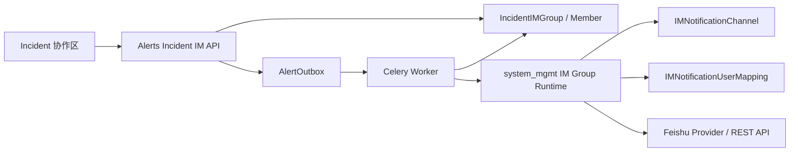
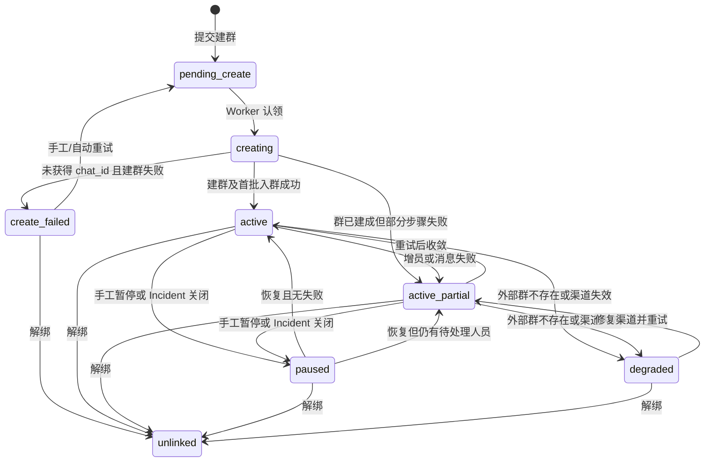
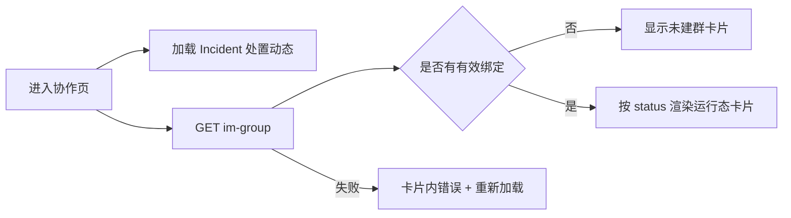
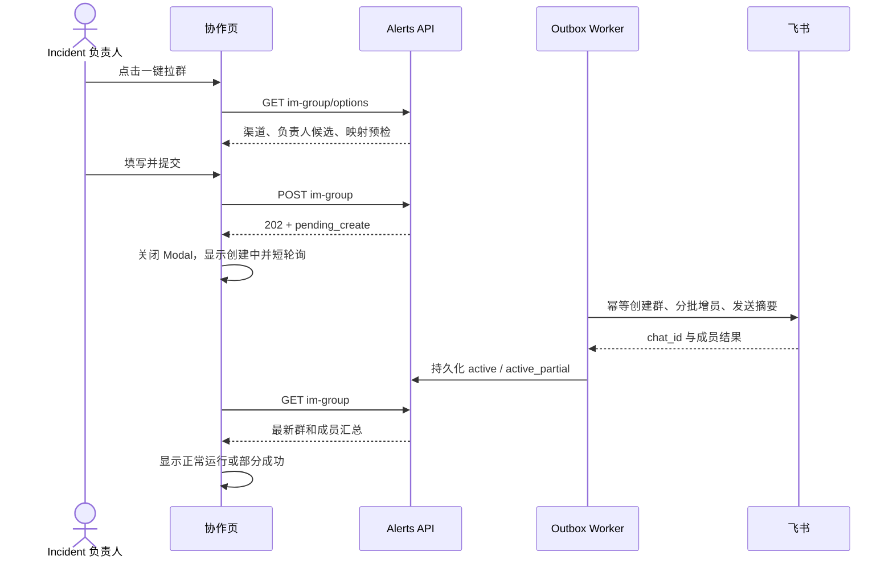
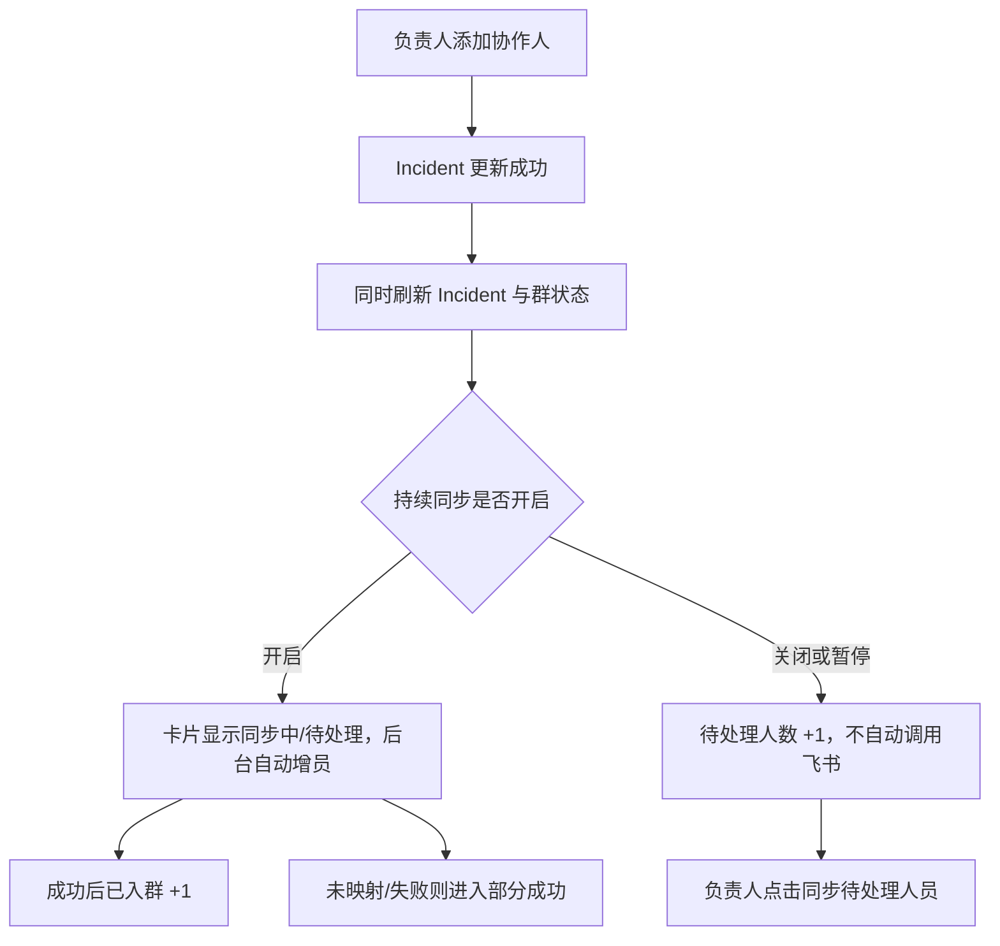

# Incident 飞书协作群设计

- 日期：2026-07-21
- 状态：待书面评审
- 首期平台：飞书
- 适用模块：`alerts`、`system_mgmt`、Web Incident 协作区

## 1. 背景与目标

Incident 拉起后，负责人通常还要到 IM 中手工建群、逐个查找参与人，并在 Incident 后续增加人员时再次补拉。这个过程慢、易漏人，也无法从 BK-Lite 判断哪些人已入群、哪些人因账号未映射而失败。

本需求在 Incident 协作区提供“一键拉群”：任意 Incident 负责人可选择一个可用的飞书通知渠道，创建与该 Incident 绑定的飞书群，并选择是否持续把后续加入 Incident 的人员同步入群。

首期要验证的核心价值是：

1. 负责人可从 Incident 内完成建群，不再手工复制人员名单。
2. BK-Lite 用户可通过现有映射可靠转换为飞书账号。
3. 新增参与人能够持续入群，失败可见、可重试、不会重复建群或重复加人。
4. Incident 关闭、重新打开及解绑后，自动化行为边界明确且可审计。

首期定位为“可内部真实验证的完整闭环”，只实现飞书；企业微信待系统管理具备企业微信 Provider、用户同步及 `userid` 映射后，接入同一扩展接口。

## 2. 已确认的产品决策

- `Incident.operator` 中任意负责人均可创建和管理 Incident 群。
- `collaborators` 是群成员，不具备建群、暂停、重试或解绑权限。
- 群成员取 `operator + collaborators` 去重结果；Incident 所属组织/团队不自动展开为群成员。
- 成员同步采用“只增不减”：人员从 Incident 移除后不自动踢出飞书群。
- 至少一名负责人已映射到飞书即可建群；其他未映射人员不阻塞建群。
- 开启持续同步后，新增人员及后续补齐映射的人员自动补拉；关闭时只通过“重试拉人”手工补拉。
- 一个 Incident 同时最多绑定一个待创建或有效群。切换渠道须先解绑，旧飞书群不删除。
- Incident 关闭时暂停自动拉人；重新打开时，如果关闭前持续同步已开启，则自动恢复。
- 首次选择的飞书渠道和外部群创建后固定，不允许原地切换。

## 3. 范围

### 3.1 首期包含

- 复用系统管理中的飞书 `IntegrationInstance`、`IMNotificationChannel` 和 `IMNotificationUserMapping`。
- 在飞书 Provider 中增加独立的 `im_group` 能力。
- 创建飞书内部群、设置一名已映射负责人为群主/管理员语义上的创建负责人，并把机器人置为群管理员（以飞书能力允许范围为准）。
- 将已映射的负责人和协作人加入群，发送 Incident 摘要消息。
- 持续同步新增成员、映射补齐后的待同步成员。
- 展示群状态、成员映射/入群结果、失败原因和下一步操作。
- 支持暂停、恢复、重试和解绑。
- 异步执行、幂等、重试、操作审计和敏感信息保护。

### 3.2 首期不包含

- 企业微信建群。
- 飞书外部用户、跨租户用户或访客入群。
- 从 Incident 删除人员时自动踢人。
- 自动解散外部群，或解绑时删除群。
- 同一 Incident 同时维护多个有效群。
- 同步群名称、群公告、群成员在飞书侧的手工变更。
- 监听群消息、把群消息回写 Incident。
- 用户主动退群后的持续自动拉回；首期由负责人手工重试。

## 4. 现状与复用边界

### 4.1 Incident 现状

- `Incident.operator` 和 `Incident.collaborators` 以 BK-Lite 用户名列表保存。
- Incident 已有协作区，可承载建群入口和群状态卡片。
- Alerts 已有 `AlertOutbox` 异步可靠执行模式，可扩展建群、发消息和补拉成员事件。

### 4.2 系统管理飞书现状

- 飞书 Provider 已提供应用凭据、用户同步和单人消息能力。
- `IMNotificationChannel` 记录渠道、团队可见范围、BK-Lite 匹配字段、飞书接收字段及启停状态。
- `IMNotificationUserMapping` 已保存 BK-Lite 用户到飞书用户标识的渠道级映射。
- 用户映射同步会删除后重建映射行，因此 Incident 成员不能外键依赖映射行 ID。

### 4.3 模块边界

| 模块 | 职责 | 不负责 |
|---|---|---|
| `system_mgmt` | 飞书凭据、渠道、用户映射、Provider 能力和飞书 API 调用 | Incident 业务状态、成员期望集合 |
| `alerts` | Incident 群绑定、成员状态、权限、状态机、Outbox 和审计 | 保存飞书密钥、实现飞书鉴权细节 |
| Web | 配置预览、状态展示和管理操作 | 自行判定权限、直接调用飞书 API |

渠道的 `team` 只控制该配置可被哪些 BK-Lite 用户使用，不决定 Incident 群成员，也不要求 Incident 与某个组织强绑定。服务端仍需校验操作者对 Incident 和所选渠道均有权限。

## 5. 总体架构



采用 Provider 扩展而不是在 Alerts 中写死飞书 REST：

```python
class IMGroupProvider(Protocol):
    def create_group(...): ...
    def get_group(...): ...
    def add_members(...): ...
    def send_group_message(...): ...
```

首期 Feishu 实现以上四个能力；“移除成员”和“解散群”不进入接口，避免形成未承诺的产品行为。未来企业微信实现相同接口即可复用 Alerts 状态机和前端。

## 6. 用户与飞书账号映射

### 6.1 解析规则

1. 根据用户选择的 `IMNotificationChannel` 查询该渠道的 `IMNotificationUserMapping`。
2. 以 `mapping.user.username` 对应 Incident 中的用户名。
3. 从映射快照中读取渠道配置的 `external_receive_key`，首期允许 `open_id` 或 `user_id`。
4. 建群时把实际采用的标识类型保存为 `member_id_type`；该绑定后续所有增员必须使用同一种类型。
5. 成员表保存当次解析出的外部 ID 快照，但不保存映射表外键。待映射人员后续重新按用户名解析。

建议新建 Incident 可用飞书渠道时默认使用 `open_id`；若现有渠道已稳定配置为 `user_id`，可直接复用，不要求迁移。

### 6.2 映射结果

| 状态 | 含义 | 是否阻塞建群 | 下一步 |
|---|---|---:|---|
| `mapped` | 唯一映射且有合法接收 ID | 否 | 正常入群 |
| `unmapped` | 没有映射或接收 ID 为空 | 仅负责人全部未映射时阻塞 | 到系统管理同步用户 |
| `conflict` | 同一 BK-Lite 用户解析出冲突身份 | 仅负责人全部不可用时阻塞 | 修复渠道映射后重试 |

建群最低条件是至少一名 `operator` 为 `mapped`。群主候选只允许选择已映射负责人；当前操作者已映射时默认选中，否则选择第一名已映射负责人。

## 7. 后端设计

### 7.1 数据模型

#### `IncidentIMGroup`

| 字段 | 说明 |
|---|---|
| `id` | UUID，亦用于构造稳定创建幂等键 |
| `incident` | Incident 外键 |
| `channel` | 可空 `IMNotificationChannel` 外键，`SET_NULL` |
| `provider_key` | 首期固定 `feishu` |
| `channel_name_snapshot` | 渠道名称快照，渠道删除后仍可审计 |
| `member_id_type` | 本群固定的 `open_id` 或 `user_id` |
| `group_name` | 创建时群名快照 |
| `external_chat_id` | 飞书 `chat_id`，创建成功后立即落库 |
| `external_owner_id` | 建群负责人外部 ID 快照 |
| `status` | 群绑定状态，见状态机 |
| `current_stage` | `queued/creating_chat/adding_members/sending_summary/completed`，用于展示服务端确认的异步阶段 |
| `continuous_sync_enabled` | 用户配置的持续同步开关 |
| `resume_after_reopen` | Incident 关闭前是否应在重开后恢复 |
| `pause_reason` | `manual`、`incident_closed` 或空 |
| `idempotency_key` | 稳定创建键，长度满足飞书限制 |
| `last_error_code/message` | 脱敏、截断后的最近错误 |
| `last_sync_at` | 最近一次同步完成时间 |
| `created_by`、时间字段 | 创建和变更审计 |
| `unlinked_at/by` | 解绑记录 |

数据库使用条件唯一约束保证一个 Incident 至多一个未解绑绑定。渠道删除前，服务层应阻止删除仍被有效绑定引用的渠道；历史绑定允许保留快照并将外键置空。

#### `IncidentIMMember`

| 字段 | 说明 |
|---|---|
| `group` | 群绑定外键 |
| `username` | BK-Lite 用户名快照 |
| `role` | `operator` 或 `collaborator`；重合时取 `operator` |
| `external_id/type` | 最近一次成功解析的飞书标识快照 |
| `mapping_status` | `mapped`、`unmapped`、`conflict` |
| `sync_status` | `waiting`、`pending`、`adding`、`joined`、`failed` |
| `attempt_count` | 尝试次数 |
| `last_error_code/message` | 成员级错误 |
| `joined_at`、时间字段 | 入群及状态更新时间 |

唯一约束为 `(group, username)`。已 `joined` 的记录不会因用户从 Incident 移除而删除或改为待移除。

### 7.2 状态机



`external_chat_id` 是“群是否已创建”的权威证据。一旦飞书返回 `chat_id`，必须先落库，再执行欢迎消息和额外成员批次；后续失败只重试未完成步骤，绝不再次调用建群。

### 7.3 API

统一响应沿用项目 API 包装格式，以下只列业务数据。

| 方法与路径 | 用途 | 权限 |
|---|---|---|
| `GET /api/v1/alerts/incidents/{id}/im-group/options/` | 可用飞书渠道、默认群名、成员映射预览 | Incident 负责人 |
| `GET /api/v1/alerts/incidents/{id}/im-group/` | 当前绑定、状态和成员汇总 | 可查看 Incident |
| `GET /api/v1/alerts/incidents/{id}/im-group/members/` | 分页成员映射与入群明细 | 可查看 Incident |
| `POST /api/v1/alerts/incidents/{id}/im-group/` | 创建绑定并异步建群，返回 `202` | Incident 负责人 |
| `PATCH /api/v1/alerts/incidents/{id}/im-group/` | 修改持续同步开关 | Incident 负责人 |
| `POST .../im-group/retry/` | 重试建群或待/失败成员 | Incident 负责人 |
| `POST .../im-group/pause/` | 手工暂停持续同步 | Incident 负责人 |
| `POST .../im-group/resume/` | 恢复并立即对账 | Incident 负责人 |
| `DELETE .../im-group/` | 稳定/失败状态下解除绑定，不删除外部群 | Incident 负责人 |

创建请求：

```json
{
  "channel_id": 12,
  "group_name": "[INC-20260721-001] 数据库连接异常",
  "owner_username": "zhangsan",
  "continuous_sync_enabled": true
}
```

创建接口在事务内完成权限与状态校验、绑定/成员快照创建和 Outbox 入队，返回绑定状态而不等待飞书。

`options` 响应至少包含渠道就绪状态、固定的成员 ID 类型、负责人候选和成员映射预览；群状态响应作为前端唯一合同，例如：

```json
{
  "id": "3c5d...",
  "provider": "feishu",
  "channel": {"id": 12, "name": "生产环境飞书应用"},
  "group_name": "[INC-20260721-001] 数据库连接异常",
  "external_chat_id": "oc_xxx",
  "status": "active_partial",
  "current_stage": "completed",
  "status_message": "2 人待映射，1 人加入失败",
  "continuous_sync_enabled": true,
  "pause_reason": null,
  "member_summary": {"total": 7, "joined": 4, "waiting": 2, "failed": 1},
  "permissions": {
    "can_manage": true,
    "can_retry": true,
    "can_pause": true,
    "can_resume": false,
    "can_unlink": true
  },
  "last_sync_at": "2026-07-21T14:32:00+08:00"
}
```

成员接口始终使用项目统一分页格式，单项合同为：

```json
{
  "username": "lisi",
  "display_name": "李四",
  "role": "collaborator",
  "mapping_status": "unmapped",
  "sync_status": "waiting",
  "error_code": "IM_USER_UNMAPPED",
  "error_message": "请先在系统管理中同步飞书用户"
}
```

前端依据服务端返回的 `permissions` 和状态渲染动作，不能自行复制业务权限矩阵。群状态接口只返回汇总；建群弹窗的映射预览由 `options` 按渠道返回，创建后的成员详情统一从分页成员接口获取。

核心错误码：

- `IM_GROUP_ACTIVE_EXISTS`：已有未解绑绑定。
- `IM_CHANNEL_NOT_READY`：渠道停用、凭据无效或缺少 `im_group` 能力。
- `IM_CHANNEL_FORBIDDEN`：操作者无权使用所选渠道。
- `IM_NO_MAPPED_OPERATOR`：没有可作为建群负责人的已映射负责人。
- `IM_OWNER_NOT_MAPPED`：选定负责人不可用。
- `IM_MEMBER_MAPPING_CONFLICT`：成员身份冲突。
- `FEISHU_PERMISSION_DENIED`、`FEISHU_RATE_LIMITED`、`FEISHU_GROUP_NOT_FOUND`：可行动的平台错误。

HTTP 语义：校验错误 `400`，权限错误 `403`，当前状态冲突 `409`，异步受理 `202`。平台原始响应、凭据和 token 不返回前端。

建群任务处于 `pending_create/creating` 时不接受解绑，返回 `409 IM_GROUP_CREATING`。原因是外部建群请求可能已发出但结果尚未落库，此时取消会产生无法判断归属的外部群；任务收敛为成功、部分成功或创建失败后才允许解绑。

### 7.4 创建流程

1. 服务端确认 Incident 存在、操作者属于 `operator`，且其数据权限允许访问该 Incident。
2. 校验所选渠道可见、启用、运行态就绪、Provider 为飞书并支持 `im_group`。
3. 计算 `operator + collaborators` 去重成员，解析渠道级映射。
4. 校验至少一名已映射负责人及合法的 `owner_username`。
5. 原子创建 `IncidentIMGroup`、成员快照及 `incident_im_group.create` Outbox。
6. Worker 认领事件，以绑定 UUID 派生飞书创建幂等值，调用创建群接口。
7. 成功获得 `chat_id` 后立即持久化；再按飞书限制分批补拉剩余成员。
8. 发送包含 Incident 编号、标题、级别、状态、负责人及 BK-Lite 详情入口的首条群消息。
9. 汇总群和成员状态；部分失败进入 `active_partial`，保留已成功结果。

飞书单次建群/增员人数限制由 Provider 内部切批，首期每批不超过 50 人。Provider 应解析飞书返回的无效 ID 列表，准确落到成员状态，而不是把整批全部判失败。

### 7.5 Outbox、幂等与重试

扩展 `AlertOutbox` 事件：

- `incident_im_group.create`
- `incident_im_group.add_members`
- `incident_im_group.send_summary`
- `incident_im_group.reconcile`

每个事件使用稳定去重键，例如 `group:{group_id}:create`、`group:{group_id}:member:{username}:add`。Worker 先读取当前数据库状态；目标已经达成时直接成功，防止任务重投产生重复副作用。

网络超时、限流和 5xx 复用现有 Outbox 策略：默认最多 8 次，按 `2^attempts × 15 秒` 退避并封顶 1 小时；权限不足、非法 ID、群不存在等终态错误不盲重试，转为可操作状态。自动重试耗尽后保留手工“重试”入口。日志只记录飞书错误码、请求 ID、步骤和成员数量，不记录密钥或完整平台载荷。

Outbox 投递器需要为 Incident IM 事件提供“重试耗尽”收口：尚无 `external_chat_id` 时把绑定置为 `create_failed`；已有 `external_chat_id` 时置为 `active_partial/degraded`。不得让绑定永久停留在 `creating`，否则前端既不能重试也不能解绑。

同一群绑定的外部操作串行执行；不同群可并行，但 Worker 需设置进程级并发上限，并在 Provider 内处理飞书限流响应，避免一次大 Incident 挤占全部通知任务。

### 7.6 持续同步

- Incident 的 `operator` 或 `collaborators` 更新提交后，事务 `on_commit` 触发该 Incident 的成员对账。
- 对账只计算“当前期望成员 - 已成功入群成员”，不生成移除动作。
- 开关开启且群为可同步状态时，新成员立即进入映射解析和增员 Outbox。
- 为避免 `system_mgmt` 反向依赖 Alerts，由 Alerts 周期任务扫描持续同步群中的 `unmapped/conflict/failed` 成员并重新解析；映射补齐后自动补拉。
- 开关关闭时仍更新页面上的待映射/待同步状态，但不自动调用飞书；负责人点击“重试拉人”后执行一次对账。
- Incident 关闭时写入 `paused + incident_closed`，保存 `resume_after_reopen`；重新打开后仅当该值为真时恢复并立即对账。
- 手工暂停不会因 Incident 重开而自动恢复。

### 7.7 外部漂移与降级

- 飞书群被删除或机器人被移出：标记 `degraded`，提示“检查飞书应用/群状态后重试，或解绑重建”，不得静默新建第二个群。
- 渠道被停用、删除或凭据失效：保留绑定和成员历史，停止自动任务并展示配置修复入口。
- 用户在飞书主动退群：首期不主动探测并循环拉回；负责人可在详情中手工重试。
- 解绑：停止后续自动任务，将绑定标为 `unlinked`，外部群保持不变；再次建群产生新绑定和新群。

### 7.8 权限与审计

- 状态读取沿用 Incident 查看权限。
- 所有变更操作必须由服务端验证 `request.user.username in incident.operator`；前端隐藏按钮不是权限控制。
- 还需验证操作者可使用所选渠道。超级管理员不因全局身份绕过本需求的负责人规则；如需介入，应先把自己加入该 Incident 的 `operator`。
- 记录建群请求/结果、持续同步开关变化、暂停/恢复、重试、成员补拉结果和解绑。
- 审计记录包含 Incident、操作者、渠道快照、群绑定 ID、成员数量和结果，不保存凭据、token 或完整外部 ID 列表。

## 8. 前端设计与交互流程

### 8.1 信息架构与页面位置

采用已确认的方案 A：入口不新建一级页面或二级标签，而是放在 Incident 详情现有“协作”页右侧栏，位于“协作人”列表上方。

现有协作页是“左侧处置动态 + 右侧 220px 协作者栏”的双栏结构。飞书群属于协作辅助状态，应常驻可见但不抢占处置动态的主区域。因此：

- 右侧栏只承载紧凑的 `IncidentIMGroupPanel`，显示状态、核心数字和最多三个操作入口。
- 创建配置使用 `Modal`，避免把表单塞进窄侧栏。
- 成员、错误及同步历史使用右侧 `Drawer`，支持分页和排障操作。
- 暂停和解除绑定使用独立确认弹窗。
- 不使用卡片套卡片、横向滚动或自定义基础控件；统一复用 Ant Design 和项目 token。

```text
┌──────────────────── Incident 详情 / 协作 ────────────────────┐
│                                                             │
│  处置动态、筛选、更新列表              │ 飞书协作群状态卡      │
│                                        │ ────────────────── │
│                                        │ 协作人               │
│                                        │ 负责人 / 协作人列表   │
│                                                             │
└─────────────────────────────────────────────────────────────┘
```

建议组件拆分：

```text
CollaborationTab
├── IncidentUpdatePanel              # 既有处置动态
└── CollaborationSidebar
    ├── IncidentIMGroupPanel          # 新增：紧凑状态卡
    └── CollaboratorPanel             # 既有协作人列表

IncidentIMGroupPanel
├── CreateIMGroupModal                # 创建与成员预检
├── IMGroupMemberDrawer               # 成员/异常详情
├── PauseIMGroupModal                 # 暂停确认
└── UnlinkIMGroupModal                # 解绑危险确认
```

群组件独立管理 API 状态，避免继续扩大现有 `CollaborationTab` 的职责；Incident 人员变更完成后通过统一的 `refreshIncidentCollaboration()` 同时刷新 Incident 和群状态。

### 8.2 页面首次加载

进入“协作”页时并行加载处置动态和当前 IM 群状态，二者失败互不阻断：



- 群状态使用局部 `Skeleton`，不能让整个协作页进入全屏 loading。
- 状态接口失败时保留处置动态和协作者功能，群区域显示“飞书群状态加载失败”和“重新加载”。
- 负责人看见可执行操作；协作人及其他只读用户仅看状态、成员详情和打开群聊入口。
- 无有效绑定时，负责人看见“一键拉群”；只读用户只看“尚未创建飞书协作群”，不显示空按钮占位。

### 8.3 未建群卡片

```text
┌────────────────────────────┐
│ 飞书协作群       [未创建]  │
│ 将负责人和协作人加入群聊， │
│ 可持续同步新增人员。       │
│ [一键拉群]                 │
└────────────────────────────┘
```

- 标题固定为“飞书协作群”，不暴露通用 Provider 术语。
- 主按钮只对 `permissions.can_manage=true` 的用户显示。
- 点击按钮后加载 `options`。加载成功再打开 Modal，避免先展示空表单后跳动。
- 没有可用渠道时仍打开 Modal，但展示明确空状态：“没有可用于建群的飞书渠道”，并提供“前往系统管理配置”入口；不显示不可提交的空表单。

### 8.4 创建群 Modal

Modal 建议宽度 600px；正文设置视口限高并内部滚动，底部按钮始终可见。字段顺序与依赖关系如下：

1. **飞书渠道**：必选，仅列出当前负责人有权使用、启用、就绪且支持 `im_group` 的渠道。
2. **群名称**：必填，默认 `[Incident 编号] 标题`，允许编辑，显示字符计数。
3. **建群负责人**：必选，只列出当前渠道中已映射的 `operator`；当前操作者可选时默认选中，否则选第一名。
4. **首批成员预检**：显示已映射、待映射、冲突数量，默认展示前 5 人，可展开完整列表。
5. **持续同步新增人员**：默认开启；辅助文案固定说明“只增不减，从 Incident 移除不会自动退群”。

```text
┌──────────── 创建 Incident 飞书群 ────────────┐
│ 飞书渠道     [生产环境飞书应用             ▾] │
│ 群名称       [[INC-001] 数据库连接异常      ] │
│ 建群负责人   [张三（zhangsan）             ▾] │
│                                                │
│ 首批成员预检  已映射 4 · 待映射 2 · 冲突 0    │
│  ✓ 张三 · 负责人                         可加入 │
│  ! 李四 · 协作人                         待映射 │
│  … 其余 4 人                         [展开全部] │
│                                                │
│ [开启] 持续同步新增人员                        │
│ 只增不减；从 Incident 移除不会自动退群。       │
│                              [取消] [创建飞书群]│
└────────────────────────────────────────────────┘
```

交互规则：

- 切换渠道后清空负责人选择，重新加载该渠道的映射预览，并用局部 loading 锁定负责人和成员区域。
- 待映射成员不阻塞创建；全部负责人不可映射时禁用提交，在负责人字段下显示“至少需要一名已映射负责人”。
- 映射冲突人员以独立状态展示，不能合并成“未映射”。
- 表单错误紧邻字段，提交失败保留用户输入；权限或渠道状态变化导致的错误需重新拉取 `options`。
- 点击“创建飞书群”后按钮进入 loading 并禁止关闭 Modal；收到 `202` 后关闭 Modal，状态卡立即切换为“创建中”。
- 前端不得等待飞书建群完成，也不得因为请求超时自行再次提交；超时后刷新群状态，交由服务端幂等判断。

### 8.5 创建与异步完成流程



“创建中”卡片显示提交时间和“查看进度”，不显示取消、解绑或再次创建。轮询规则：

- 收到 `202` 后延迟 2 秒开始。
- 前 30 秒每 2 秒刷新，之后每 5 秒刷新。
- 进入稳定状态、组件卸载或页面不可见时停止；页面恢复可见时立即刷新一次。
- 创建状态超过正常预期时只显示“创建时间较长，可查看进度”，不在前端擅自判失败。

“查看进度”复用详情 Drawer，但在群未创建完成时展示阶段进度而非空成员表：已提交、创建飞书群、邀请首批成员、发送 Incident 摘要。只展示后端已确认的阶段；当前阶段显示处理中，失败阶段显示安全错误和自动重试状态。

### 8.6 运行态紧凑卡片

右侧栏宽度有限，卡片动作固定收口为：

1. `查看详情`：始终存在。
2. 一个当前最重要动作：正常时“打开群聊”，部分成功时“重试待处理”，暂停时“恢复同步”，异常时“重新检查”。
3. `更多`：持续同步设置、暂停、复制群 ID、解除绑定等低频操作。

```text
┌────────────────────────────┐
│ 飞书协作群       [部分成功]│
│ [INC-001] 数据库连接异常   │
│ 已入群 4 · 待映射 2 · 失败 1│
│ 持续同步：开启             │
│ 最近同步：14:32            │
│ [查看详情] [重试待处理] [更多]│
└────────────────────────────┘
```

不在 220px 卡片中并排展示五六个按钮。群名和渠道名超长时单行省略并通过 `EllipsisWithTooltip` 查看完整内容；数字使用等宽数字样式。

### 8.7 状态—文案—动作矩阵

| 前端状态 | 后端条件 | 核心文案 | 优先动作 | 负责人“更多” |
|---|---|---|---|---|
| 未创建 | 无有效绑定 | 尚未创建飞书协作群 | 一键拉群 | 无 |
| 创建中 | `pending_create/creating` | 正在创建群并邀请首批成员 | 查看进度 | 无 |
| 正常运行 | `active` 且无待处理 | 新增人员将按当前配置同步 | 打开群聊 | 暂停、关闭持续同步、复制群 ID、解绑 |
| 部分成功 | `active_partial` 或待处理人数大于 0 | 已成功成员不受影响，仍有 N 人待处理 | 重试待处理 | 暂停、持续同步设置、打开群聊、解绑 |
| 手工暂停 | `paused + manual` | 新增人员暂不自动入群 | 恢复同步 | 打开群聊、持续同步设置、解绑 |
| Incident 已关闭 | `paused + incident_closed` | 重新打开 Incident 后按原配置恢复 | 打开群聊 | 复制群 ID、解绑；不显示恢复 |
| 创建失败 | `create_failed` 且无 `chat_id` | 飞书群尚未创建 | 重试创建 | 重新选择需先解绑本次失败绑定 |
| 配置异常 | `degraded` 或外部群失效 | 不会自动创建第二个群 | 重新检查 | 打开配置、复制错误码、解绑重建 |

状态标签必须同时包含文字与图标，不只依赖颜色。卡片错误文案显示经过后端归一化的安全消息，原始飞书响应不进入前端。

“正在同步 N 人”是由成员存在 `pending/adding` 派生的临时提示，不新增持久化群状态；底层仍为 `active` 或 `active_partial`，成员任务完成后自然收敛。

### 8.8 成员详情 Drawer

点击“查看详情”打开右侧 Drawer，建议宽度 720px；小屏使用 `min(720px, 100vw)`。Drawer 包含：

- 顶部：群名、渠道、群状态、持续同步状态、最近同步时间。
- 汇总：已入群、待映射、失败三个数字。
- 筛选：全部、待处理、已入群；默认选中“待处理”，没有待处理时默认“全部”。
- 成员列表：显示姓名/用户名、Incident 角色、映射状态、入群状态、最近错误及更新时间。
- 底部：负责人显示当前批次的“重试待处理人员”；只读用户只有“关闭”。

成员始终通过分页接口获取，默认 20 条，可选 10/20/50/100。默认排序：失败 → 冲突 → 未映射 → 待加入 → 已入群，同状态内按用户名排序。

成员级下一步：

| 成员状态 | 展示 | 操作 |
|---|---|---|
| 未映射 | 未找到该渠道的飞书账号映射 | 前往系统管理；负责人可重新解析 |
| 冲突 | 匹配到冲突的飞书身份 | 前往系统管理修复；不直接增员 |
| 待加入 | 已映射，等待同步 | 持续同步开启时无需操作；关闭时可手工同步 |
| 加入失败 | 显示安全错误原因 | 重试该成员或批量重试 |
| 已入群 | 显示加入时间 | 无移除操作 |

### 8.9 Incident 人员变更后的交互

复用现有“邀请协作人”和移除协作人入口，不新增第二套成员编辑器。



- 邀请协作人成功后，Toast 只说明 Incident 更新成功；群状态由卡片呈现，不用第二个成功 Toast 干扰用户。
- 持续同步开启时，卡片短暂显示“正在同步 1 人”；完成后收敛为正常或部分成功。
- 持续同步关闭或手工暂停时，卡片显示“1 人待同步”，优先动作变为“同步待处理”。
- 移除协作人的确认文案增加：“此操作不会将该人员移出已经创建的飞书群。”移除成功后不减少“已入群”历史人数，也不调用飞书。
- 同一用户同时是负责人和协作人时以负责人展示，不重复计算。

### 8.10 重试与错误恢复

“重试待处理”只处理 `unmapped/conflict/failed/waiting`，不触碰 `joined`：

1. 点击后按钮进入 loading，调用 `POST retry`。
2. 后端受理后卡片显示“正在重新检查 N 人”。
3. Drawer 保持打开时刷新当前页和汇总，不清空筛选条件。
4. 全部成功后显示一次成功 Toast；仍有失败时显示“已完成，仍有 N 人待处理”，详细原因留在 Drawer。

错误恢复入口按原因区分：

- 用户未映射/冲突：前往系统管理的对应渠道详情。
- 飞书用户不可用：提示检查应用可见范围或用户状态。
- 渠道停用/凭据失效：前往系统管理修复渠道。
- 群不存在/机器人被移出：提供“重新检查”和“解除绑定后重建”，不得提供直接“再建一个群”。
- 网络/限流：提示系统会自动重试，同时保留手工刷新；未耗尽自动重试前不突出危险操作。

### 8.11 持续同步、暂停与 Incident 关闭

三个概念在 UI 中必须分开：

- **关闭持续同步**：长期配置变化。新增成员只进入待处理，负责人仍可手工同步。
- **手工暂停**：临时冻结。显示暂停人和时间；恢复后立即对账全部待处理人员。
- **Incident 关闭暂停**：由 Incident 状态驱动。页面不提供“恢复同步”，只能重新打开 Incident；重开后按 `resume_after_reopen` 自动恢复。

手工暂停需确认：

> 暂停后，后续加入 Incident 的人员不会自动进入飞书群；当前群和已入群成员不受影响。恢复时将立即补拉待处理人员。

恢复操作受理后显示 loading，成功后卡片先进入“正在同步”，再收敛到正常或部分成功。

### 8.12 打开群聊与复制群 ID

- 后端返回经过验证的群跳转链接时，负责人和只读成员均可使用“打开群聊”，以新窗口打开并设置安全的 `rel` 属性。
- 没有可靠跳转链接时不拼装 URL，“打开群聊”不显示；“更多”提供复制 `chat_id`。
- 复制成功/失败都有 Toast，群 ID 只在详情或复制动作中出现，不作为卡片主信息。

### 8.13 解除绑定流程

解绑属于危险但可恢复的 BK-Lite 侧操作，使用二次确认：

```text
解除飞书群绑定？

此操作不会删除飞书群。BK-Lite 将停止同步并保留历史记录；
再次一键拉群会创建一个新群。

请输入当前群名称确认：[________________]
                         [取消] [解除绑定]
```

- 输入完全匹配当前群名后才能提交。
- 提交期间禁止关闭弹窗和重复点击。
- 成功后关闭 Drawer/Modal，右侧栏回到“未创建”，并显示一次“已解除绑定，原飞书群未删除”。
- 失败时保留弹窗及输入，显示后端安全错误；前端不得乐观清空绑定。

### 8.14 数据刷新与前端状态管理

- 群状态和成员列表使用独立 hook/service，不和处置动态数组混为一个 loading/error 状态。
- 稳定状态复用协作页现有 15 秒刷新节奏，同时在窗口重新聚焦、人员变更和管理操作成功后立即刷新。
- 创建、增员和重试过程中启用短轮询；同一 Incident 只允许一个轮询实例。
- 请求响应必须通过 `incidentPk + groupId` 防止切换 Incident 后旧响应覆盖新页面。
- Drawer 关闭时取消成员分页请求；组件卸载时清理定时器和 AbortController。
- 所有写操作使用独立 loading key，避免“重试”导致“解绑”等无关按钮一起 loading。

### 8.15 权限、可访问性和响应式

- 前端以 API 返回的 `permissions` 决定动作可见性，不根据本地 `operator` 数组自行推导最终权限。
- `PermissionWrapper` 仍用于模块级 Edit 权限，但不能替代 Incident operator 业务权限。
- 所有文案进入 `react-intl`；时间使用本地化时间工具，人数使用可本地化插值。
- 状态标签使用语义图标、文字和 token 色三重表达；按钮、菜单、Drawer、Modal 均可通过键盘访问。
- 图标按钮必须有 `aria-label`；展开成员预览使用 `aria-expanded/aria-controls`；异步状态变化通过可访问的 live region 轻量播报。
- 右侧栏保持现有宽度；窄屏下协作页变为单列时，飞书群卡片排在协作者列表前。Modal 主体限高滚动，Drawer 最大宽度不超过视口。
- 群名、渠道名、用户名和错误文案均支持中英文长文本省略、换行或 Tooltip，不产生整页横向滚动。

### 8.16 前端组件与 API 对应

| 组件/动作 | API | loading/error 范围 |
|---|---|---|
| `IncidentIMGroupPanel` | `GET im-group` | 仅状态卡 |
| `CreateIMGroupModal` 初始化 | `GET im-group/options` | Modal 内容区 |
| 创建群 | `POST im-group` | 创建按钮与 Modal 关闭能力 |
| `IMGroupMemberDrawer` | `GET im-group/members` | Drawer 列表，不阻断顶部汇总 |
| 持续同步设置 | `PATCH im-group` | 当前开关 |
| 重试 | `POST im-group/retry` | 当前重试按钮 |
| 暂停/恢复 | `POST pause/resume` | 当前操作与状态卡 |
| 解除绑定 | `DELETE im-group` | 危险确认弹窗 |

### 8.17 前端验收场景

1. operator 和 collaborator 进入同一 Incident，前者可建群和管理，后者只能查看。
2. 没有可用渠道、全部负责人未映射和部分成员未映射分别呈现不同状态及下一步。
3. 创建提交后不重复提交，卡片从创建中收敛为正常或部分成功。
4. 添加协作人后，持续同步开启、关闭和暂停三种情况下的卡片与动作符合设计。
5. 移除协作人前显示“不自动退群”提示，成功后不触发飞书移除。
6. Drawer 的待处理筛选、分页、单人/批量重试及错误入口可用。
7. 手工暂停、Incident 关闭暂停及关闭持续同步的文案和恢复入口不混淆。
8. 外部群丢失时不出现再次直接建群入口，只允许重新检查或解绑重建。
9. 解绑必须输入群名，成功后原飞书群保留，页面回到未创建状态。
10. 创建轮询、稳定刷新、窗口聚焦和切换 Incident 时无旧请求覆盖、定时器泄漏或重复请求。
11. 所有管理按钮具备 loading、防重复提交、键盘焦点和可行动错误信息。
12. 中英文长群名、长用户名及 100 人成员分页下无弹窗触底或页面横向滚动。

## 9. 飞书接入要求

### 9.1 应用预检

系统管理中的飞书应用需要满足：

- 应用凭据有效，租户访问令牌可获取。
- 机器人能力已启用并可创建/管理内部群。
- 具备读取/使用目标用户标识、创建群、增加群成员、查询群和发送群消息所需权限。
- 应用处于目标租户可用范围内，待拉用户对应用可见。
- 用户同步已运行，至少一名 Incident 负责人有有效映射。

`options` 接口应返回渠道就绪状态和缺失项，前端不能让用户选中明显不可用的渠道。飞书权限名称及接口参数以实施时官方文档为准：

- [创建群接口](https://open.feishu.cn/document/server-docs/group/chat/create?lang=zh-CN)
- [群组 API 概览](https://open.feishu.cn/document/server-docs/group/overview)

### 9.2 Provider 返回合同

Provider 将平台响应归一化为：成功结果、无效成员列表、可重试错误、终态配置错误和外部对象不存在。Alerts 不解析飞书原始响应格式。

## 10. 安全、可靠性与可观测性

- 飞书密钥只保存在系统管理集成实例中，通过运行时服务读取；Alerts 数据库和日志不得复制密钥。
- 所有用户、Incident、渠道和绑定查询均做服务端数据权限过滤。
- 群名和消息内容做长度与字符校验；只发送必要 Incident 摘要，不发送敏感告警原始载荷。
- 数据库变更与 Outbox 创建同事务，避免“记录已创建但任务丢失”。
- Worker 使用稳定事件键和状态 CAS，避免并发重复建群/增员。
- 暴露建群耗时、成功/部分成功/失败次数、待映射人数、增员失败率和 Outbox 积压指标。
- 外部调用记录阶段、平台错误码、请求 ID 和耗时；个人外部 ID 在普通日志中脱敏。

## 11. 测试策略

实现阶段严格 TDD，先写行为测试。

### 11.1 后端自动化测试

- 权限：任意 operator 可管理，collaborator/无关用户不可管理，渠道数据范围服务端生效。
- 映射：`open_id`、`user_id`、未映射、冲突、映射删除重建后重新解析。
- 创建：至少一名负责人、部分映射允许、并发创建只产生一个有效绑定。
- 幂等：超时重投不重复建群；已有 `chat_id` 后消息/增员失败只重试失败步骤。
- 批次：超过 50 人正确分批，无效 ID 精确标记成员。
- 同步：新增人员自动拉入，移除人员不踢出，关闭/重开暂停恢复，手工暂停不被自动恢复。
- 降级：限流、网络错误、权限不足、群被删除、渠道停用/删除。
- 解绑：停止后续任务、保留历史、不删除飞书群、允许新建新绑定。
- Provider：用 Mock HTTP 覆盖请求参数、错误归一化和敏感信息不泄漏。

### 11.2 前端自动化测试

- 负责人/协作人的按钮可见性。
- 渠道切换后映射预览刷新及提交条件。
- 创建中、正常、部分成功、暂停、配置异常状态。
- 详情筛选、错误提示、重试、暂停/恢复和解绑确认。
- 创建中轮询启动/停止，重复点击被阻止。
- 状态文字、键盘操作和非颜色可识别性。

## 12. 飞书真实流程验证

先在专用飞书测试租户/测试应用验证，不直接使用生产 Incident。准备 1 个机器人应用、1 个已启用飞书渠道、至少 4 个 BK-Lite 测试用户：2 个已映射负责人、1 个已映射协作人、1 个未映射协作人。

按以下顺序验收：

1. 系统管理同步飞书用户，确认映射预览与实际账号一致。
2. 负责人 A 创建群，确认只产生一个飞书群、机器人在群内、群名正确。
3. 确认负责人和已映射协作人入群，未映射成员在 BK-Lite 显示待映射。
4. 确认群内收到 Incident 摘要且详情链接可访问。
5. 连续点击或模拟任务重投，确认不重复建群、不重复产生副作用。
6. 补齐未映射用户并执行系统管理用户同步；持续同步开启时确认其自动入群。
7. 新增一名 Incident 协作人，确认自动入群。
8. 从 Incident 移除一名成员，确认其仍留在飞书群。
9. 关闭 Incident，新增成员不自动入群；重新打开后确认恢复并补拉。
10. 手工暂停后新增成员不入群；恢复后立即补拉。
11. 制造应用权限不足、非法用户或网络失败，确认状态可见、错误可行动、重试后收敛。
12. 解绑，确认飞书群仍存在、BK-Lite 停止同步，并可重新创建一个新绑定。

真实验证通过标准：全部 12 个场景有截图/日志证据；无重复群；所有成员状态与飞书实际一致；错误日志不含凭据；解绑后无继续增员任务。

## 13. 验收标准

- Incident 负责人能在协作区选择可用飞书渠道并异步创建群。
- 至少一名负责人映射时允许部分成功建群；未映射人员清晰可见。
- 负责人和协作人按映射加入群，群内收到 Incident 摘要。
- 持续同步开启时，新加入 Incident 或后续补齐映射的成员最终入群。
- 从 Incident 移除人员不会自动退群。
- 创建、增员和重试具备幂等性，不产生重复外部群。
- Incident 关闭/重开、手工暂停/恢复、解绑行为符合本文状态机。
- 所有管理操作仅 Incident 负责人可执行，并进入审计。
- 外部失败可区分、可重试、可定位，不泄漏飞书凭据。
- 后端新增/变更代码覆盖率不低于 75%，相关 Server 测试、Web lint 和 type-check 全部通过。

## 14. 实施拆分建议

1. `system_mgmt`：定义 `im_group` Provider 合同，完成 Feishu Provider 与渠道就绪检查。
2. `alerts`：以 TDD 增加模型、迁移、权限服务、成员解析、状态机和 API。
3. `alerts`：增加 Outbox Worker、持续对账、Incident 状态联动和审计。
4. Web：实现建群弹窗、状态卡、成员详情和管理动作。
5. 自动化回归：后端、前端及权限/并发/失败测试。
6. 测试租户真实飞书验证并保留验收证据。

企业微信后续接入时，不改变 `IncidentIMGroup`、`IncidentIMMember`、Alerts API 和前端主流程，只新增 Provider、渠道就绪校验及企业微信 `userid` 映射支持。
