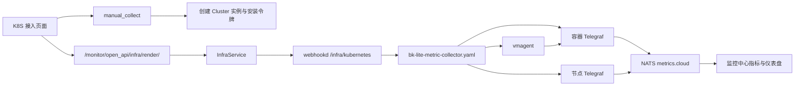
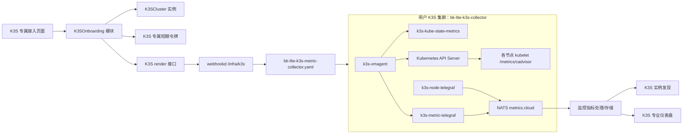

# BK-Lite 监控中心独立 K3S 监控链路技术设计

## 1. 文档信息

- 状态：待评审
- 日期：2026-07-23
- 范围：监控中心新增独立 K3S 监控接入、采集、对象、实例发现与专业仪表盘链路
- 明确不包含：修改现有 K8S 监控行为、复用 K8S 业务身份、把 K3S 作为 K8S 的兼容模式
- 参考材料：`/Users/luoyang/Desktop/work/code/weopsx/outputs/k3s/BK-Lite-K8S采集兼容K3S改造说明.md`

## 2. 结论

新增一条从产品入口到数据展示均独立的 K3S 纵向链路。K3S 与 K8S 只复用无业务含义的通用基础设施，例如监控插件导入框架、实例存储、NATS 指标通道、VictoriaMetrics/Telegraf 技术栈和通用页面外壳；不得复用 K8S 的业务标识、安装接口、采集清单、命名空间、Kubernetes 资源名、缓存键、对象模型或仪表盘。

K3S 采集不部署独立 cAdvisor DaemonSet，而是由 vmagent 通过 Kubernetes API Server 的 Node Proxy 抓取各节点 kubelet 暴露的 `/metrics/cadvisor`。K3S 专属清单同时部署 kube-state-metrics 和节点 Telegraf，使监控链路不依赖 CMDB 的 K8S 资源采集清单。

该设计的核心约束是：

> 安装、运行、升级或卸载 K3S 监控，不得读取、修改或删除任何 K8S 监控专属资源；K8S 监控是否存在也不得影响 K3S 监控的完整性。

## 3. 背景与现状复核

### 3.1 当前 K8S 监控链路

当前 K8S 链路大致如下：



主要代码和配置事实：

- 插件描述位于 `server/apps/monitor/support-files/plugins/unknown/k8s/k8s/metrics.json`，以 `K8S`、`instance_type=k8s` 和 `Cluster/Node/Pod` 作为业务身份。
- 前端在 `web/src/app/monitor/(pages)/integration/list/detail/configure/page.tsx` 中按 `collect_type === "k8s"` 进入 K8S 专属配置流程。
- 当前接入复用 `server/apps/monitor/services/manual_collect.py` 创建 Cluster 实例、生成临时令牌和安装命令。
- `server/apps/monitor/views/infra.py` 固定渲染 metric 类型，并由 `server/apps/monitor/services/infra.py` 请求 webhookd 的 `/infra/kubernetes`。
- webhookd 使用 `agents/webhookd/infra/kubernetes.sh` 渲染清单。
- `agents/webhookd/bk-lite-metric-collector.yaml` 部署独立 cAdvisor DaemonSet，并包含 `--docker_only` 和 `/var/lib/docker` 挂载；这与 K3S 默认 containerd 运行时不匹配。
- K8S 专业仪表盘位于 `web/src/app/monitor/dashboards/objects/k8s-*`，查询条件硬编码 `instance_type=k8s`。

### 3.2 现有链路中的隐含依赖

当前 K8S 专业仪表盘和实例发现会查询 `kube_node_info` 等 kube-state-metrics 指标，但 `agents/webhookd/bk-lite-metric-collector.yaml` 本身不部署 kube-state-metrics。kube-state-metrics 位于独立的 `agents/webhookd/bk-lite-resource-collector.yaml` 中，而 `specs/capabilities/resource-collector-template.md` 又明确规定资源采集模板拥有 kube-state-metrics，metric 模板不应包含它。

因此，当前 K8S 监控实际上存在“监控指标清单依赖 CMDB 资源清单”的隐含运行时耦合。新 K3S 链路不能复制该缺陷。K3S 专属监控清单必须自包含监控中心所需的 kube-state-metrics 指标。

### 3.3 对参考附件的复核

参考附件中以下判断成立：

- `--docker_only` 和 Docker 目录挂载不适合默认使用 containerd 的 K3S。
- 通过 kubelet `/metrics/cadvisor` 获取容器指标是可行方向。
- 经 API Server 访问 Node Proxy 需要 `nodes/proxy` 权限。
- 删除新 YAML 中的对象不会自动删除集群内既有对象。
- 使用 ConfigMap `subPath` 挂载时，配置更新后需要显式重启工作负载。
- amd64/arm64 镜像兼容性必须成为发布条件。

以下建议不直接采纳：

- 不修改 K8S 清单来兼容 K3S，而是新增 K3S 专属清单和安装链路。
- 不删除或复用 K8S cAdvisor 资源，K3S 清单只管理带 K3S 身份的资源。
- 不把 kube-state-metrics 放回 K8S metric 清单；只在 K3S 专属清单中部署 K3S 自有实例。
- 不使用 `insecure_skip_verify`；使用 ServiceAccount Token 和集群 Service CA 验证 API Server。
- 不沿用 `instance_type=k8s`、K8S 对象或 K8S 仪表盘。
- 不在 `kubernetes.sh` 中继续增加类型分支；新增 K3S 渲染入口。

## 4. 目标与非目标

### 4.1 目标

1. 用户能在监控中心独立选择 K3S，并完成实例创建、清单下载/安装和上报验证。
2. K3S 使用独立的插件、采集类型、实例类型、对象、安装接口、清单和仪表盘。
3. 单份 K3S 监控清单即可提供集群状态、Pod/容器和节点系统指标，不依赖 K8S 或 CMDB 采集清单。
4. 支持 K3S 单节点、多节点、amd64 和 arm64 部署；首发版本范围按第 14.6 节的版本策略确定。
5. 安装幂等、升级可控、卸载有资源边界、失败可诊断。
6. 现有 K8S 功能和行为保持不变。

### 4.2 非目标

- 不统一或重构 K8S 接入链路。
- 不把 K3S 与 K8S 合并为一个可切换发行版的插件。
- 不复用 K8S 已创建的实例、令牌、命名空间、ClusterRole 或 ServiceAccount。
- 不在本期提供用户可配置采集周期；首期固定为 60 秒。
- 不在本期建设通用 Kubernetes 发行版抽象。只有 K8S、K3S 两个真实调用方确认存在稳定共性后，才允许抽取无业务语义的共享模块。
- 不负责修复现有 K8S 对 CMDB kube-state-metrics 的依赖。

## 5. 方案选择

### 5.1 采用：独立 K3S 纵向切片

从入口、身份、后端编排、渲染、集群资源、指标标签到仪表盘全部独立。仅复用通用框架和传输基础设施。

优点：

- 隔离边界清晰，K3S 生命周期不会误伤 K8S。
- 可独立发布、回滚和验证。
- K3S 的 containerd、轻量部署和 ARM 场景可以独立演进。
- 故障定位可沿 K3S 链路完成，不需要推断 K8S 分支状态。

代价：

- 初期存在少量页面和编排结构重复。
- K8S 和 K3S 的公共改进需要分别评估。

这些代价是有意接受的。当前业务要求是独立链路，过早建立“通用 Kubernetes 发行版接口”会扩大调用方需要理解的配置面，形成浅模块。

### 5.2 拒绝：在 K8S 链路增加 `distribution=k3s` 分支

该方案代码量较少，但会继续共享 K8S 对象、安装接口和生命周期，无法保证卸载、升级和故障影响隔离，不符合独立链路要求。

### 5.3 拒绝：复制全部 K8S 代码后只替换清单

该方案表面独立，但会把 `instance_type=k8s`、K8S 仪表盘查询和 CMDB kube-state-metrics 依赖一起复制，得到名称不同但行为仍耦合的链路。

## 6. 总体架构



K3S 纵向切片由五个模块组成：

1. **K3S 插件模块**：声明监控对象、指标和唯一业务身份。
2. **K3S Onboarding 模块**：以小接口封装实例创建、安装命令、清单渲染和上报验证。
3. **K3S 清单渲染模块**：只渲染 K3S 专属模板，不接收 K8S 类型参数。
4. **K3S 集群采集模块**：在独立命名空间运行 vmagent、kube-state-metrics 和 Telegraf。
5. **K3S 展示模块**：独立完成实例发现和 Cluster/Node/Pod 仪表盘查询。

外部 seam 是 K3S Onboarding 的四个业务操作。NATS、缓存、HTTP 和 Kubernetes 属于实现内部依赖，不应泄露到前端接口中。生产环境使用真实适配器，测试使用内存或桩适配器。

## 7. 业务身份与资源命名

### 7.1 平台身份

| 维度 | K3S 值 | 约束 |
|---|---|---|
| 插件标识 | `K3S` | 不复用 `K8S` |
| 采集类型 | `k3s` | 前端和后端显式路由 |
| 实例类型 | `k3s` | 所有指标查询必须带该标签 |
| 对象类型 | `K3S` | 用于插件/对象归属 |
| 集群对象 | `K3SCluster` | 基础对象 |
| 节点对象 | `K3SNode` | 衍生对象 |
| Pod 对象 | `K3SPod` | 衍生对象 |
| 缓存键前缀 | `k3s_infra_install_token` | 不与通用 infra 或 K8S 令牌互认 |

插件目录固定为：

`server/apps/monitor/support-files/plugins/unknown/k3s/k3s/`

对象唯一键：

- `K3SCluster`：`instance_id`
- `K3SNode`：`instance_id + node`
- `K3SPod`：`instance_id + pod`

`instance_id` 仍用于把一次接入创建的集群实例与其上报指标关联，但实例归属校验必须确认目标对象是 `K3SCluster`，不能仅凭任意实例 ID 签发安装清单。

### 7.2 集群资源身份

| 维度 | 取值 |
|---|---|
| Namespace | `bk-lite-k3s-collector` |
| 资源名前缀 | `k3s-` |
| ClusterRole/Binding 前缀 | `bk-lite-k3s-` |
| 管理标签 | `app.kubernetes.io/managed-by=bk-lite` |
| 产品标签 | `app.kubernetes.io/part-of=bk-lite-k3s-monitoring` |
| 名称标签 | `app.kubernetes.io/name=<resource-name>` |
| 版本标签 | `app.kubernetes.io/version=<collector-version>` |

ClusterRole 和 ClusterRoleBinding 是集群级资源，必须使用 K3S 专属名称及标签；卸载脚本只允许删除清单中列举的 K3S 资源，不能按宽泛标签或命名空间之外的模式批量清理。

## 8. K3S Onboarding 深模块

新增：

- `server/apps/monitor/services/k3s_onboarding.py`
- `server/apps/monitor/views/k3s_onboarding.py`

模块对调用方只暴露四个操作：

```text
create_instance
generate_install_command
render_manifest
verify_reporting
```

接口语义：

### 8.1 `create_instance`

- 输入：K3S 集群显示名称及现有通用实例字段。
- 行为：只创建 `K3SCluster` 实例，初始化 K3S 接入状态。
- 输出：实例 ID 和当前接入状态。
- 错误：对象不存在、名称冲突、参数错误时返回结构化业务错误。

### 8.2 `generate_install_command`

- 输入：K3SCluster 实例 ID。
- 行为：验证实例归属，签发 5 分钟有效、最多使用 5 次的 K3S 安装令牌，生成严格 TLS 的下载命令。每次通过令牌校验的 render 请求原子消耗一次使用次数。
- 输出：可审计的安装命令、令牌过期时间。
- 安全约束：命令使用 `curl --fail --show-error --silent --location`，不得包含 `-k` 或 `--insecure`；令牌不写日志。

### 8.3 `render_manifest`

- 输入：K3S 专属安装令牌。
- 行为：解析令牌绑定的实例和租户信息，注入 NATS、实例标签及 collector 版本，渲染唯一的 K3S 模板。
- 输出：Kubernetes 多文档 YAML。
- 安全约束：只接受 `k3s_infra_install_token`，不得接受 K8S/通用 infra 令牌；不得接受 `config_type` 或发行版切换参数。

### 8.4 `verify_reporting`

- 输入：K3SCluster 实例 ID。
- 行为：在有限时间窗内验证三段信号是否出现，并返回分段状态和诊断提示。
- 输出：
  - 集群资源信号：`kube_node_info`
  - Pod/容器信号：`container_cpu_usage_seconds_total`
  - 节点系统信号：`system_load1`
- 判定：三段均正常才标记“接入成功”；部分成功返回“接入异常”及缺失段，不把网络超时伪装为业务成功。

模块路由固定为：

```text
POST /api/v1/monitor/api/k3s_onboarding/create_instance/
POST /api/v1/monitor/api/k3s_onboarding/install_command/
GET  /api/v1/monitor/api/k3s_onboarding/verify/
POST /api/v1/monitor/open_api/k3s_onboarding/render/
```

路由注册可以按现有 Django 工程结构拆分文件，但对外路径、K3S 业务语义和授权边界不得合并进 `/infra/kubernetes`。

## 9. K3S 采集清单

新增模板：

`agents/webhookd/bk-lite-k3s-metric-collector.yaml`

新增 webhookd 渲染脚本：

`agents/webhookd/infra/k3s.sh`

新增入口：

`/infra/k3s`

`k3s.sh` 只加载 K3S 模板、校验 K3S 必需变量并返回渲染结果。它不得调用 `kubernetes.sh`，也不得通过 `type=k3s` 进入现有 K8S 分支。

### 9.1 工作负载

K3S 清单包含：

- `k3s-vmagent`：抓取 kubelet cAdvisor 和 kube-state-metrics。
- `k3s-kube-state-metrics`：提供集群、节点、Pod 元数据与状态指标。
- `k3s-metric-telegraf`：接收 vmagent remote write 并发送到 NATS `metrics.cloud`。
- `k3s-node-telegraf`：以 DaemonSet 采集节点系统指标并发送到 NATS `metrics.cloud`。

不包含：

- 独立 cAdvisor DaemonSet。
- Docker Socket。
- `/var/lib/docker` 挂载。
- `--docker_only`。
- K8S/CMDB 资源采集器的 ServiceAccount、Role 或 ConfigMap。

### 9.2 kubelet cAdvisor 抓取

vmagent 通过 API Server Node Proxy 抓取每个节点：

```text
/api/v1/nodes/<node-name>/proxy/metrics/cadvisor
```

认证和 TLS：

- `authorization.credentials_file` 指向 ServiceAccount Token。
- `tls_config.ca_file` 指向 `/var/run/secrets/kubernetes.io/serviceaccount/ca.crt`。
- `tls_config.server_name` 使用 Kubernetes Service 的证书名称。
- 禁止 `insecure_skip_verify: true`。

服务发现与 relabel：

1. 使用 Kubernetes node 服务发现获得节点名。
2. 将抓取地址重写为集群内 API Server Service。
3. 将 metrics path 重写为该节点的 proxy cAdvisor 路径。
4. 注入 `instance_id`、`instance_type=k3s` 和节点身份标签。

vmagent 的 ClusterRole 权限固定为：

- 核心资源 `nodes`：`get`、`list`、`watch`，用于节点服务发现。
- 核心资源 `nodes/proxy`：`get`，用于读取 kubelet 指标。

若 Kubernetes 实际鉴权要求增加权限，必须先补充失败证据、安全评审和 RBAC 测试，再修改该集合，不能在部署模板中预授予宽泛权限。kube-state-metrics 使用自己的专属 ServiceAccount 和按其指标 allowlist 推导的只读权限，不与 vmagent 共用 ClusterRole。

`nodes/proxy` 权限能力较强，必须绑定给 K3S 专用 ServiceAccount，不与其他工作负载共享；设计评审和安全文档中需显式记录这一风险。

### 9.3 指标保留策略

首期继续保留现有 K8S 专业仪表盘所需的六类容器指标族，以便复用查询技术而不复用查询身份：

- `container_cpu_usage_seconds_total`
- `container_memory_working_set_bytes`
- `container_fs_usage_bytes`
- `container_fs_limit_bytes`
- `container_network_receive_bytes_total`
- `container_network_transmit_bytes_total`

过滤规则：

- 删除缺失 `pod` 的 root、节点汇总和非 Pod 指标。
- CPU、内存、文件系统指标删除空 `container` 的 Pod 聚合序列。
- 网络指标保留 Pod sandbox 序列，因为网络通常归属 Pod 网络命名空间；仪表盘按 Pod 聚合，避免依赖业务容器名。
- 保留 `namespace`、`pod`、`container`、`node`、`instance_id`、`instance_type` 等查询所需标签，禁止高基数的容器 ID 或镜像 digest 进入最终业务维度，除非有已批准的查询场景。

### 9.4 kube-state-metrics

K3S 清单部署独立 kube-state-metrics，资源名、ServiceAccount、Service、Role 和绑定均使用 K3S 前缀。vmagent 只抓取 K3S 自有 Service，不通过标签选择器误抓取其他命名空间中的 kube-state-metrics。

保留实例发现和首期仪表盘需要的指标：

- `kube_node_info`
- `kube_node_status_condition`
- `kube_pod_info`
- `kube_pod_status_phase`
- 现有 K3SCluster/K3SNode/K3SPod 指标描述中实际引用的其他 KSM 指标

插件指标描述、vmagent allowlist 和仪表盘查询必须由一致性测试保证同步，不能靠人工记忆维护三份列表。

### 9.5 节点 Telegraf

沿用当前节点系统指标的采集和 NATS 输出技术，但使用 K3S 专属资源、配置和标签：

- 所有指标包含 `instance_id` 和 `instance_type=k3s`。
- 节点身份标签与 `K3SNode` 唯一键一致。
- 固定 60 秒采集周期。
- 不读取或覆盖 K8S Telegraf ConfigMap。

### 9.6 镜像与架构

当前使用的部分固定镜像标签并不能仅凭 manifest inspect 证明为多架构镜像。K3S 发布前必须验证清单内每个镜像同时提供目标平台：

- `linux/amd64`
- `linux/arm64`

发布清单使用固定版本，并固定到经验证的多架构镜像 digest 或内部不可变镜像索引。任何单架构镜像都会阻断该架构的 K3S 发布，但不阻断其他架构已验证版本。

## 10. 插件、实例发现与仪表盘

### 10.1 K3S 插件

K3S 插件目录独立维护 `metrics.json` 等支持文件：

- 基础对象：`K3SCluster`
- 衍生对象：`K3SNode`、`K3SPod`
- 所有查询默认约束 `instance_type=k3s`
- 指标可沿用成熟的 Prometheus 指标名，但对象 ID、显示名称、插件归属和查询标签不能沿用 K8S

插件初始化仍复用通用的 `plugin_init -> migrate_plugin -> import_compound_monitor_object` 框架。这里复用的是插件导入能力，不是 K8S 插件数据。

### 10.2 实例发现

K3S 实例发现按独立对象执行：

- `K3SCluster`：来自创建接入时的人工实例。
- `K3SNode`：由带 `instance_type=k3s`、目标 `instance_id` 的 `kube_node_info` 发现。
- `K3SPod`：由带相同身份约束的 `kube_pod_info` 或选定 Pod 指标发现。

发现逻辑不能查询 `instance_type=k8s`，也不能把同名 K8S Node/Pod 合并进 K3S 对象。

### 10.3 专业仪表盘

新增独立注册项和目录：

- `k3s-cluster`
- `k3s-node`
- `k3s-pod`

可参考现有 K8S 专业仪表盘的布局和 PromQL 技术，但必须复制为 K3S 所有并完成以下替换：

- 对象类型改为 `K3SCluster/K3SNode/K3SPod`。
- 查询标签改为 `instance_type=k3s`。
- 对象筛选字段与 K3S 唯一键一致。
- 空数据、部分数据和权限错误文案使用 K3S 语义。

不能让一个仪表盘通过运行时参数同时服务 K8S 和 K3S。后续若两套仪表盘出现两个真实调用方都稳定需要的纯展示逻辑，可再抽取无业务身份的图表外壳。

## 11. 前端接入流程

新增目录：

`web/src/app/monitor/(pages)/integration/list/detail/configure/k3s/`

流程：

1. 监控集成列表展示独立 K3S 卡片。
2. `collect_type === "k3s"` 进入 K3S 专属配置页。
3. 用户创建 K3SCluster 实例。
4. 页面请求 K3S 安装命令。
5. 用户下载或执行 K3S 专属清单。
6. 页面轮询 K3S 上报验证接口，分别展示集群资源、Pod/容器、节点系统三段状态。
7. 三段均成功后进入 K3S 专业仪表盘。

首期页面不显示“采集周期”字段，因为后端和模板固定 60 秒。避免继续沿用当前 K8S 页面中“前端可填写但后端忽略”的伪配置。

可以复用 Ant Design、通用复制按钮、步骤条和代码展示外壳。K3S 的表单状态、接口调用、错误映射和完成判定必须留在 K3S 目录内。

## 12. 生命周期与安全

### 12.1 安装

- 服务端提供可下载的固定边界安装 YAML。
- 安装前推荐执行 `kubectl apply --dry-run=server -f ...`。
- 正式安装使用 `kubectl apply`，重复执行应保持幂等。
- 安装令牌固定 5 分钟过期、最多使用 5 次，且只绑定一个 K3SCluster 实例。
- 渲染响应禁止缓存敏感内容，服务端日志对令牌和 NATS 凭据脱敏。

### 12.2 升级

- 清单包含 collector 版本标签。
- ConfigMap 通过 `subPath` 挂载的工作负载，在配置变更后必须显式执行限定名称的 `rollout restart`，或由清单中的配置摘要触发滚动更新。
- 升级只操作 `bk-lite-k3s-collector` 命名空间和显式列举的 `bk-lite-k3s-*` 集群级资源。
- 禁止 `kubectl apply --prune`，防止标签或选择器错误导致越界删除。

### 12.3 回滚

- 每个发布版本保留完整、可重新渲染的上一版清单。
- 回滚通过重新应用上一版清单完成，并对相关 K3S Deployment/DaemonSet 做有界滚动。
- 平台配置和集群资源版本分别记录，验证接口应能提示版本不一致。

### 12.4 卸载

- 提供与安装版本匹配的卸载 YAML 或显式资源清单。
- 只删除 K3S 清单中声明的资源。
- 不按 `managed-by=bk-lite` 这一宽泛标签删除资源。
- 不删除 K8S、CMDB 或用户自建的 kube-state-metrics、cAdvisor、Telegraf。
- 删除 K3SCluster 平台实例与卸载集群采集器是两个明确动作；默认不因平台实例删除而远程执行集群删除。

## 13. 错误处理与可观测性

### 13.1 结构化错误

| 阶段 | 典型错误 | 页面行为 |
|---|---|---|
| 创建实例 | 对象未初始化、名称冲突、参数错误 | 保留表单，显示可修复原因 |
| 生成命令 | 实例不属于 K3SCluster、无权限 | 不签发令牌，记录审计事件 |
| 渲染清单 | 令牌失效、实例不存在、缺少环境配置 | 返回明确错误码，不返回半成品 YAML |
| 集群安装 | RBAC、镜像拉取、架构不兼容 | 展示排查命令和失败资源 |
| 上报验证 | KSM 缺失、cAdvisor 缺失、节点指标缺失 | 分段展示，不笼统显示“未上报” |
| 传输 | NATS 暂时不可用 | 采集器重试，平台验证保持异常状态 |

### 13.2 诊断信息

采集器日志必须能够回答：

- vmagent 是否发现节点。
- API Server Node Proxy 返回的是 2xx、401/403 还是连接/TLS 错误。
- kube-state-metrics 是否可抓取。
- remote write 是否被 Telegraf 接收。
- Telegraf 是否成功发送到 NATS。

平台审计日志记录实例 ID、租户、操作、collector 版本和结果，不记录令牌、ServiceAccount Token 或 NATS 密码。

## 14. 测试策略

测试以 K3S 模块接口和完整纵向行为为主，不为内部透传函数堆叠浅层测试。

### 14.1 插件测试

- K3S 插件可被初始化和重复迁移。
- `K3SCluster/K3SNode/K3SPod` 对象存在且唯一键正确。
- 所有 K3S 查询包含 `instance_type=k3s`。
- K3S 插件中不存在 K8S 对象 ID 或 `instance_type=k8s`。

### 14.2 清单静态测试

- YAML 可解析，Kubernetes 对象名无重复。
- 所有 namespaced 资源位于 `bk-lite-k3s-collector`。
- 所有集群级资源使用 `bk-lite-k3s-` 前缀。
- 不包含 `--docker_only`、Docker Socket、`/var/lib/docker` 或 `insecure_skip_verify`。
- 包含 Service CA、ServiceAccount Token 和 Node Proxy 路径。
- 不包含任何现有 K8S 专属资源名。
- 镜像均为固定版本，并通过 amd64/arm64 manifest 检查。

### 14.3 指标一致性测试

从以下三个来源提取指标名并做集合校验：

1. K3S 插件指标描述。
2. vmagent/KSM allowlist。
3. K3S 专业仪表盘查询。

仪表盘所需指标必须是采集 allowlist 的子集；插件声明的核心指标必须能由清单产生。对允许存在但暂未展示的指标使用显式白名单。

### 14.4 后端测试

- `create_instance` 只创建 K3SCluster。
- K8S/其他类型实例不能生成 K3S 安装命令。
- K3S 令牌不能调用 K8S render，K8S/通用令牌不能调用 K3S render。
- 过期、篡改和跨租户令牌被拒绝。
- 渲染只使用 K3S 模板，变量正确转义，凭据不出现在日志中。
- `verify_reporting` 覆盖三段全成功、单段缺失、全部缺失和查询异常。
- 缓存、webhookd 或指标查询暂时失败时返回结构化错误，不影响服务启动。

### 14.5 前端测试

- K3S 卡片只进入 K3S 配置页。
- 页面只调用 K3S onboarding 接口。
- 不显示无效的采集周期输入。
- 安装命令不含 `-k`。
- 三段验证状态及错误提示正确。
- K3S 仪表盘查询不会发出 `instance_type=k8s`。

### 14.6 K3S 环境测试矩阵

| 场景 | amd64 | arm64 |
|---|---:|---:|
| 单节点 K3S（server 同时承担 agent） | 必测 | 必测 |
| 多节点 K3S（server + agent） | 必测 | 必测 |
| K3S 发布时仍受官方维护的最旧 minor 最新 patch | 必测 | 冒烟 |
| K3S `stable` channel 对应完整版本 | 必测 | 必测 |

补充验证：

- server 节点运行 agent 时能发现并采集。
- agentless server 不会被误判为应有 cAdvisor 数据的工作节点。
- containerd 场景能得到目标容器指标。
- 重复安装无资源冲突。
- 从上一 collector 版本升级和回滚成功。
- 卸载后 K8S 与 CMDB 资源保持不变。

K3S 版本契约采用“验证过的完整版本白名单”，不使用未经验证的 `>=` 范围：

1. 每次 BK-Lite 发布冻结时，解析 K3S 官方仍维护的最旧 minor 最新 patch，以及 `stable` channel 指向的完整版本。
2. 将两个完整版本号写入发布测试配置和用户文档；如果两者相同，只保留一个版本。
3. 只有通过上述矩阵的完整版本才标记为“已验证支持”；其他 K3S 版本可以尝试接入，但产品不声明已验证。
4. 发布后 channel 漂移不会自动扩大支持范围，新增版本必须重新执行矩阵并更新白名单。

## 15. 验收标准

### 15.1 功能验收

- 监控中心存在独立 K3S 集成入口。
- 能创建 K3SCluster、安装采集器并看到三段上报验证成功。
- K3SCluster/K3SNode/K3SPod 能按预期发现。
- K3S Cluster/Node/Pod 专业仪表盘有数据。

### 15.2 隔离验收

- 未安装 K8S 采集器和 CMDB 资源采集器时，K3S 监控仍完整工作。
- 同一集群并存 K8S 旧采集器时，安装、升级、回滚、卸载 K3S 不修改 K8S 资源。
- K3S 平台实例、令牌、指标和仪表盘不会与 K8S 混用。
- K3S 清单中不存在 K8S 命名空间和 K8S 专属资源名。
- 现有 K8S 自动化测试和关键接入冒烟测试无行为变化。

### 15.3 安全与运维验收

- API Server TLS 校验开启，安装命令不绕过 TLS。
- K3S Node Proxy 权限只绑定专属 ServiceAccount。
- amd64/arm64 镜像验证通过。
- 安装幂等，升级和回滚有界，卸载仅删除 K3S 资源。
- 日志和错误响应不泄露凭据。

## 16. 实施分解建议

后续实施计划按以下顺序拆分，每一步都保持可单独验证：

1. K3S 插件、对象身份和指标契约。
2. K3S 采集模板、RBAC、webhookd 独立渲染入口及静态测试。
3. K3S Onboarding 后端模块、令牌隔离和三段验证。
4. K3S 前端接入页和状态反馈。
5. K3S 实例发现与独立专业仪表盘。
6. amd64/arm64 K3S 环境端到端验证、升级/回滚/卸载演练。
7. K8S 零回归验证与发布文档。

实施不得先建立 K8S/K3S 通用发行版抽象。若开发中发现可共享代码，只能在 K8S 和 K3S 两个真实调用方均存在、共享内容无业务身份且测试能通过该 seam 验证时抽取。

## 17. 风险与缓解

| 风险 | 影响 | 缓解 |
|---|---|---|
| `nodes/proxy` 权限较强 | ServiceAccount 被滥用时可访问 kubelet 能力 | 专属账号、最小绑定、只读容器、令牌自动挂载范围控制、显式安全审计 |
| 不同 K3S 版本 kubelet 指标标签变化 | 查询或实例发现缺失 | 固定支持矩阵，做多版本 E2E 和指标契约测试 |
| arm64 镜像缺失 | 工作负载 ImagePull/exec 失败 | 发布前逐镜像检查多架构索引并做真机/节点验证 |
| KSM 与已有 KSM 并存 | 重复抓取或资源名冲突 | 独立命名空间、资源名和精确抓取目标 |
| 指标高基数 | 存储和查询成本上升 | allowlist、relabel 丢弃无用标签、按 Pod 聚合 |
| K3S/K8S 复制后长期漂移 | 修复需要双份维护 | 只在两个真实调用方稳定后抽取无业务语义深模块，不共享业务身份 |
| subPath 配置不自动刷新 | 升级后仍使用旧配置 | 配置摘要触发滚动或显式有界 rollout |

## 18. 外部技术依据

- K3S 官方文档说明 K3S 是兼容 Kubernetes 的发行版，并默认打包 containerd 等运行时能力：[K3S Documentation](https://docs.k3s.io/)
- K3S 架构区分 server、agent 以及不运行 agent 的 server 场景：[K3S Architecture](https://docs.k3s.io/architecture)
- K3S 官方通过 release channel 提供随时间变化的版本指针，因此本设计在每次 BK-Lite 发布时冻结实际完整版本：[Manual Upgrades](https://docs.k3s.io/upgrades/manual)
- Kubernetes 官方文档列出 kubelet 的 `/metrics/cadvisor` 指标端点：[System Metrics](https://kubernetes.io/docs/concepts/cluster-administration/system-metrics/)
- Kubernetes Node API 支持 Node Proxy 子资源：[Node v1 API](https://kubernetes.io/docs/reference/kubernetes-api/core-resources/node-v1/)
- Kubernetes RBAC 最佳实践提示 `nodes/proxy` 能访问 kubelet API，风险高于普通只读资源权限：[RBAC Good Practices](https://kubernetes.io/docs/concepts/security/rbac-good-practices/)
- cAdvisor 官方运行参数说明中 `--docker_only` 仅报告 Docker 容器：[cAdvisor Runtime Options](https://github.com/google/cadvisor/blob/master/docs/runtime_options.md)
