# Alerts 告警中心业务与技术架构

本文描述 `apps.alerts` 当前代码实现对应的业务边界、后端分层、核心数据模型和完整业务链路。图中流程以当前代码为准，覆盖告警接入、事件处理、告警生成、恢复、分派、通知、升级、自动处置和事故管理。

## 1. 模块定位

Alerts 是 BK-Lite 的告警中心，负责把不同监控系统产生的原始事件转换为统一事件，通过屏蔽、丰富、即时告警、周期聚合和恢复判断形成可运营的告警，再驱动分派、通知、提醒、升级、自动处置和事故协同。

核心业务对象分为三层：

- `Event`：来自监控源的原始或标准化事件，是接入、去重、屏蔽和聚合的输入。
- `Alert`：需要人员或自动化系统处理的告警实例，承载状态、责任人、提醒、升级和处置生命周期。
- `Incident`：由一个或多个相关告警组成的事故，用于更高层级的协同和跟踪。

模块不负责资产主数据、用户组织、作业执行和消息通道的具体实现，而是通过 CMDB、System Management、Job Management 等模块提供的 RPC/NATS 接口完成协作。

## 2. 业务架构图

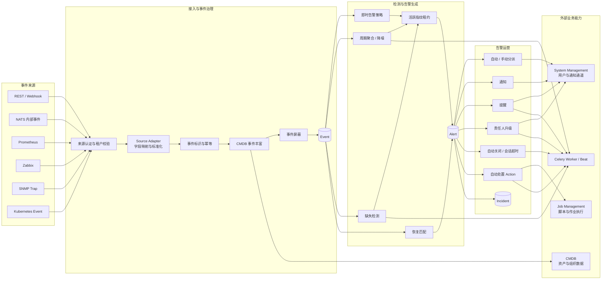

## 3. 后端技术架构

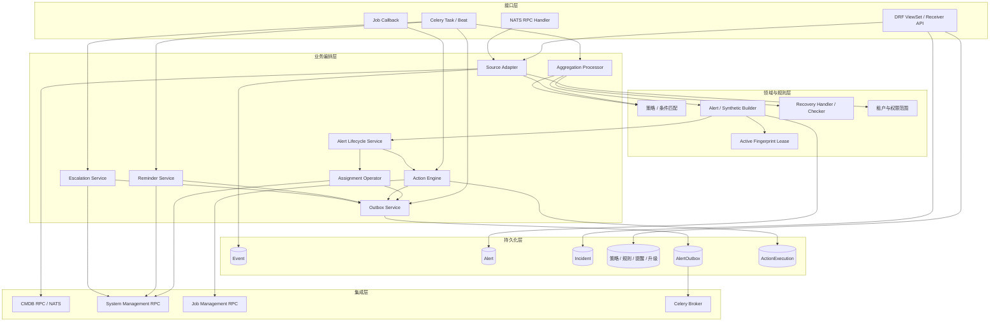

### 3.1 分层职责

| 层级 | 主要职责 | 关键目录或文件 |
| --- | --- | --- |
| 接口层 | 认证、参数解析、权限校验、HTTP/NATS 响应适配 | `views/`、`nats/nats.py` |
| 接入适配 | 来源配置、字段映射、标准化、事件入库、接入统计 | `common/source_adapter/` |
| 聚合检测 | 即时匹配、周期聚合、缺失检测、会话超时 | `aggregation/` |
| 生命周期 | 统一分发 created、assigned 等生命周期副作用 | `service/alert_lifecycle.py` |
| 告警运营 | 分派、通知、提醒、升级、自动关闭 | `common/assignment.py`、`service/` |
| 自动处置 | 动作规则匹配、目标解析、作业执行、callback | `action/`、`views/action.py` |
| 可靠投递 | 事务内记录副作用、提交后投递、失败重试 | `service/outbox.py`、`models/outbox.py` |
| 权限边界 | 当前团队、子团队、对象权限和 JSON team 查询 | `utils/permission_scope.py`、`core/utils/viewset_utils.py` |

## 4. 核心数据模型及关系

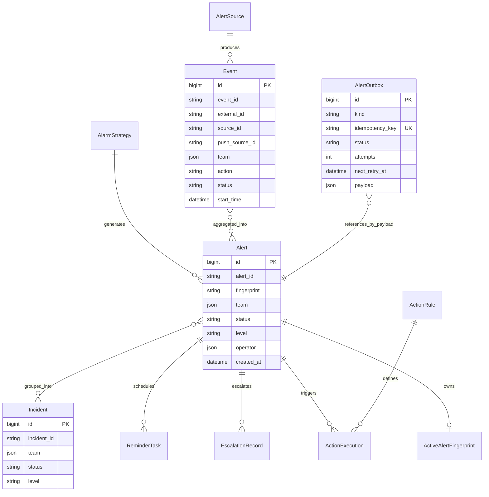

### 4.1 Alert 状态机

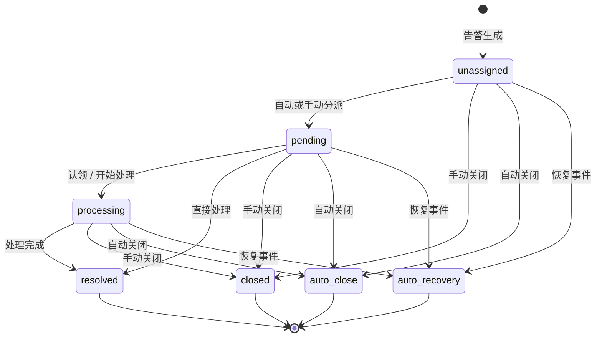

进入 `resolved`、`closed`、`auto_close` 或 `auto_recovery` 等非活跃状态后，告警释放活跃指纹租约，后续同一指纹可以重新形成新告警。

## 5. 告警接入与生成主流程

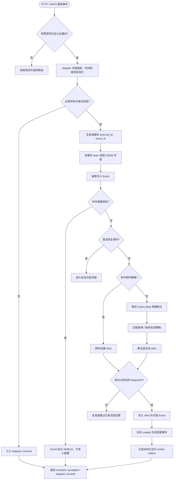

### 5.1 接入结果契约

- 全部接受：HTTP `200`，NATS `result=true`。
- 部分接受：HTTP `207`，响应携带接受、跳过和错误数量。
- 全部拒绝：HTTP `422`，NATS `result=false`。
- 接入层返回实际处理结果，不以输入数组长度冒充成功写入数量。

## 6. 即时告警、周期聚合与缺失检测

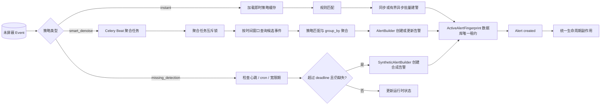

三条建警入口共享相同约束：

- 使用数据库唯一活跃指纹租约避免周期任务、即时任务或重试并发重复建警。
- 创建成功后统一触发 `created` Action 和自动分派，不允许入口各自遗漏生命周期钩子。
- Celery 核心任务异常继续向上抛出，使任务保持失败状态并可被监控或重试。

## 7. 恢复与自动关闭流程

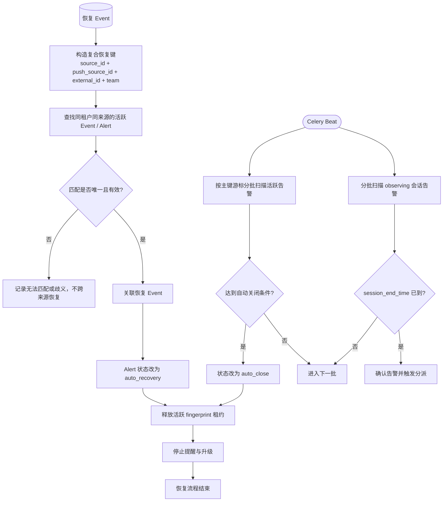

恢复匹配禁止仅按 `external_id` 跨全局查询，以免同一外部标识在不同来源或团队之间串写状态。

## 8. 告警分派、通知、提醒与升级

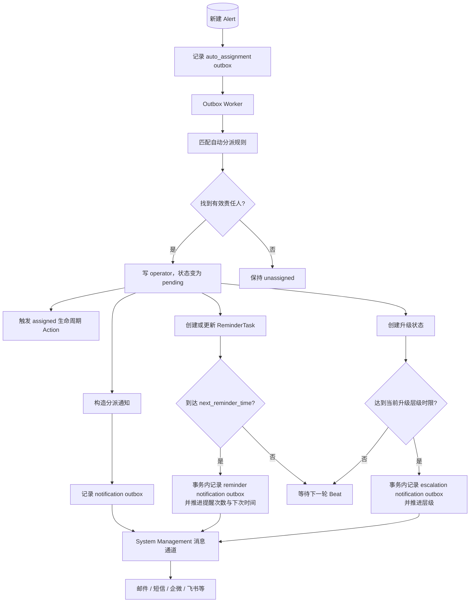

### 8.1 Outbox 可靠投递

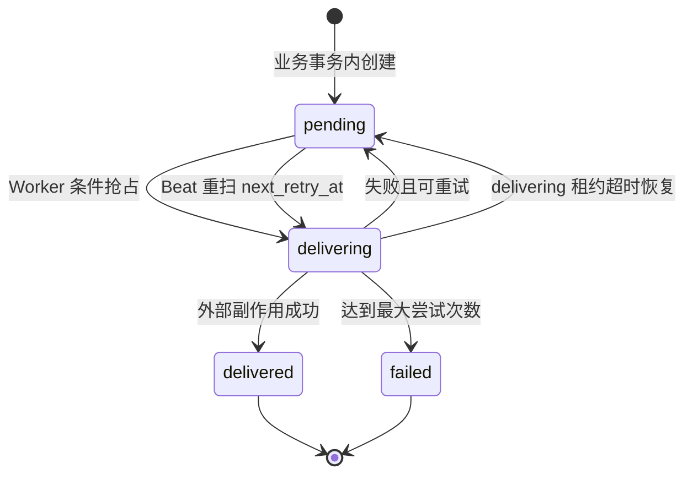

Outbox 保证数据库业务状态和待执行副作用同时提交。Broker 首次入队失败时记录仍保持 `pending`，周期扫描会继续投递。`idempotency_key` 防止提醒、升级、动作和自动分派因重复请求产生重复副作用。

## 9. Action 自动处置完整链路

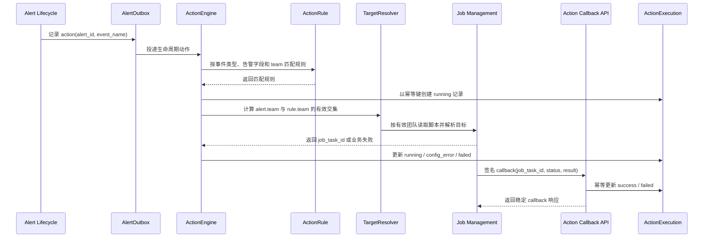

关键约束：

- 当前已接入 Action 的生命周期事件包括 `created`、`assigned`、`acknowledged`、`reassigned`、`closed` 和 `resolved`；自动恢复目前只更新告警状态并停止提醒，不派发独立的 `recovered` Action。
- 自动触发使用稳定幂等键，同一规则、告警和已接入 Action 的生命周期事件只产生一次执行。
- 手工触发要求调用方提供幂等键，网络重试不会重复执行远程作业。
- 脚本查询、目标解析和作业下发统一使用 `alert.team ∩ rule.team`，禁止通过多团队规则扩大执行范围。
- Job 回调需要签名校验，重复 callback 不产生重复状态副作用。
- 业务失败必须反映到 `ActionExecution` 和 API 返回值，Celery 不把异常任务标记为成功。

## 10. Incident 事故协同流程

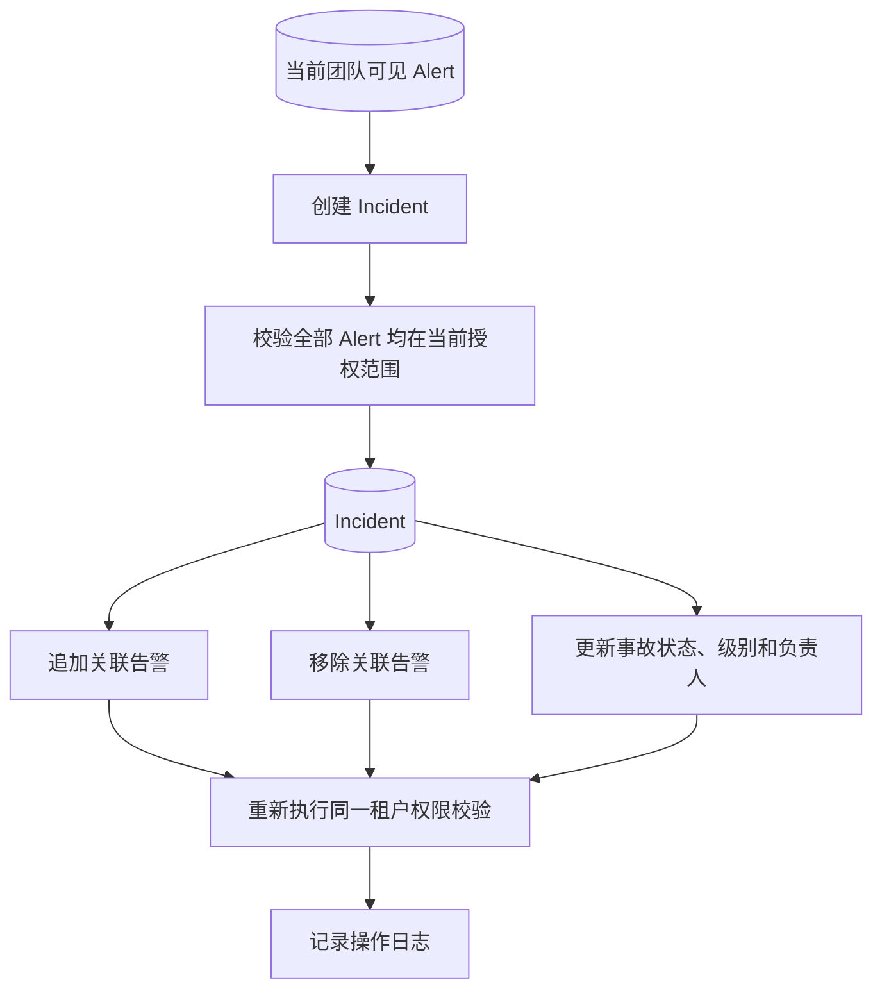

list、detail、create、update、add-alert 和 remove-alert 使用一致的团队范围。未授权告警 ID 不会被用于查询或回显标题，避免通过错误响应枚举跨团队敏感信息。

## 11. 权限、事务和资源边界

### 11.1 租户与权限

- HTTP 请求从当前团队 Cookie 和用户组织树计算查询范围。
- NATS/RPC 从显式 `user_info`、团队和权限规则计算范围；缺少组织或授权上下文时 fail closed。
- JSON `team` 成员查询通过统一跨数据库 helper 实现，兼容支持 JSON contains 的数据库和 SQLite fallback。
- Alert、Event、Incident、ActionRule、ActionExecution、EnrichmentRule 及统计接口使用相同范围语义。

### 11.2 事务与幂等

- 告警状态更新与 outbox 创建处于同一数据库事务。
- AlertOutbox、ActionExecution 和 ActiveAlertFingerprint 使用数据库唯一约束裁决并发。
- 提醒次数、升级层级和对应通知意图在同一事务内推进，避免状态已更新但通知永久丢失。
- 恢复、关闭和自动恢复终态统一释放活跃指纹租约。

### 11.3 资源边界

- 自动关闭和会话超时使用主键游标分批扫描，不一次性加载全部告警。
- 即时告警和自动分派按配置阈值或固定批次处理。
- Outbox 设置最大尝试次数、指数退避、重试时间和 delivering 超时恢复。
- 接入结果和日志记录统计及标识，不记录完整敏感事件正文、凭据或大 payload。

## 12. 可观测性与排障入口

| 排障目标 | 主要标识或数据 |
| --- | --- |
| 接入是否丢事件 | `received`、`accepted`、`skipped`、`errored`、`source_id` |
| Event 是否形成 Alert | `event_id`、`external_id`、策略 ID、fingerprint |
| 是否发生重复建警 | `ActiveAlertFingerprint.fingerprint`、关联 Alert |
| 自动分派停在哪一步 | Alert 状态、operator、auto_assignment outbox 状态 |
| 通知是否投递 | AlertOutbox kind、status、attempts、next_retry_at、last_error |
| 自动处置是否执行 | ActionExecution idempotency_key、status、job_task_id |
| 恢复为何未生效 | source_id、push_source_id、external_id、team 复合键 |
| 定时任务是否失败 | Celery 任务状态、异常日志、扫描批次和游标 |

## 13. 关键代码导航

- 接入入口：`views/receiver.py`、`nats/nats.py`
- 来源适配：`common/source_adapter/base.py`
- 即时告警：`aggregation/processor/instant_dispatcher.py`
- 周期聚合：`aggregation/processor/aggregation_processor.py`
- 告警构建：`aggregation/builder/alert_builder.py`
- 缺失检测：`aggregation/builder/synthetic_alert_builder.py`
- 恢复处理：`aggregation/recovery/recovery_handler.py`
- 生命周期：`service/alert_lifecycle.py`
- 活跃指纹：`service/active_fingerprint.py`
- 自动分派：`common/assignment.py`
- 通知：`common/notify/dispatcher.py`
- 提醒和升级：`service/reminder_service.py`、`service/escalation_service.py`
- 可靠投递：`service/outbox.py`
- 自动处置：`action/engine.py`、`action/handlers/job.py`
- 权限范围：`utils/permission_scope.py`
- 定时任务：`tasks/tasks.py`
