# CMDB 业务架构与业务流程

> 文档范围：`server/apps/cmdb/` 社区层及其 Enterprise Overlay 接口。 
> 文档依据：当前 `feature_windyzhao` 分支后端实现。 
> 图例约定：实线表示同步调用或数据读写，虚线表示异步任务、事件投递或补偿恢复。

## 1. 业务定位与边界

CMDB 是 BK-Lite 的配置数据中心，负责定义运维对象、维护资产实例和关系、接入自动采集与自定义上报，并向监控、告警、作业、运营分析等模块提供统一的资产查询、权限范围和变更事件。

CMDB 的核心业务闭环是：

1. 定义分类、模型、字段、唯一规则和模型关系。
2. 通过人工维护、文件导入、自动采集、节点同步或自定义上报形成资产实例。
3. 对实例及关系执行权限校验、唯一性校验、幂等写入和变更审计。
4. 基于资产数据提供拓扑、K8s、应用资源、网络机房和 IPAM 等业务视图。
5. 通过订阅、NATS/RPC 和审计镜像将变更可靠地传播给其他模块。

### 1.1 主要角色

| 角色 | 主要职责 |
|---|---|
| CMDB 管理员 | 管理分类、模型、字段、唯一规则、关联规则、采集任务和全局配置 |
| 资产管理员 | 在授权组织范围内维护实例、关系、文件、配置版本和导入导出 |
| 运维人员 | 查询资产、拓扑、K8s、应用资源、IPAM、采集结果和变更记录 |
| 采集代理 Stargazer | 接收采集参数，执行主机、数据库、中间件、网络、K8s、云和配置文件采集并回传结果 |
| Node Management | 提供节点、接入点、远程执行和节点同步能力 |
| 下游业务模块 | 通过 HTTP 或 NATS/RPC 查询 CMDB，消费资产上下文和变更事件 |
| Enterprise 上报方 | 使用任务凭证向自定义上报入口提交实例与关系数据 |

### 1.2 业务能力全景

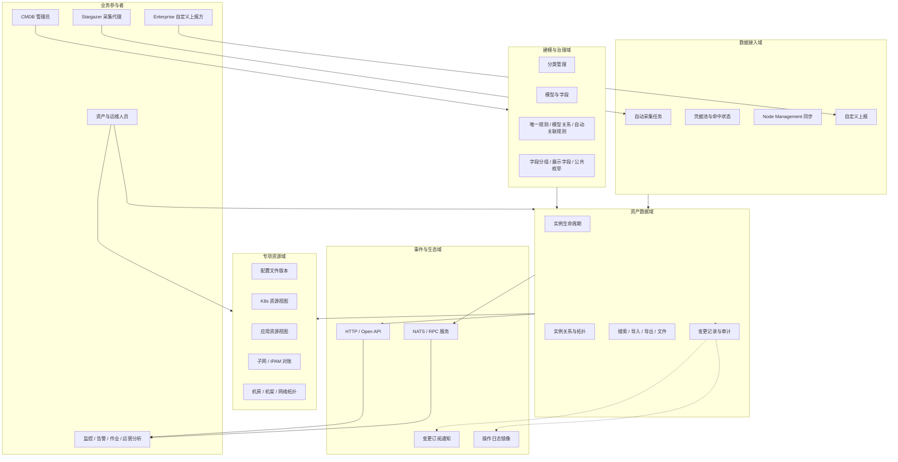

## 2. 后端技术架构

CMDB 后端采用 Django/DRF 作为接口与编排层，图数据库保存模型、实例和关系主数据，Django 关系库保存流程状态、任务、审计和配置元数据，MinIO 保存配置文件正文。Celery/Beat 处理采集、订阅、对账和补偿任务，NATS/RPC 负责跨模块调用与采集结果回传。

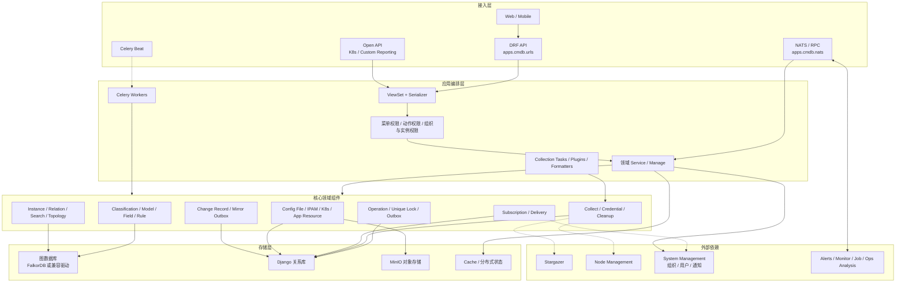

### 2.1 分层职责

| 层次 | 主要路径 | 职责 |
|---|---|---|
| 路由与协议层 | `urls.py`、`views/`、`nats/nats.py` | 注册 HTTP/NATS 入口、解析请求、返回稳定协议 |
| 权限与校验层 | `views/mixins.py`、`utils/permission_util.py`、Serializer/Validator | 校验功能权限、组织范围、实例权限、字段和业务参数 |
| 领域编排层 | `services/`、`collection/` | 编排建模、实例、采集、配置、订阅、IPAM、拓扑和审计业务 |
| 图访问层 | `graph/drivers/graph_client.py`、`graph/falkordb.py`、`graph/neo4j.py` | 提供统一的图查询、实体写入、关系写入和拓扑遍历接口 |
| 异步任务层 | `tasks/celery_tasks.py`、`config.py` | 执行采集、订阅、清理、同步、对账、Outbox 消费和故障恢复 |
| 状态持久层 | `models/` | 保存任务、版本、投递、审计、作业、锁和个性化配置 |
| 扩展层 | `extensions/`、`collect/extensions.py`、`instance_ops/extensions.py` | 提供社区层与 Enterprise Overlay 的稳定扩展边界 |

## 3. 领域对象与存储归属

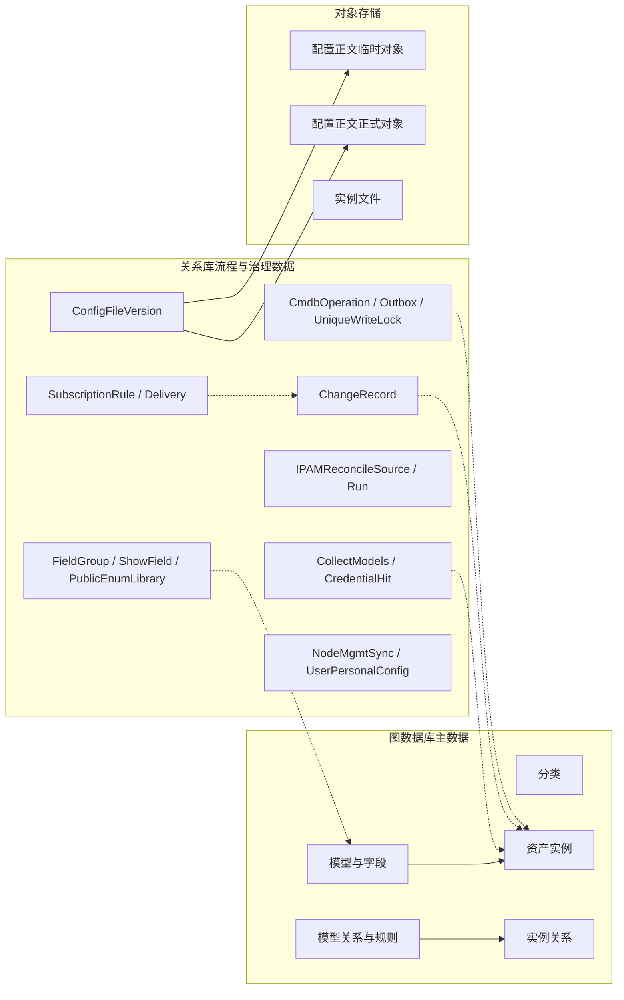

### 3.1 一致性边界

- 图数据库与关系库不处于同一数据库事务中。实例创建/更新通过 `CmdbOperation`、图写入标记和 Outbox 收敛跨存储状态。
- 配置版本元数据与 MinIO 正文不处于同一事务中。正文采用临时对象、`PENDING` 状态、事务提交后发布和周期补偿。
- 变更记录镜像到 System Management 不在主写事务中完成。批量审计通过 `ChangeRecordMirrorOutbox` 异步投递。
- 自动采集结果以 `task_id` 作为执行代次，旧 Worker 或超时任务不能覆盖新执行结果。

## 4. 核心业务流程

### 4.1 模型治理流程

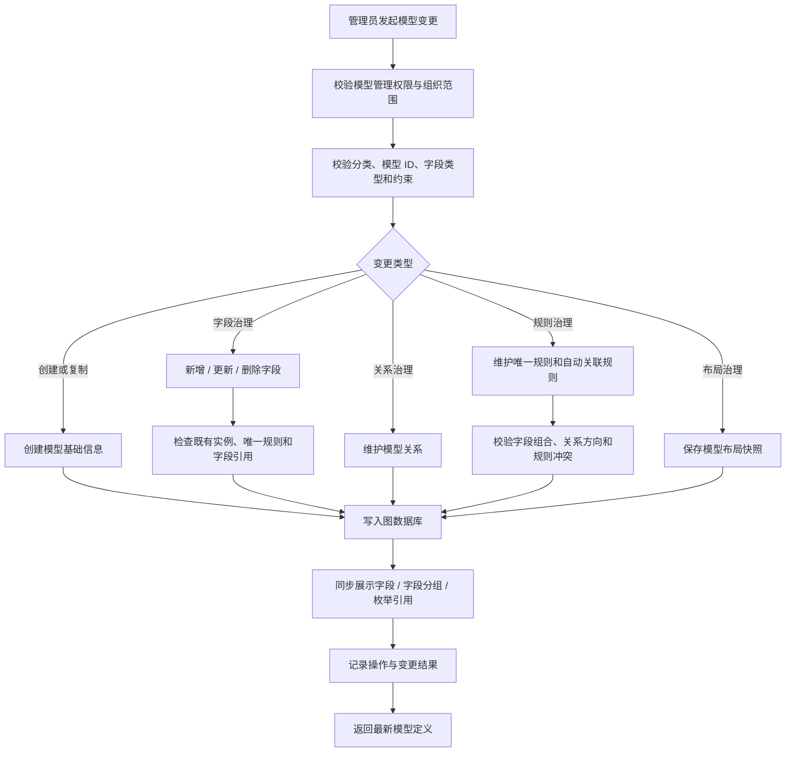

关键规则：

- 删除字段前必须检查实例数据、唯一规则、自动关联规则和展示配置引用。
- 模型关系与自动关联规则分离：模型关系定义可连接性，自动关联规则定义如何根据字段生成实例关系。
- 公共枚举库是字段选项的治理来源，字段分组和展示字段只影响展示，不改变实例真实属性。

### 4.2 实例创建与更新的可靠写入流程

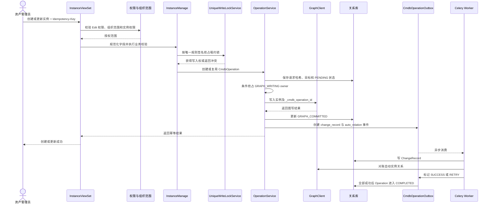

实例写入状态：

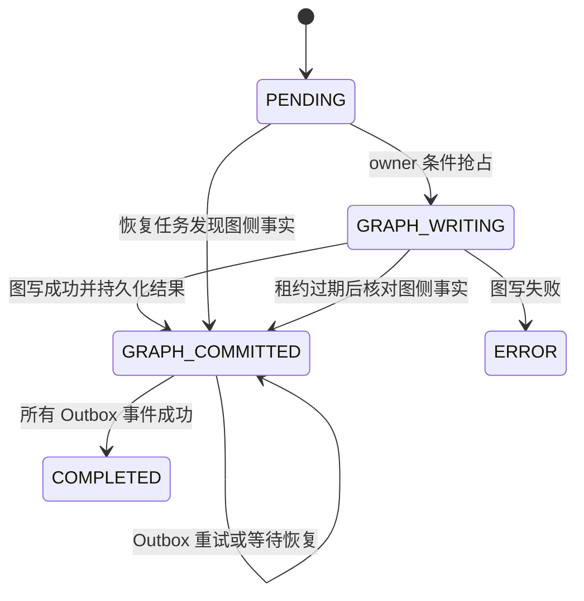

### 4.3 实例查询、拓扑与权限裁剪流程

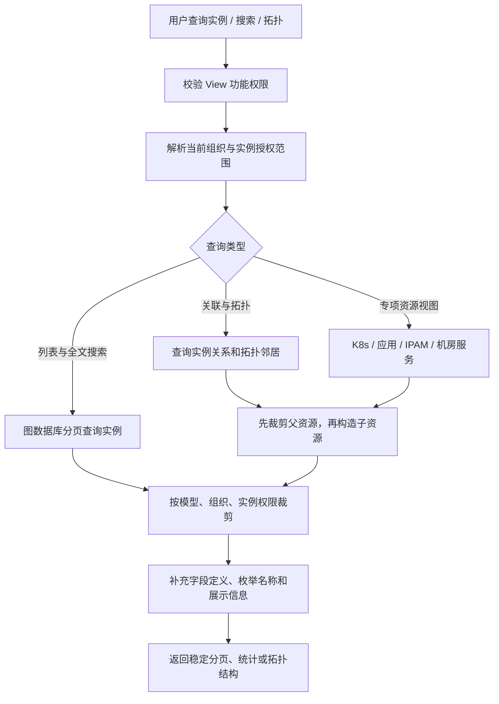

权限语义：

- 功能权限决定用户能否进入某个动作，例如 `asset_info-View`、`asset_info-Edit`。
- 组织范围决定用户可见的团队或组织数据。
- 实例权限用于对具体资产执行二次裁剪，不能只依赖前端过滤。
- 层级资源采用父级优先的 fail-closed 策略：父 Namespace、应用或集群不可见时，其子资源也不可见。

### 4.4 自动采集完整流程

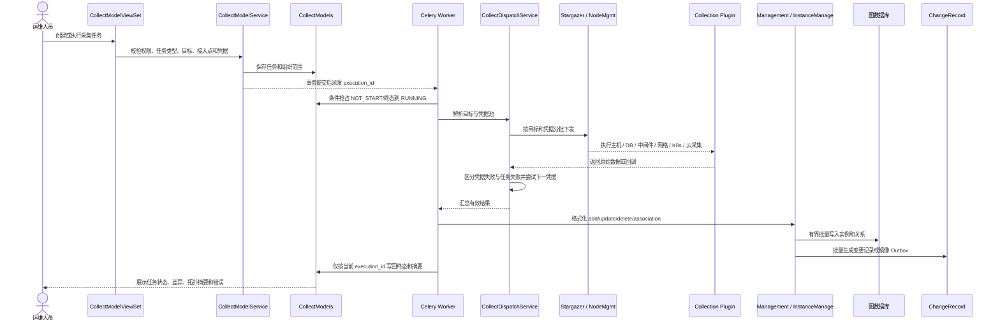

采集任务控制点：

- 创建/更新任务后的外部同步使用 `transaction.on_commit`，避免数据库回滚后遗留幽灵任务。
- 同一任务通过数据库条件更新抢占执行权，重复触发不会并发覆盖。
- 多凭据派发记录目标与凭据命中状态；凭据错误允许换凭据，业务错误不会盲目重试全部凭据。
- 格式化结果统一为 `add`、`update`、`delete`、`association`，再进入 CMDB 合并链路。
- 周期巡检每 5 分钟检查超时任务，且以 execution ID 防止旧 Worker 覆盖新执行。

### 4.5 配置文件版本与正文生命周期

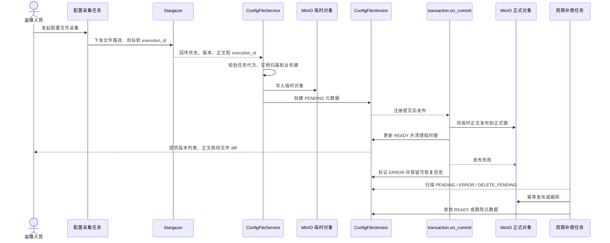

正文状态：

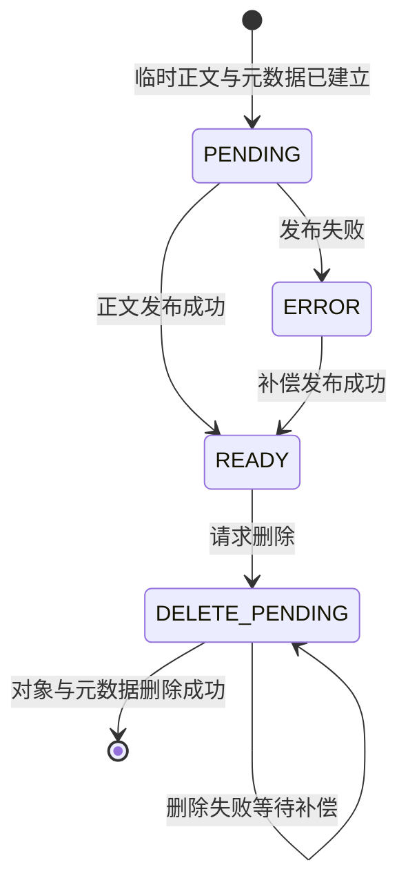

关键约束：

- 自动采集版本以 `(collect_task, instance_id, version)` 为业务唯一键。
- 同业务键、同正文是幂等重投；同业务键、不同正文是协议冲突，不覆盖旧数据。
- 正文读取和 diff 必须分别校验两个版本所属实例的读取权限，并拒绝跨实例或跨文件比较。

### 4.6 订阅检测与可靠通知流程

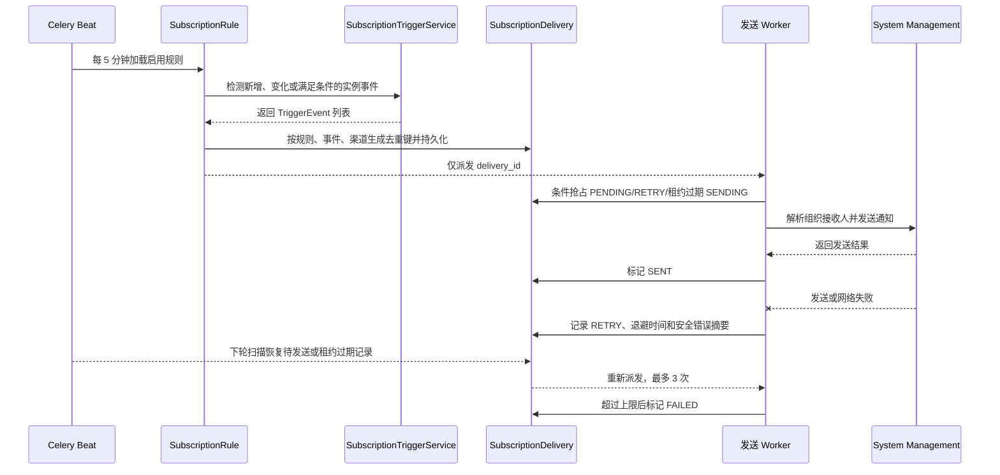

投递状态：

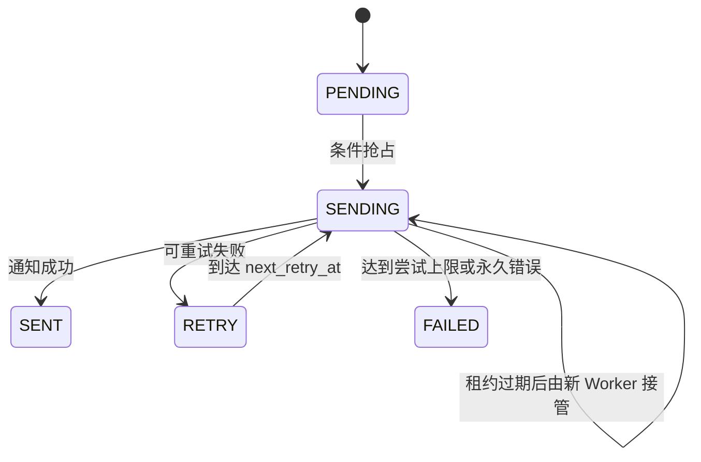

### 4.7 IPAM 对账流程

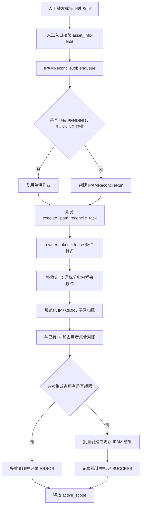

关键语义：

- `active_scope='global'` 的可空唯一值在关系库中裁决全局单活，避免多个全量对账同时执行。
- 扫描采用 ID 游标和批次上限，不依赖全量加载或重复 COUNT。
- 来源 CI、子网、已有 IP 和占用者都有资源上限，超过上限时失败关闭而不是继续无界占用内存。
- 日志和数据库只保存脱敏错误摘要，不持久化 broker 连接信息或凭据。

### 4.8 K8s 与应用资源视图流程

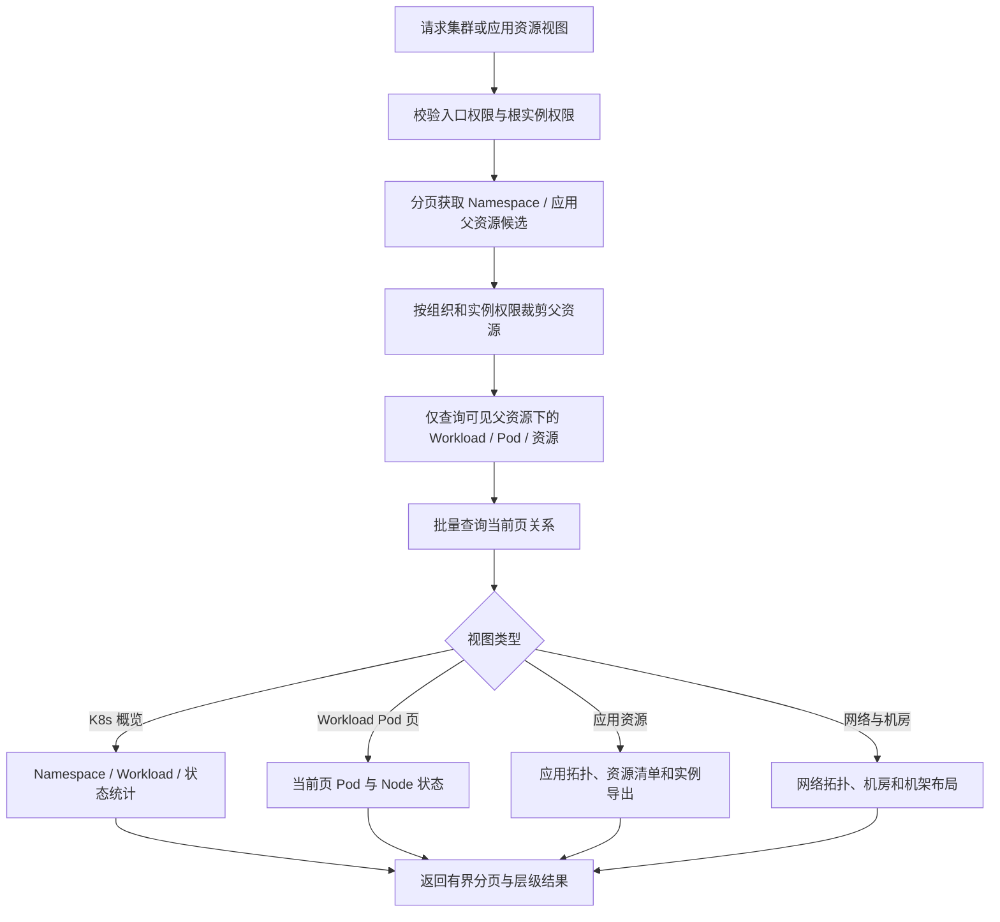

查询原则：

- 默认概览不加载全量 Pod，只读取概览所需的父层和批量关系。
- Workload Pod 页只查询当前页 Pod，并批量查询当前页 Pod 到 Node 的关系。
- 不可见父资源的子资源不会进入候选集合，避免通过子资源名称或数量泄露父级存在性。

### 4.9 自定义上报流程

> 自定义上报通过社区层稳定入口加载 Enterprise 实现；Enterprise 不可用时由兼容层维持 Django migration/runtime 注册一致性。

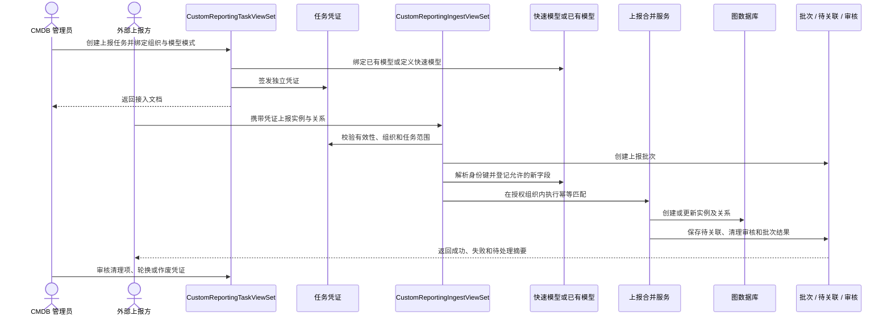

### 4.10 变更记录与跨模块镜像流程

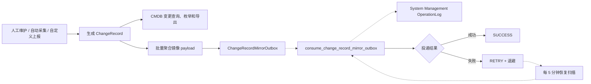

批量变更记录不在采集主任务中逐条同步调用下游 RPC；主链路只写持久化 Outbox，由 Worker 有界消费、租约接管和失败退避。

## 5. 业务状态与异常处理总览

| 业务链路 | 幂等或并发控制 | 失败处理 | 恢复入口 |
|---|---|---|---|
| 实例创建/更新 | `operator + Idempotency-Key`；唯一规则租约锁；图写 owner | 图写失败进入 `ERROR`；后置事件进入 `RETRY/FAILED` | `reconcile_cmdb_operations_task` |
| 自动采集 | `CollectModels.task_id` 执行代次；数据库条件抢占 | 当前执行写安全错误摘要；旧执行结果被忽略 | `sync_periodic_update_task_status` |
| 配置正文 | 业务唯一键；正式对象内容哈希比对 | 保留 `PENDING/ERROR/DELETE_PENDING` 和临时键 | `reconcile_config_file_content_task` |
| 订阅通知 | SHA-256 去重键；投递 owner 与租约 | 3 次退避重试，永久错误进入 `FAILED` | `check_subscription_rules` 的恢复扫描 |
| IPAM 对账 | `active_scope='global'` 单活；owner 与租约 | 超限或执行异常进入 `ERROR` 并释放单活键 | `reconcile_ipam_task` |
| 审计镜像 | Outbox event_id；owner 与租约 | 有界重试、退避、安全错误摘要 | `recover_change_record_mirror_outbox_task` |

## 6. 外部系统交互

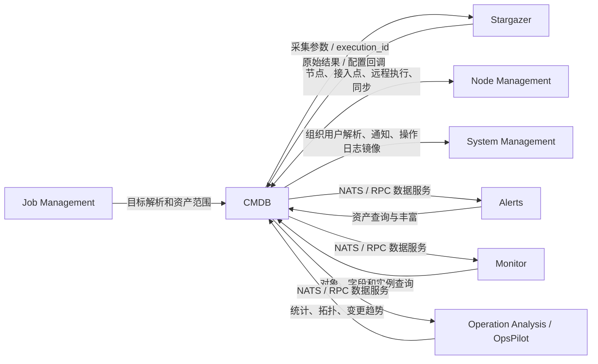

主要 NATS/RPC 能力包括：

- 模型、字段、分类、实例和关系查询。
- 带授权范围的实例创建、更新、删除和批量搜索。
- 配置文件与凭据命中结果回调。
- CMDB 统计、模型实例统计、采集统计和变更趋势。
- 机房 3D 布局、模型实例数量和展示字段同步。

## 7. API 与代码入口索引

| 业务域 | HTTP 入口 | 核心服务/实现 | 主要持久化对象 |
|---|---|---|---|
| 分类 | `api/classification` | `services/classification.py` | 图数据库分类节点 |
| 模型治理 | `api/model` | `services/model.py`、`views/model.py` | 图数据库模型、字段、关系和规则 |
| 实例与拓扑 | `api/instance` | `services/instance.py`、`services/operation_service.py` | 图实例/关系、`CmdbOperation`、Outbox |
| 采集任务 | `api/collect` | `services/collect_service.py`、`collection/` | `CollectModels`、凭据命中状态 |
| 采集调试 | `api/collect_tool` | `services/collect_tool_service.py` | 调试缓存与任务结果 |
| 配置文件 | `api/config_file_versions` | `services/config_file_service.py`、`config_file_content_lifecycle.py` | `ConfigFileVersion`、MinIO 正文 |
| 变更记录 | `api/change_record` | `utils/change_record.py`、`change_record_mirror.py` | `ChangeRecord`、Mirror Outbox |
| 订阅 | `api/subscription` | `subscription_trigger.py`、`subscription_task.py` | `SubscriptionRule`、`SubscriptionDelivery` |
| IPAM | `api/instance/ipam_*` | `ipam_reconcile.py`、`ipam_reconcile_job.py` | 图实例、`IPAMReconcileSource/Run` |
| K8s 安装与资源 | `api/k8s_setup`、`api/instance/*k8s*` | `k8s_setup.py`、`k8s_resource_overview.py` | 图实例与关系、安装令牌缓存 |
| 应用资源 | `api/instance/*application_resource*` | `application_resource_overview.py` | 图实例与关系 |
| Node 同步 | `api/node_mgmt_sync` | `node_mgmt_sync_service.py` | `NodeMgmtSyncConfig/Run` |
| 字段展示治理 | `api/field_groups`、`api/public_enum_libraries` | `field_group.py`、`display_field/` | `FieldGroup`、`ShowField`、`PublicEnumLibrary` |
| 用户配置 | `api/user_configs` | `views/user_personal_config.py` | `UserPersonalConfig` |
| 自定义上报 | `api/custom_reporting/tasks`、`api/custom_reporting/ingest` | `custom_reporting/` 与 Enterprise Overlay | 上报任务、批次、待关联、凭证和审核数据 |
| 跨模块服务 | `apps/cmdb/nats/nats.py` | NATS 注册函数 | 图数据、关系库统计和下游响应 |

## 8. Celery 调度与恢复矩阵

| 调度项 | 周期 | 业务作用 |
|---|---:|---|
| `sync_periodic_update_task_status` | 每 5 分钟 | 关闭超时采集任务，防止任务永久停留在执行中 |
| `check_subscription_rules` | 每 5 分钟 | 检测订阅规则，并恢复待发送或租约过期投递 |
| `daily_data_cleanup_task` | 每日 02:00 | 按清理策略处理过期采集数据 |
| `reconcile_ipam_task` | 每小时 | 创建或复用全局 IPAM 对账作业 |
| `reconcile_config_file_content_task` | 每 15 分钟 | 补偿配置正文发布、删除和临时对象清理 |
| `reconcile_cmdb_operations_task` | 每 5 分钟 | 恢复跨图/关系库实例操作及后置 Outbox |
| `recover_change_record_mirror_outbox_task` | 每 5 分钟 | 恢复批量变更记录镜像投递 |

## 9. 架构约束与维护原则

1. 图数据库是模型、实例和关系的主数据源；关系库用于承载流程状态，不能在两个存储中维护互相竞争的实例真相。
2. 所有 HTTP、Open API 和 NATS 写入口都必须在服务端校验授权范围，调用方传入的组织 ID 不能直接作为可信边界。
3. 跨存储和跨服务副作用必须通过状态机、Outbox、`transaction.on_commit` 或补偿任务收敛，不能依赖一次同步调用必然成功。
4. 自动采集和对账必须有批次、游标、超时、资源上限和幂等语义，禁止无界全量加载。
5. 业务错误应区分权限拒绝、协议冲突、凭据失败、任务失败、超时、部分成功和待补偿，避免统一压缩成模糊的成功/失败。
6. 新增模型、采集类型或专项视图时，应复用现有 `ViewSet → Service → Graph/ORM → Outbox/Task` 链路，并补充权限、状态转换和异常恢复测试。
