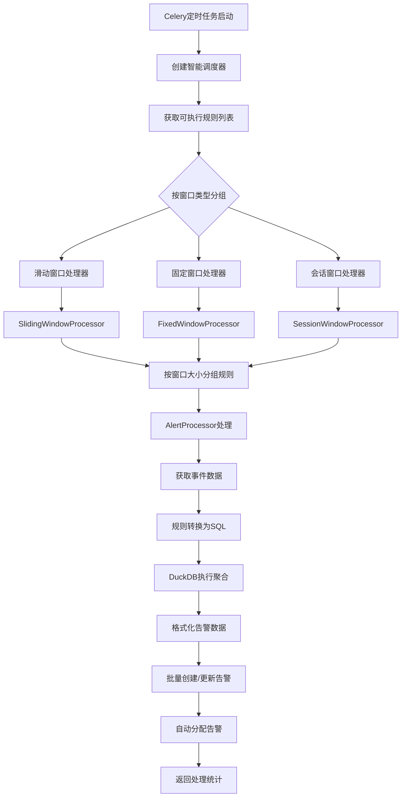

# 告警聚合任务执行流程文档

## 概述

`event_aggregation_alert` 是告警系统的核心周期任务，负责将原始事件（Event）按照预定义的规则聚合为告警（Alert）。该任务采用多窗口类型处理架构，支持滑动窗口、固定窗口、会话窗口三种聚合策略，通过DuckDB引擎进行高性能的事件数据分析和聚合。

## 整体架构流程图



## 详细执行流程

### 1. 任务启动阶段

#### 1.1 任务入口
```python
@shared_task
def event_aggregation_alert():
    """按窗口类型分组执行的聚合任务"""
    logger.info("开始执行多窗口类型聚合任务")
```

**执行频率**：通常每分钟执行一次（通过Celery Beat调度）

#### 1.2 导入核心组件
```python
from apps.alerts.common.rules.rule_manager import create_smart_scheduler
from apps.alerts.common.aggregation.agg_window import WindowProcessorFactory
```

**关键组件**：
- `SmartWindowScheduler`: 智能调度器，判断当前时间应执行哪些规则
- `WindowProcessorFactory`: 窗口处理器工厂，创建不同类型的窗口处理器

### 2. 规则调度阶段

#### 2.1 创建智能调度器
```python
scheduler = create_smart_scheduler()
executable_rules = scheduler.get_executable_rules()
```

**调度逻辑**：
- **滑动窗口**：每分钟都执行
- **固定窗口**：按时间对齐执行（如每5分钟的整点时刻）
- **会话窗口**：根据超时配置判断执行时机

#### 2.2 时间对齐判断（固定窗口）
```python
def should_execute_fixed_window(self, window_size: str, alignment: str = 'minute') -> bool:
    window_minutes = self.parse_window_size_to_minutes(window_size)
    
    if alignment == 'minute':
        current_minute = self.current_time.minute
        return current_minute % window_minutes == 0
```

**示例**：
- 5分钟窗口：在0, 5, 10, 15, 20, 25... 分钟时执行
- 15分钟窗口：在0, 15, 30, 45分钟时执行

### 3. 窗口处理阶段

#### 3.1 按窗口类型顺序处理
```python
window_order = ['sliding', 'fixed', 'session']

for window_type in window_order:
    rules_to_execute = executable_rules.get(window_type, [])
    if not rules_to_execute:
        continue
        
    alerts_created, alerts_updated = WindowProcessorFactory.process_window_type_rules(
        window_type=window_type,
        rules=rules_to_execute
    )
```

**处理顺序说明**：
1. **滑动窗口**：实时性要求最高，优先处理
2. **固定窗口**：定期统计，中等优先级
3. **会话窗口**：复杂逻辑，最后处理

#### 3.2 三种窗口类型的实际执行差异

##### 3.2.1 滑动窗口处理流程
```python
class SlidingWindowProcessor(BaseWindowProcessor):
    def process_rules(self, rules: List[CorrelationRules]) -> Tuple[int, int]:
        # 每分钟都执行，处理最近N分钟的数据
        for window_size, size_rules in grouped_rules.items():
            processor = AlertProcessor(window_size=window_size)
            # 查询时间范围：NOW() - window_size 到 NOW()
            batch_alerts, batch_updates = processor._process_batch_correlation_rules(
                size_rules, "sliding"
            )
```

**执行特点**：
- **时间窗口**：每分钟查询最近N分钟的数据（如最近5分钟）
- **数据重叠**：连续两次执行会有4分钟的数据重叠
- **触发频率**：高频触发，适合实时监控
- **示例场景**：网站每分钟检查，5分钟内出现3次失败就告警

##### 3.2.2 固定窗口处理流程
```python  
class FixedWindowProcessor(BaseWindowProcessor):
    def process_rules(self, rules: List[CorrelationRules]) -> Tuple[int, int]:
        # 只在时间对齐点执行（如每5分钟的整点）
        for window_size, size_rules in grouped_rules.items():
            if not self._should_execute_at_current_time(window_size):
                continue  # 不到执行时间，跳过
            processor = AlertProcessor(window_size=window_size)
            # 查询精确的窗口时间范围，无重叠
            batch_alerts, batch_updates = processor._process_batch_correlation_rules(
                size_rules, "fixed"
            )
```

**执行特点**：
- **时间窗口**：严格按时间边界切分（如10:00-10:05, 10:05-10:10）
- **数据重叠**：无重叠，每个事件只被处理一次
- **触发频率**：按窗口大小间隔触发（如每5分钟）
- **示例场景**：每15分钟统计一次错误率，避免重复计算

##### 3.2.3 会话窗口处理流程
```python
class SessionWindowProcessor(BaseWindowProcessor):
    def process_rules(self, rules: List[CorrelationRules]) -> Tuple[int, int]:
        # 基于事件间隔和超时逻辑动态执行
        for rule in rules:
            session_timeout = rule.session_timeout  # 如10分钟
            # 查询活跃会话和超时会话
            active_sessions = self._find_active_sessions(rule)
            timeout_sessions = self._find_timeout_sessions(rule, session_timeout)
            
            # 处理超时的会话
            if timeout_sessions:
                processor = AlertProcessor(window_size=session_timeout)
                batch_alerts, batch_updates = processor._process_session_rules(
                    timeout_sessions, "session"
                )
```

**执行特点**：
- **时间窗口**：动态窗口，基于事件活动模式
- **数据重叠**：无重叠，基于会话状态管理
- **触发频率**：当会话超时或满足关闭条件时触发
- **示例场景**：Jenkins构建失败后10分钟无操作就告警

#### 3.3 窗口处理器创建
```python
class WindowProcessorFactory:
    _processors = {
        'sliding': SlidingWindowProcessor,
        'fixed': FixedWindowProcessor, 
        'session': SessionWindowAggProcessor
    }
    
    @classmethod
    def create_processor(cls, window_type: str) -> BaseWindowProcessor:
        processor_class = cls._processors[window_type]
        return processor_class(window_size=window_size)
```

### 4. 事件数据获取阶段

#### 4.1 查询时间范围计算
```python
def get_events_for_correlation_rule(self, correlation_rule: CorrelationRules) -> pd.DataFrame:
    if correlation_rule.window_type == 'sliding':
        # 滑动窗口：查询窗口大小内的数据
        window_delta = WindowCalculator.parse_time_str(correlation_rule.window_size)
        start_time = self.now - window_delta
    elif correlation_rule.window_type == 'fixed':
        # 固定窗口：查询足够大的范围以支持对齐计算
        window_delta = WindowCalculator.parse_time_str(correlation_rule.window_size) 
        start_time = self.now - window_delta * 2
    elif correlation_rule.window_type == 'session':
        # 会话窗口：查询更大的范围以支持会话分析
        max_window = WindowCalculator.parse_time_str(self.default_window_size)
        start_time = self.now - max_window
```

#### 4.2 事件数据过滤
```python
instances = Event.objects.filter(
    received_at__gte=start_time,
    received_at__lt=self.now,
    source__is_active=True
).exclude(
    status=EventStatus.SHIELD, 
    alert__status__in=AlertStatus.ACTIVATE_STATUS
).values(*self.event_fields)
```

**过滤条件**：
- 时间范围内的事件
- 来源处于激活状态
- 排除已屏蔽的事件
- 排除已关联激活告警的事件

#### 4.3 事件数据格式化
```python
def format_event_df(event_df: pd.DataFrame) -> pd.DataFrame:
    if event_df.empty:
        return event_df
    
    # 添加指纹字段用于聚合
    event_df['fingerprint'] = event_df.apply(
        lambda row: generate_instance_fingerprint({
            "resource_id": row["resource_id"],
            "item": row["item"], 
            "source_id": row["source_id"],
            "rule_id": row["rule_id"]
        }), axis=1
    )
    
    # 标准化级别字段
    event_df["level"] = event_df["level"].apply(lambda x: int(x))
    
    return event_df
```

### 5. 规则转换与SQL生成阶段

#### 5.1 规则转换流程
```python
# JSONRuleConverter: JSON配置 → TemplateContext
converter = JSONRuleConverter()
context = converter.convert_aggregation_rule_to_context(aggregation_rule)

# TemplateEngine: TemplateContext → DuckDB SQL
template_engine = TemplateEngine()
sql = template_engine.render_sql(context)
```

#### 5.2 模板上下文构建
```python
@dataclass
class TemplateContext:
    table: str = 'alerts_event'
    time_column: str = 'received_at'
    window_size: int = 10
    window_type: str = 'fixed'
    resource_filters: List[FilterCondition] = []
    threshold_conditions: List[FilterCondition] = []
    group_by_fields: List[str] = []
    aggregation_rules: AggregationRules = None
```

#### 5.3 三种窗口类型的聚合方式详解

根据窗口类型选择不同的聚合策略和SQL模板，每种窗口类型都有其独特的聚合逻辑和适用场景：

##### 5.3.1 滑动窗口（Sliding Window）聚合方式

**核心特点**：
- 窗口持续滑动，每分钟执行一次
- 窗口之间存在重叠，同一事件可能被多次处理
- 实时性强，能快速响应问题

**聚合逻辑**：
1. 查询最近N分钟的事件数据
2. 按分组字段（如资源ID+指标）进行聚合
3. 每次执行都处理完整的窗口数据
4. 可能产生重复告警，但保证实时性

**SQL模板示例**：
```sql
WITH sliding_window AS (
    SELECT *,
           ROW_NUMBER() OVER (
               PARTITION BY resource_id, item, level 
               ORDER BY received_at DESC
           ) as rn
    FROM alerts_event
    WHERE received_at >= NOW() - INTERVAL '{{window_size}} minutes'
      AND received_at < NOW() - INTERVAL '{{slide_interval - 1}} minutes'
      AND status = 'received'
      AND {{resource_filters}}
),
aggregated_events AS (
    SELECT 
        CONCAT('SW-', DATE_TRUNC('minute', MIN(received_at)), '-', 
               COALESCE(resource_id, 'unknown'), '-', 
               COALESCE(item, 'unknown')) as window_id,
        MIN(received_at) as window_start,
        MAX(received_at) as window_end,
        resource_id,
        resource_type,
        resource_name,
        item,
        level,
        COUNT(*) as event_count,
        ARRAY_AGG(event_id ORDER BY received_at) as event_ids,
        ARRAY_AGG(title ORDER BY received_at) as event_titles,
        -- 合并标签信息
        REDUCE(ARRAY_AGG(labels), CAST(NULL AS JSON), 
               (acc, x) -> CASE WHEN acc IS NULL THEN x 
                          ELSE JSON_MERGE_PATCH(acc, x) END) as merged_labels,
        -- 统计聚合
        AVG(value) as avg_value,
        MIN(value) as min_value,
        MAX(value) as max_value,
        STDDEV(value) as stddev_value,
        -- 自定义聚合函数
        {{custom_aggregations}}
    FROM sliding_window
    GROUP BY resource_id, resource_type, resource_name, item, level
    HAVING COUNT(*) >= {{min_event_count}}
)
SELECT * FROM aggregated_events
WHERE {{threshold_conditions}}
ORDER BY window_start DESC, event_count DESC
```

**应用场景**：
- 实时故障监控：网站可用性、API响应时间
- 安全事件检测：异常登录、恶意访问
- 性能指标监控：CPU/内存使用率超阈值

##### 5.3.2 固定窗口（Fixed Window）聚合方式

**核心特点**：
- 窗口边界严格按时间对齐（如每5分钟、每15分钟）
- 窗口之间不重叠，每个事件只属于一个窗口
- 避免重复告警，资源消耗较低

**聚合逻辑**：
1. 计算时间对齐的窗口边界
2. 只在窗口完全结束后才处理该窗口数据
3. 每个时间点的事件只被处理一次
4. 支持历史窗口数据的补偿处理

**SQL模板示例**：
```sql
WITH fixed_window_boundaries AS (
    -- 计算固定窗口边界，确保时间对齐
    SELECT 
        DATE_TRUNC('minute', 
            DATE_SUB(NOW(), INTERVAL MOD(EXTRACT(MINUTE FROM NOW()), {{window_size}}) MINUTE)
        ) as current_window_end,
        DATE_TRUNC('minute', 
            DATE_SUB(NOW(), INTERVAL ({{window_size}} + MOD(EXTRACT(MINUTE FROM NOW()), {{window_size}})) MINUTE)
        ) as current_window_start
),
windowed_events AS (
    SELECT 
        e.*,
        -- 计算每个事件属于哪个窗口
        DATE_TRUNC('minute', 
            DATE_SUB(e.received_at, 
                INTERVAL MOD(EXTRACT(MINUTE FROM e.received_at), {{window_size}}) MINUTE)
        ) as window_end,
        DATE_TRUNC('minute', 
            DATE_SUB(e.received_at, 
                INTERVAL ({{window_size}} + MOD(EXTRACT(MINUTE FROM e.received_at), {{window_size}})) MINUTE)
        ) as window_start
    FROM alerts_event e, fixed_window_boundaries b
    WHERE e.received_at >= b.current_window_start
      AND e.received_at < b.current_window_end
      AND e.status = 'received'
      AND {{resource_filters}}
),
aggregated_events AS (
    SELECT 
        CONCAT('FW-', window_start, '-', 
               COALESCE(resource_id, 'unknown'), '-', 
               COALESCE(item, 'unknown')) as window_id,
        window_start,
        window_end,
        resource_id,
        resource_type,
        resource_name,
        item,
        level,
        COUNT(*) as event_count,
        ARRAY_AGG(event_id ORDER BY received_at) as event_ids,
        -- 时间序列聚合
        MIN(received_at) as first_event_time,
        MAX(received_at) as last_event_time,
        -- 级别聚合（取最高级别）
        MIN(level) as max_severity_level,
        -- 值的统计聚合
        SUM(value) as total_value,
        AVG(value) as avg_value,
        COUNT(DISTINCT resource_name) as affected_resources,
        -- 自定义聚合函数
        {{custom_aggregations}}
    FROM windowed_events
    GROUP BY window_start, window_end, resource_id, resource_type, resource_name, item, level
    HAVING COUNT(*) >= {{min_event_count}}
)
SELECT * FROM aggregated_events  
WHERE {{threshold_conditions}}
ORDER BY window_start DESC, event_count DESC
```

**应用场景**：
- 定期报表统计：每小时错误率、每日性能指标
- 批量数据处理：日志分析、指标汇总
- SLA监控：服务可用性统计、响应时间分析

##### 5.3.3 会话窗口（Session Window）聚合方式

**核心特点**：
- 基于事件间隔动态调整窗口大小
- 检测"活动停止"或"连续活动"状态
- 支持会话关闭条件和智能超时

**聚合逻辑**：
1. 按会话键（如资源ID+指标）分组事件
2. 基于时间间隔判断会话的开始和结束
3. 支持显式关闭条件（如成功事件关闭失败会话）
4. 超时自动关闭长时间无活动的会话

**SQL模板示例**：
```sql
WITH session_events AS (
    SELECT *,
           -- 计算与前一个事件的时间间隔
           LAG(received_at) OVER (
               PARTITION BY {{session_key_fields}} 
               ORDER BY received_at
           ) as prev_event_time,
           -- 判断是否是新会话的开始
           CASE WHEN 
               LAG(received_at) OVER (
                   PARTITION BY {{session_key_fields}} 
                   ORDER BY received_at
               ) IS NULL 
               OR EXTRACT(EPOCH FROM (received_at - LAG(received_at) OVER (
                   PARTITION BY {{session_key_fields}} 
                   ORDER BY received_at
               ))) > {{session_gap_seconds}}
           THEN 1 ELSE 0 END as is_session_start
    FROM alerts_event
    WHERE received_at >= NOW() - INTERVAL '{{max_session_duration}} minutes'
      AND status = 'received'
      AND {{resource_filters}}
),
session_groups AS (
    SELECT *,
           -- 计算会话ID（累计会话开始标记）
           SUM(is_session_start) OVER (
               PARTITION BY {{session_key_fields}} 
               ORDER BY received_at 
               ROWS UNBOUNDED PRECEDING
           ) as session_group_id
    FROM session_events
),
active_sessions AS (
    SELECT 
        CONCAT('SESS-', {{session_key_fields}}, '-', session_group_id) as session_id,
        MIN(received_at) as session_start,
        MAX(received_at) as session_end,
        resource_id,
        resource_type, 
        resource_name,
        item,
        level,
        COUNT(*) as event_count,
        ARRAY_AGG(event_id ORDER BY received_at) as event_ids,
        -- 会话持续时间
        EXTRACT(EPOCH FROM (MAX(received_at) - MIN(received_at)))/60 as session_duration_minutes,
        -- 最后一个事件到现在的时间间隔
        EXTRACT(EPOCH FROM (NOW() - MAX(received_at)))/60 as idle_minutes,
        -- 失败和成功事件统计
        COUNT(*) FILTER (WHERE value = 0) as failure_count,
        COUNT(*) FILTER (WHERE value = 1) as success_count,
        -- 判断会话是否应该超时关闭
        CASE WHEN EXTRACT(EPOCH FROM (NOW() - MAX(received_at)))/60 > {{session_timeout_minutes}}
             THEN 1 ELSE 0 END as is_timeout,
        -- 判断是否有显式关闭条件
        CASE WHEN COUNT(*) FILTER (WHERE {{session_close_condition}}) > 0
             THEN 1 ELSE 0 END as has_close_event,
        -- 自定义聚合函数  
        {{custom_aggregations}}
    FROM session_groups
    GROUP BY session_group_id, resource_id, resource_type, resource_name, item, level
),
timeout_sessions AS (
    -- 筛选超时且未显式关闭的会话
    SELECT *
    FROM active_sessions
    WHERE is_timeout = 1 
      AND has_close_event = 0
      AND event_count >= {{min_event_count}}
      AND {{threshold_conditions}}
)
SELECT * FROM timeout_sessions
ORDER BY session_start DESC, event_count DESC
```

**会话关闭逻辑**：
```sql
-- 示例：Jenkins构建失败后收到成功事件则关闭会话
session_close_condition: |
    resource_type = 'jenkins' 
    AND item = 'jenkins_build_status' 
    AND value = 1
```

**应用场景**：
- CI/CD故障跟踪：构建失败后无人工干预检测
- 服务故障分析：服务异常后恢复状态检测
- 用户行为分析：用户活动会话超时检测
- 安全事件关联：攻击行为的持续时间分析

#### 5.4 三种窗口类型时间线对比实例

假设有一个网站监控场景，窗口大小均为5分钟，以下是三种窗口类型在相同时间线上的处理差异：

```
时间线：10:00 -> 10:01 -> 10:02 -> 10:03 -> 10:04 -> 10:05 -> 10:06 -> 10:07
事件：   E1      E2      E3      E4      E5      E6      E7      E8
```

##### 滑动窗口（5分钟窗口，每分钟滑动）
```
10:01执行: 查询[09:56-10:01] → 处理E1
10:02执行: 查询[09:57-10:02] → 处理E1,E2  
10:03执行: 查询[09:58-10:03] → 处理E1,E2,E3
10:04执行: 查询[09:59-10:04] → 处理E1,E2,E3,E4
10:05执行: 查询[10:00-10:05] → 处理E1,E2,E3,E4,E5
10:06执行: 查询[10:01-10:06] → 处理E2,E3,E4,E5,E6
```
**特点**：每次都处理最近5分钟数据，E2-E5会被多次处理

##### 固定窗口（5分钟窗口，整点对齐）
```
10:00执行: 查询[09:55-10:00] → 处理上个窗口数据
10:05执行: 查询[10:00-10:05] → 处理E1,E2,E3,E4,E5
10:10执行: 查询[10:05-10:10] → 处理E6,E7,E8,E9,E10
```
**特点**：严格按时间边界，每个事件只被处理一次

##### 会话窗口（5分钟超时）
```
E1发生(10:00): 开始会话SESS-1
E2发生(10:01): 续延会话SESS-1 (间隔1分钟<5分钟)
E3发生(10:02): 续延会话SESS-1 (间隔1分钟<5分钟)
...无新事件...
10:07检查: SESS-1超时(最后事件10:02, 已超过5分钟) → 触发告警
E6发生(10:05): 开始新会话SESS-2
```
**特点**：基于事件活动模式动态调整，适合检测"无人处理"场景

#### 5.5 窗口类型对比总结

| 窗口类型 | 执行频率 | 数据重叠 | 实时性 | 资源消耗 | 适用场景 |
|---------|----------|----------|--------|----------|----------|
| 滑动窗口 | 每分钟 | 有重叠 | 高 | 高 | 实时监控、快速响应 |
| 固定窗口 | 按对齐时间 | 无重叠 | 中等 | 低 | 定期统计、批量处理 |
| 会话窗口 | 动态 | 无重叠 | 低 | 中等 | 故障跟踪、行为分析 |

**选择建议**：
- **实时告警**：选择滑动窗口，如网站可用性监控
- **定期报表**：选择固定窗口，如每小时错误统计
- **故障跟踪**：选择会话窗口，如CI/CD流水线故障分析

**实际业务场景示例**：

1. **网站监控**（滑动窗口）：
   - 规则：5分钟内出现3次HTTP 500错误
   - 效果：快速发现问题，可能重复告警但保证及时性

2. **服务器性能统计**（固定窗口）：
   - 规则：每15分钟统计CPU使用率超80%的次数
   - 效果：准确统计，无重复计算，适合报表

3. **CI/CD故障处理**（会话窗口）：
   - 规则：构建失败后10分钟内无成功事件则告警
   - 效果：智能检测无人处理的故障，避免误报

### 6. DuckDB执行阶段

#### 6.1 DuckDB引擎初始化
```python
class DuckDBEngine:
    def __init__(self, connection_params: dict = None):
        self.database = ':memory:'  # 内存数据库
        self.connection = duckdb.connect(database=self.database)
```

**DuckDB优势**：
- 内存分析数据库，OLAP查询性能优异
- 支持复杂的窗口函数和聚合操作
- 与Pandas无缝集成
- 支持JSON数据处理

#### 6.2 数据加载与查询
```python
def execute_aggregation_query(self, event_df: pd.DataFrame, sql: str) -> pd.DataFrame:
    # 将Pandas DataFrame注册为DuckDB表
    self.connection.register('alerts_event', event_df)
    
    # 执行聚合查询
    result = self.connection.execute(sql).fetchdf()
    
    return result
```

#### 6.3 聚合结果处理
执行SQL后，DuckDB返回聚合后的DataFrame，包含：
- `window_id`: 窗口标识
- `event_count`: 事件数量
- `resource_id/resource_type/resource_name`: 资源信息
- `window_start/window_end`: 窗口时间范围
- `merged_labels`: 合并的标签信息
- `custom_aggregations`: 自定义聚合结果

### 7. 告警生成阶段

#### 7.1 告警格式化
```python
def format_aggregated_result_to_alert(self, agg_result_df: pd.DataFrame, rule: dict) -> List[Dict]:
    format_alert_list = []
    
    for _, row in agg_result_df.iterrows():
        # 生成告警标题和内容
        formatted_title, formatted_content = format_alert_message(rule, row.to_dict())
        
        alert_data = {
            'alert_id': f"ALERT-{uuid.uuid4().hex.upper()}",
            'title': formatted_title,
            'content': formatted_content,
            'level': rule.get('severity', 'warning'),
            'fingerprint': row.get('fingerprint', ''),
            'resource_id': row.get('resource_id'),
            'resource_type': row.get('resource_type'),
            'resource_name': row.get('resource_name'),
            'labels': row.get('merged_labels', {}),
            'first_event_time': row.get('window_start'),
            'last_event_time': row.get('window_end'),
            'event_ids': row.get('event_ids', []),
            'stats': {
                'event_count': row.get('event_count', 0),
                'window_type': row.get('window_type'),
                'custom_metrics': row.get('custom_aggregations', {})
            }
        }
        format_alert_list.append(alert_data)
    
    return format_alert_list
```

#### 7.2 告警模板渲染
```python
def format_template_string(template: str, data: Dict[str, Any]) -> str:
    """格式化模板字符串中的变量"""
    result = template
    for key, value in data.items():
        placeholder = "${" + key + "}"
        result = result.replace(placeholder, str(value))
    return result
```

**模板变量示例**：
- `${resource_name}`: 资源名称
- `${event_count}`: 事件数量
- `${window_start}`: 窗口开始时间
- `${failure_count}`: 失败次数（自定义聚合）

### 8. 告警存储阶段

#### 8.1 批量创建告警
```python
def bulk_create_alerts(self, alerts: List[Dict[str, Any]]) -> List[str]:
    alert_objects = []
    
    for alert_data in alerts:
        alert_obj = Alert(
            alert_id=alert_data['alert_id'],
            title=alert_data['title'],
            content=alert_data['content'],
            level=alert_data['level'],
            fingerprint=alert_data['fingerprint'],
            # ... 其他字段
        )
        alert_objects.append(alert_obj)
    
    # 批量创建，提高性能
    created_alerts = Alert.objects.bulk_create(alert_objects, ignore_conflicts=True)
    return [alert.alert_id for alert in created_alerts]
```

#### 8.2 关联事件数据
```python
# 为每个告警关联相关事件
for alert_data in alerts:
    alert = Alert.objects.get(alert_id=alert_data['alert_id'])
    event_ids = alert_data.get('event_ids', [])
    
    if event_ids:
        events = Event.objects.filter(event_id__in=event_ids)
        alert.events.set(events)
```

#### 8.3 告警更新处理
```python
def update_alerts(self, alerts: List[Dict[str, Any]]):
    """更新现有告警"""
    for alert_data in alerts:
        Alert.objects.filter(
            fingerprint=alert_data['fingerprint'],
            status__in=AlertStatus.ACTIVATE_STATUS
        ).update(
            last_event_time=alert_data['last_event_time'],
            updated_at=timezone.now(),
            labels=alert_data['labels']
        )
```

### 9. 告警分配阶段

#### 9.1 自动分配逻辑
```python
def alert_auto_assign(self, alert_id_list: List[str]):
    """告警自动分配"""
    try:
        execute_auto_assignment_for_alerts(alert_id_list)
        logger.info(f"自动分配完成，处理告警数量: {len(alert_id_list)}")
    except Exception as e:
        logger.error(f"告警自动分配失败: {str(e)}")
```

**分配策略**：
- 基于资源类型的默认分配规则
- 基于标签的智能分配
- 基于历史处理记录的分配
- 轮询分配机制

### 10. 统计与监控阶段

#### 10.1 处理统计收集
```python
processing_stats[window_type] = {
    'rules_count': len(rules_to_execute),
    'alerts_created': alerts_created,
    'alerts_updated': alerts_updated,
    'status': 'success'
}
```

#### 10.2 最终结果汇总
```python
total_created = 0
total_updated = 0

for window_type, stats in processing_stats.items():
    if stats['status'] == 'success':
        created = stats.get('alerts_created', 0)
        updated = stats.get('alerts_updated', 0)
        total_created += created
        total_updated += updated
        
logger.info(f"多窗口类型聚合任务执行完成，总计: 新建告警={total_created}, 更新告警={total_updated}")
```

## 性能优化策略

### 1. 数据库查询优化
- **索引优化**：在`received_at`, `status`, `fingerprint`等字段上建立索引
- **分页查询**：大数据量时采用分页处理
- **批量操作**：使用`bulk_create`和`bulk_update`提升写入性能

### 2. 内存管理
- **DuckDB内存限制**：设置合理的内存使用上限
- **DataFrame处理**：及时释放不需要的DataFrame对象
- **分批处理**：按窗口大小分组，避免一次性处理过多数据

### 3. 并发控制
- **窗口类型串行**：不同窗口类型顺序执行，避免数据竞争
- **规则并行**：同一窗口类型内的规则可以并行处理
- **事务管理**：合理使用数据库事务，确保数据一致性

### 4. 错误处理与容错
```python
try:
    alerts_created, alerts_updated = WindowProcessorFactory.process_window_type_rules(
        window_type=window_type,
        rules=rules_to_execute
    )
except Exception as e:
    logger.error(f"{window_type} 窗口类型处理失败: {str(e)}")
    processing_stats[window_type] = {
        'rules_count': len(rules_to_execute),
        'status': 'failed',
        'error': str(e)
    }
```

## 监控与告警

### 1. 任务执行监控
- **执行时间监控**：记录每个阶段的执行耗时
- **成功率监控**：统计任务成功和失败次数
- **资源使用监控**：监控内存和CPU使用情况

### 2. 业务指标监控
- **告警生成率**：每分钟产生的告警数量
- **事件处理率**：每分钟处理的事件数量
- **规则执行率**：各类规则的执行频率和成功率

### 3. 异常告警
- **任务执行失败**：任务异常中断或超时
- **数据异常**：事件数据格式错误或缺失
- **性能异常**：执行时间超过阈值或内存使用过高

## 扩展性设计

### 1. 新增窗口类型
通过实现`BaseWindowProcessor`接口，可以轻松添加新的窗口类型：
```python
class CustomWindowProcessor(BaseWindowProcessor):
    def get_window_type(self) -> str:
        return "custom"
    
    def process_rules(self, rules: List[CorrelationRules]) -> Tuple[int, int]:
        # 自定义处理逻辑
        pass
```

### 2. 自定义聚合函数
在规则配置中添加新的聚合函数：
```json
{
    "custom_aggregations": {
        "custom_metric": "CUSTOM_FUNCTION(field_name)",
        "business_kpi": "COMPLEX_CALCULATION(field1, field2)"
    }
}
```

### 3. 插件化架构
支持通过插件方式扩展：
- 自定义事件来源适配器
- 自定义告警通知渠道
- 自定义聚合算法

这套告警聚合系统具有高性能、高可用、高扩展的特点，能够处理大规模的事件数据，并通过灵活的规则配置满足各种复杂的业务需求。
