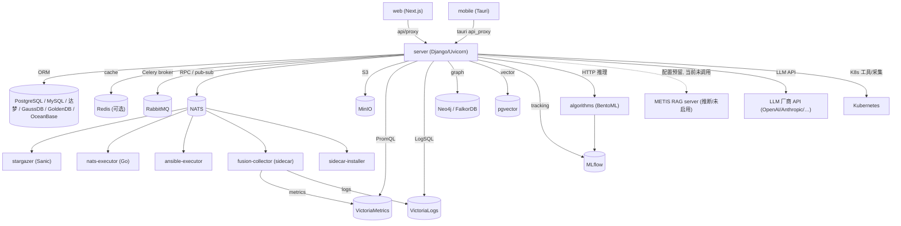
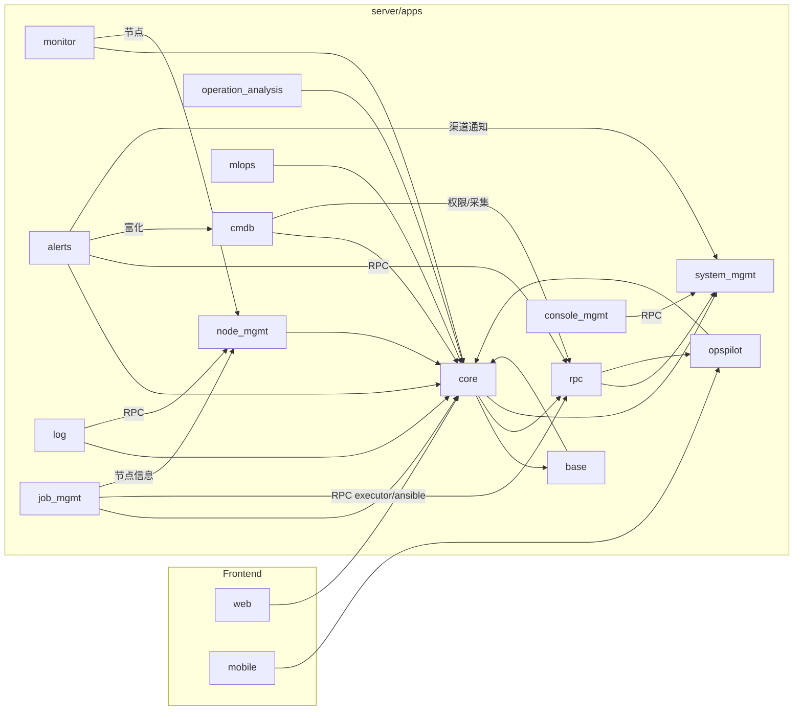
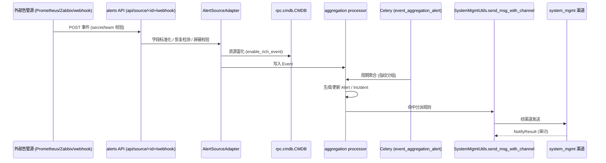

# BK-Lite 总体架构设计文档（ARD）

> 证据标记：**【已实现/已存在】**（代码可直接定位）、**【推断】**（可合理推断、证据不足）、**【待确认】**（文档应有、代码无明确依据）。

---

## 1. 文档概述

本文档基于 BK-Lite（蓝鲸轻量版）代码仓库的静态反向分析，描述其整体架构、模块划分、依赖关系、数据流、接口、存储、部署与安全设计。BK-Lite 是腾讯蓝鲸出品的 **AI-first 轻量级运维（O&M）平台**，采用 **monorepo + 微服务化** 组织：Django 后端、Next.js Web/移动端、分布式采集与执行 agents、BentoML 算法服务。

文档目标读者为研发、架构与运维团队，可作为内部架构文档初稿。各模块的深入说明见 `modules/` 子目录。

**证据来源**：`AGENTS.md`、`Readme.md`、仓库根目录结构（`server/`、`web/`、`mobile/`、`agents/`、`algorithms/`、`deploy/`、`webchat/`）。

---

## 2. 系统目标与范围

### 2.1 系统目标【已实现/已存在】
BK-Lite 提供一体化的运维能力中台，覆盖以下业务域（均对应已存在的 Django app）：

| 业务域 | 对应 app | 核心能力 |
|--------|----------|----------|
| 配置管理（CMDB） | `apps/cmdb` | 资产模型、实例、关系图谱、自动采集 |
| 监控告警 | `apps/monitor` | 监控对象/指标/插件、策略扫描、告警生命周期 |
| 统一告警 | `apps/alerts` | 多源事件接入、富化、降噪/关联、分派与通知 |
| 日志中心 | `apps/log` | 日志采集配置、查询、日志告警策略 |
| 运营分析 | `apps/operation_analysis` | 仪表盘、拓扑、架构图、数据源聚合 |
| 节点管理 | `apps/node_mgmt` | 节点/控制器/采集器、云区域、sidecar 配置下发 |
| 作业平台 | `apps/job_mgmt` | 脚本/playbook/文件分发、定时任务 |
| MLOps | `apps/mlops` | 数据集、训练任务、模型发布与服务 |
| AI 助手 | `apps/opspilot` | RAG、知识库、Bot、LLM 接入 |
| 系统管理 | `apps/system_mgmt` | 用户/组/角色/权限、登录、审计、通知渠道 |
| 控制台 | `apps/console_mgmt` | 用户初始化、站内通知、应用偏好 |

### 2.2 业务边界【已实现/已存在 + 推断】
- 平台**自身不直接存储时序与日志原始数据**，而是依赖外部 VictoriaMetrics（指标）与 VictoriaLogs（日志）。【已实现】（`apps/monitor/utils/victoriametrics_api.py`、`apps/log/constants/victoriametrics.py`）
- 数据采集与命令执行下沉到分布式 agents（stargazer / nats-executor / ansible-executor / fusion-collector），平台通过 **NATS** 与之通信。【已实现】（`agents/*`、`apps/rpc/*`）
- AI 推理能力（异常检测、时序预测、日志聚类、文本/图像分类、目标检测）由独立的 BentoML 服务承载。【已实现】（`algorithms/classify_*_server`）

### 2.3 范围外 / 待确认
- **多租户隔离边界**：代码中存在 `domain`（域）+ `group`（组层级）+ `team` 三层数据范围概念，但完整的租户隔离策略与跨域数据可见性规则【待确认】。（`apps/system_mgmt/models/user.py`、`apps/base/models/user.py`）

**证据来源**：`server/apps/` 目录、`server/urls.py`（按 app 自动注册 `api/v1/<app>/`）、`AGENTS.md` 中 Server 概览。

---

## 3. 总体架构

### 3.1 分层视图【已实现/已存在】
1. **接入层**：Next.js Web（`web/`，11 个产品模块）+ 移动端（`mobile/`，Tauri，opspilot 会话 + workbench 子集）。前端通过 `/api/proxy/[...path]` 反向代理到后端 `NEXTAPI_URL/api/v1/`。
2. **应用层（后端单体多 app）**：Django 4.2 + Uvicorn(ASGI)，`server/apps/*`。URL 路由自动发现（`server/urls.py` 遍历 `apps.*` 注册 `api/v1/<app>/`）。app 自动注册进 `INSTALLED_APPS`（`base`/`core`/`rpc` 常驻，其余受 `INSTALL_APPS` 环境变量控制）。
3. **异步层**：Celery（broker 默认 RabbitMQ）+ Beat 调度，各 app 提供 `tasks.py`/`tasks/`；NATS 监听器（`nats_api.py`/`nats/`）。
4. **服务间通信层**：`apps/rpc/*` 封装基于 NATS 的 RPC（`RpcClient` 按 `NATS_NAMESPACE`=`bklite` 路由），并提供 `AppClient` 本进程回退调用。
5. **agents 层**：stargazer（Sanic，协议采集）、nats-executor（Go，命令执行）、ansible-executor（Python，playbook）、fusion-collector（sidecar 容器：telegraf/vector/beats/snmptrapd 等）、sidecar-installer（Go，安装）、webhookd（webhook 接入）。
6. **算法层**：`algorithms/classify_*_server`，BentoML 服务，集成 MLflow。
7. **基础设施层**：PostgreSQL/MySQL/达梦/GaussDB/GoldenDB/OceanBase（多引擎）、Redis（可选缓存：设置 `REDIS_CACHE_URL` 时 `default` 走 Redis，否则回退 LocMem；另预置 `db`(DatabaseCache)/`dummy` 命名别名）、RabbitMQ（Celery broker）、NATS（消息/RPC）、MinIO（对象存储）、MLflow（模型注册）、VictoriaMetrics/VictoriaLogs（时序/日志）。

**证据来源**：`server/urls.py`、`server/config/components/{base,database,cache,celery,nats,minio,mlflow}.py`、`server/apps/rpc/base.py`、`agents/*`、`algorithms/*`、`web/src/app/(core)/api/proxy/[...path]/route.ts`、`web/src/utils/request.ts`。

---

## 4. 模块划分与职责

### 4.1 后端业务模块【已实现/已存在】
见 §2.1 表格。补充关键职责：
- **cmdb**：除关系型存储外，使用 **Neo4j / FalkorDB** 存储资产关系图谱（`apps/cmdb/graph/{neo4j,falkordb}.py`），通过 `collection/collect_plugin/*` 支持 SNMP/SSH/云 API/K8s/中间件/数据库等多类采集插件。
- **monitor**：插件化采集配置 + 基于 VictoriaMetrics 的 PromQL 策略扫描（`tasks/services/policy_scan/`），告警三级模型 Event→Alert，原始快照存 S3/MinIO（`S3JSONField`）。
- **alerts**：多源适配器（Prometheus/Zabbix/NATS/webhook/monitor/restful，`common/source_adapter/`）→ 事件富化（CMDB RPC）→ 指纹聚合 → 分派/抑制/升级/提醒 → 经 system_mgmt 渠道通知。
- **log**：基于 **VictoriaLogs** 的 LogSQL 查询（`utils/query_log.py`），定时扫描产生日志告警。
- **node_mgmt**：节点/控制器/采集器注册与生命周期，经 NATS 下发 sidecar 配置、SSH 安装控制器，包存 MinIO。
- **job_mgmt**：脚本/playbook/文件分发，经 `rpc.executor`（nats-executor）或 `rpc.ansible`（ansible-executor）执行，结果经 NATS 回调，日志走 JetStream。
- **mlops**：6 类场景（异常/时序/日志聚类/分类/图像分类/目标检测）× 数据集/训练/发布/服务，集成 MLflow，数据存 MinIO。
- **opspilot**：LangChain + pgvector RAG（naive/QA/graph 模式），知识库文件存 MinIO，外部依赖 METIS RAG server、Kubernetes（Bot 部署）、RabbitMQ（会话队列，推断）。

### 4.2 公共基座模块【已实现/已存在】
- **base**：自定义 `AUTH_USER_MODEL=base.User`（username+domain 唯一），`UserAPISecret`（API 密钥）。
- **core**：Celery app（`bklite`）、认证后端（`APISecretAuthBackend`/`AuthBackend`）、中间件栈、加解密 `EncryptMixin`、权限缓存、公共模型（`TimeInfo`/`MaintainerInfo`）。
- **rpc**：NATS RPC 网关（`RpcClient`/`AppClient`/`OperationAnalysisRpc`）、JetStream 对象存储封装（`jetstream.py`），各域 RPC 客户端（`cmdb.py`/`monitor.py`/`node_mgmt.py`/`executor.py`/`ansible.py`/`system_mgmt.py`/`opspilot.py` 等）。

**证据来源**：各 app `models/`、`views`/`urls.py`、`tasks*`、`nats*`、`apps/core/{celery.py,backends.py,mixinx.py,middlewares/}`、`apps/rpc/{base,jetstream}.py`、`apps/base/models/user.py`。

---

## 5. 核心业务流程 / 数据流

### 5.1 监控告警链路【已实现/已存在】
采集器（telegraf via fusion-collector）→ VictoriaMetrics ←(PromQL 查询) Celery `scan_policy_task`（`apps/monitor/tasks/`）→ 阈值评估 → 生成 `MonitorEvent`/`MonitorAlert`，原始数据存 MinIO，策略 CRUD 事件经 NATS 同步。

### 5.2 统一告警链路【已实现/已存在】
外部源（Prometheus/Zabbix/webhook/NATS/monitor）→ `AlertSourceAdapter`（`common/source_adapter/base.py`）字段标准化 → 恢复检测/屏蔽校验 → 富化（`apps.rpc.cmdb.CMDB`）→ 指纹聚合（`aggregation/`）→ `Alert`/`Incident` → 分派规则 + `NotifyResult` → 经 `SystemMgmtUtils.send_msg_with_channel()`（system_mgmt 渠道）通知。Celery `event_aggregation_alert`/`check_and_send_reminders`/`beat_close_alert` 周期驱动。

### 5.3 日志采集与告警链路【已实现/已存在】
CollectType/CollectInstance/CollectConfig 定义采集 → 日志汇聚至 VictoriaLogs → Celery `scan_log_policy_task` 按周期扫描 → 生成 `Alert`/`Event`/`EventRawData`；查询经 NATS（`log_search`/`log_hits`）。

### 5.4 作业执行链路【已实现/已存在】
用户提交 → 危险命令校验 → Celery `execute_script_task`/`execute_playbook_task`/`distribute_files_task` → 路由到 nats-executor（sidecar 节点）或 ansible-executor（手动/Windows 目标）→ 异步 NATS 回调 `ansible_task_callback` 更新 `JobExecution` → 日志经 JetStream 实时流。

### 5.5 CMDB 采集链路【已实现/已存在】
`CollectModels` 配置 → Celery `sync_collect_task` → 分发到 `CollectDispatchService`/协议采集 → 格式化（add/update/delete/association）→ 写入图库 + ORM，变更记 `ChangeRecord`，订阅通知 `SubscriptionTaskService`。

### 5.6 AI 问答链路【已实现/已存在】
用户 → opspilot bot/chat → `chat_service` 组装 RAG kwargs（`rag_service.format_naive_rag_kwargs`）→ **本地 pgvector** 检索（`metis/llm/rag/naive_rag/pgvector`）→ LLMModel（OpenAI/Anthropic/… provider）生成 → 返回（含 OpenAI 兼容端点 `bot_mgmt/v1/chat/completions`）。注：`METIS_SERVER_URL` 在 config.py 定义但当前代码未调用。

**证据来源**：`apps/monitor/tasks/`、`apps/alerts/{common/source_adapter,aggregation,tasks/tasks.py,nats/nats.py}`、`apps/log/{tasks/policy.py,nats/log.py}`、`apps/job_mgmt/{tasks.py,nats_api.py,services/}`、`apps/cmdb/tasks/celery_tasks.py`、`apps/opspilot/services/{chat_service,rag_service}.py`。

---

## 6. 接口设计与集成关系

### 6.1 对外 HTTP API【已实现/已存在】
- 统一前缀 `api/v1/<app>/`，由 `server/urls.py` 自动注册。
- 共 7 个 app 提供 `open_api/*` 端点（`cmdb`、`monitor`、`alerts`、`log`、`job_mgmt`、`operation_analysis`、`node_mgmt`，如 `cmdb/open_api/k8s_setup`、`monitor/open_api/infra`、`alerts/open_api/k8s`、`log/open_api/k8s`），用于免登录/集成场景。
- DRF + 自定义认证（Token / API Secret / Session）。

### 6.2 前端 ↔ 后端【已实现/已存在】
- Web：`axios` baseURL=`/api/proxy`，Next route handler 代理到 `NEXTAPI_URL/api/v1`，请求注入 `Authorization: Bearer {token}`，支持 SSE。
- Mobile：Tauri Rust 命令 `api_proxy`/`api_stream_proxy` 绕过 CORS，token 存于 Tauri Store。

### 6.3 服务间通信（NATS RPC）【已实现/已存在】
- `RpcClient.run(method_name, ...)` 经 `nats_client.request(namespace, method, ...)`，命名空间 `bklite`，默认超时 60s（`NATS_REQUEST_TIMEOUT`）。
- 各 app 通过 `@nats_client.register` 暴露处理函数（`nats_api.py`/`nats/*.py`），启动时自动发现。
- RPC 域客户端（`apps/rpc/` 共 14 个域封装）：`executor`（local/ssh execute、download/upload、unzip、health）、`ansible`、`cmdb`、`monitor`、`log`、`node_mgmt`、`system_mgmt`、`opspilot`、`alerts`、`job_mgmt`、`mlops`、`console_mgmt`、`stargazer`（独立 namespace + health_check）、`operation_analysis`（独立 server/namespace）；`base.py`/`jetstream.py` 为基础设施，`sensitive.py` 为 RPC 载荷脱敏工具（非客户端）。

### 6.4 外部系统集成【已实现/已存在】
VictoriaMetrics、VictoriaLogs、MLflow、MinIO、Kubernetes（opspilot bot 部署、采集 DaemonSet）、METIS RAG server、LLM 厂商 API（OpenAI/Azure/Aliyun/Zhipu/Baidu/Anthropic/DeepSeek）。

**证据来源**：`server/urls.py`、各 app `urls.py`、`apps/rpc/{base,executor,ansible,...}.py`、`apps/core/backends.py`、`web/src/utils/request.ts`、`mobile/src/utils/tauriApiProxy.ts`、`apps/opspilot/models/model_provider_mgmt.py`。

---

## 7. 数据存储设计

| 存储 | 用途 | 证据 | 标记 |
|------|------|------|------|
| PostgreSQL（默认，多引擎可选） | 所有 app 的 ORM 元数据/状态 | `config/components/database.py` | 已实现 |
| MySQL/达梦/GaussDB/GoldenDB/OceanBase | 国产化/异构数据库适配（自定义 backend + 补丁） | `database.py` | 已实现 |
| Neo4j / FalkorDB | CMDB 资产关系图谱 | `apps/cmdb/graph/{neo4j,falkordb}.py` | 已实现 |
| VictoriaMetrics | 指标时序（monitor 策略查询、cmdb K8s 查询） | `apps/monitor/utils/victoriametrics_api.py` | 已实现 |
| VictoriaLogs | 日志存储与查询 | `apps/log/constants/victoriametrics.py` | 已实现 |
| MinIO / S3 | 配置文件、告警快照、playbook、SSH key、训练数据、知识文件 | `config/components/minio.py`（buckets 列表） | 已实现 |
| Redis / LocMem | 缓存：`REDIS_CACHE_URL` 非空时 `default`=Redis，否则=LocMem；另预置 `db`(DatabaseCache)/`dummy` 命名别名（非 `default`） | `config/components/cache.py:6-25` | 已实现 |
| RabbitMQ | Celery broker | `config/components/celery.py` | 已实现 |
| pgvector | opspilot 向量检索 | `apps/opspilot/.../pgvector` | 已实现 |
| Elasticsearch | opspilot metis 工具检索 | `apps/opspilot/metis/llm/tools/elasticsearch/` | 已实现 |
| MLflow | 实验/模型注册 | `config/components/mlflow.py` | 已实现 |
| NATS JetStream KV/Object Store | 作业日志流、安装包传输、对象存储 | `apps/rpc/jetstream.py` | 已实现 |

**MinIO bucket（已实现）**：私有 `rewind-private`/`munchkin-private`/`log-alert-raw-data`/`monitor-alert-raw-data`/`job-mgmt-private`/`cmdb-config-file`；公共 `rewind-public`/`munchkin-public`。

**证据来源**：`server/config/components/{database,cache,celery,minio,mlflow,nats}.py`、`apps/cmdb/graph/*`、`apps/monitor/utils/victoriametrics_api.py`、`apps/log/constants/victoriametrics.py`、`apps/rpc/jetstream.py`。

---

## 8. 部署与运行架构

### 8.1 运行进程【已实现/已存在】
- 后端：`make dev` → Uvicorn ASGI :8011；`make celery` → Celery worker+Beat；`make start-nats` → NATS 监听。
- 前端：Web Next.js :3000（生产 Docker 多模块构建，`NEXTAPI_URL=http://bklite-server:8000`）；Mobile Next.js :3001 + Tauri。
- agents：stargazer Sanic :8083；nats-executor Go 二进制；ansible-executor Python。
- 算法：BentoML :3000。

### 8.2 容器与编排【已实现/已存在 + 推断】
- Web 多阶段 Dockerfile（builder→node:24-alpine runtime）。【已实现】
- `deploy/dist/bk-lite-kubernetes-collector/` 提供 K8s 采集 DaemonSet（cadvisor、telegraf 等）。【已实现】
- 完整平台 K8s 编排（各 app/agent/中间件的 Deployment/Service）【待确认】——仓库内 `deploy/` 仅见采集器部分。

**证据来源**：`server/Makefile`、`web/Dockerfile`、`web/.env.example`、`mobile/src-tauri/tauri.conf.json`、`agents/stargazer/`、`deploy/dist/bk-lite-kubernetes-collector/*.yaml`。

---

## 9. 安全、权限与审计

### 9.1 认证【已实现/已存在】
- 多认证后端，`AUTHENTICATION_BACKENDS` 顺序为 `AuthBackend`（默认，Token 经 system_mgmt 校验）→ `APISecretAuthBackend`（API 密钥）→ `django.contrib.auth.backends.ModelBackend`，叠加 Session。（`apps/core/backends.py:185`、`apps/core/backends.py:26`、`config/components/app.py:61-65`）
- 登录入口：`apps/core` 的 `/api/login`、`/api/verify_otp_login`、`/api/wechat_login`；统一通过 `_set_auth_cookie_on_response()` 设置 `bklite_token` cookie（见 `server/apps/core/views.py`）。
- system_mgmt 提供 JWT 生成（含 `jti`/`exp`）、OTP、token 黑名单、账户锁定与密码策略。（`apps/system_mgmt/nats_api.py`、`utils/password_validator.py`）

### 9.2 授权【已实现/已存在】
- 三层数据范围：`domain`（域）→ `group`（层级组，`parent_id` + `allow_inherit_roles` 角色继承）→ `team`。
- 角色/菜单/数据规则：`Role.menu_list`、`GroupDataRule.rules`、`UserRule`。
- 权限缓存（TTL 60s）：`apps/core/utils/permission_cache.py`；DRF 装饰器 `HasPermission`。
- NATS 侧权限过滤：各 app `nats/*` 基于角色/组构建查询过滤（cmdb/monitor/log/mlops 等）。

### 9.3 加密与审计【已实现/已存在】
- 敏感字段加密：`EncryptMixin`（Fernet，密文前缀 `gAAAAA`）；采集/渠道凭据加密存储。
- 审计：`apps/system_mgmt` 的 `OperationLog`/`UserLoginLog`/`ErrorLog`；cmdb `ChangeRecord`；alerts `OperatorLog`/`NotifyResult`。

### 9.4 待确认
- 跨域/跨租户的数据隔离强制点是否在所有 ViewSet 统一生效【待确认】。
- `open_api/*` 端点的鉴权方式（是否完全免登录或有 secret 校验）需逐一确认【待确认】。

**证据来源**：`apps/core/backends.py`、`apps/core/mixinx.py`、`apps/system_mgmt/{models,nats_api.py,utils}`、`apps/base/models/user.py`、各 app `nats/*`、`server/apps/core/views.py`。

---

## 10. 可观测性与运维要求

### 10.1 已存在【已实现/已存在】
- 结构化日志：`apps/core/logger`（分模块 logger：`cmdb_logger`/`celery_logger`/`alert_logger`/`opspilot_logger` 等）；日志组件 `config/components/log.py`。
- 请求耗时中间件 `request_timing_middleware`。
- agents/算法服务暴露 Prometheus 指标（fusion-collector telegraf、BentoML `serving/metrics.py`）。
- 健康检查：stargazer `health_check`、nats-executor `*.local.health`、node_mgmt `check_all_region_services`。

### 10.2 待确认
- 统一的链路追踪（OpenTelemetry/Jaeger）【待确认】——未见明确集成。
- 平台级监控自监控（self-monitoring）方案【待确认】。

**证据来源**：`apps/core/{logger.py,middlewares/request_timing_middleware.py}`、`config/components/log.py`、`agents/fusion-collector/telegraf/telegraf.conf`、`algorithms/*/serving/metrics.py`、`apps/node_mgmt/tasks/services/cloud_service_check_health.py`。

---

## 11. 风险、约束与技术债

| 项 | 描述 | 标记 |
|----|------|------|
| 单体后端耦合 | 所有业务 app 同进程运行，虽经 rpc/NATS 解耦但仍共享 DB 与部署单元 | 已实现（约束） |
| NATS 强依赖 | RPC、采集、执行、通知、权限同步均依赖 NATS，单点风险高 | 已实现（约束） |
| JetStream 默认关闭 | `NATS_JETSTREAM_ENABLED=False` **硬编码**（不可经环境变量覆盖），但 job 日志/安装包传输依赖 JetStream，需运维确认启用 | 已实现（风险） |
| 多数据库引擎补丁 | 国产库通过自定义 backend + monkey patch 适配，升级兼容性脆弱 | 已实现（技术债） |
| 后端端口不一致 | 开发 :8011 vs 生产 Docker `NEXTAPI_URL=...:8000`，部署需统一 | 已实现（风险） |
| MinIO 默认凭据 | MinIO 无内置默认凭据（仅读环境变量）；RabbitMQ 默认 `admin:password` 需加固 | 已实现（风险） |
| 外部依赖众多 | VM/VLogs/MLflow/MinIO/RabbitMQ/Neo4j/pgvector/ES/K8s 等，部署复杂度高 | 已实现（约束） |
| open_api 鉴权 | 多处 `open_api/*` 鉴权强度待核 | 待确认（风险） |
| deploy 不完整 | 仓库仅含采集器 K8s 模板，完整编排缺失 | 待确认（风险） |

**证据来源**：`config/components/nats.py`（JetStream 开关）、`database.py`（多引擎补丁）、`apps/rpc/*`、`deploy/`。

---

## 12. 待确认问题清单

1. 完整平台的部署编排（除采集器外）位于何处？是否在 `support-files/` 或外部仓库？【待确认】
2. `open_api/*` 各端点的鉴权机制与暴露范围。【待确认】
3. 多租户（domain）隔离是否在所有数据访问路径强制生效。【待确认】
4. opspilot 的 `METIS_SERVER_URL`/`MUNCHKIN_BASE_URL`/`CONVERSATION_MQ_*` 在 config.py 定义但代码未引用——是预留外部联动还是历史遗留。【待确认】
5. NATS JetStream 生产是否启用（影响 job 日志与 sidecar 安装）。【待确认】
6. 是否存在统一链路追踪 / APM。【待确认】
7. VictoriaMetrics/VictoriaLogs 的数据写入路径（采集器→VM 的具体 remote write 配置）。【推断为 telegraf/vector，需确认】

---

## 附录 A：总体架构说明

BK-Lite 是一个以 Django 单体后端为核心、辅以分布式 agents 与独立算法服务的 **AI-first 运维平台**。前端（Web/Mobile）通过反向代理统一访问 `api/v1/<app>/` 接口；后端按业务域拆分为十余个 Django app，借助自动路由发现与自动 app 注册实现"约定优于配置"。同步请求走 HTTP/DRF，跨服务与跨进程协作走 **NATS RPC**（命名空间 `bklite`），耗时任务交由 **Celery（RabbitMQ broker）** 异步处理。

平台自身不承载时序与日志原始数据，而是将指标交给 **VictoriaMetrics**、日志交给 **VictoriaLogs**，对象交给 **MinIO**，资产关系交给 **Neo4j/FalkorDB**，向量检索交给 **pgvector**，模型生命周期交给 **MLflow**。数据采集与命令执行下沉到 **stargazer / fusion-collector / nats-executor / ansible-executor** 等 agents，由 **node_mgmt** 统一纳管并经 NATS 下发配置与指令。AI 能力由 **opspilot**（RAG/知识库/Bot）与 **algorithms**（BentoML 推理服务）共同提供。整体形成"统一接入 + 业务中台 + 异步编排 + 分布式执行 + 外部存储/算力"的分层架构。

---

## 附录 B：系统上下游关系图

**说明**：节点均对应代码/配置中的实体——前后端代理（`web/src/utils/request.ts`、`mobile/src/utils/tauriApiProxy.ts`）、各存储组件（`config/components/*`）、agents（`agents/*`）、算法（`algorithms/*`）、LLM provider（`opspilot/models/model_provider_mgmt.py`）。fusion-collector→VictoriaMetrics 已由 `agents/fusion-collector/telegraf/telegraf.conf` 证实（output url `victoria-metrics:8428`）。METIS RAG server 以虚线表示：`METIS_SERVER_URL` 仅在 `opspilot/config.py` 定义、当前代码未调用，故标注(推断/未启用)。

---

## 附录 C：模块依赖图

**说明**：依赖边来自实际 import 与 RPC 调用——`alerts` 调 `apps.rpc.cmdb.CMDB` 富化、经 `SystemMgmtUtils` 通知；`job_mgmt` 调 `apps.rpc.{executor,ansible,node_mgmt}`；`console_mgmt` 调 `apps.rpc.system_mgmt`；`core` 依赖 `base`（User 模型）、`rpc`、`system_mgmt`（token 校验）。所有业务 app 共用 `core`（logger/中间件/加密/celery）。

---

## 附录 D：关键请求链路图（统一告警接入与通知）

**说明**：链路节点对应 `apps/alerts/urls.py:49`（`api/source/<source_id>/webhook/`）、`common/source_adapter/base.py`（富化 `enrich_event` 调 `CMDB().search_instances`，base.py:444）、`apps.rpc.cmdb.CMDB`、`aggregation/processor/aggregation_processor.py`、`tasks/tasks.py:event_aggregation_alert`、`utils/system_mgmt_util.py:SystemMgmtUtils`、`models/alert_operator.py:NotifyResult`。
