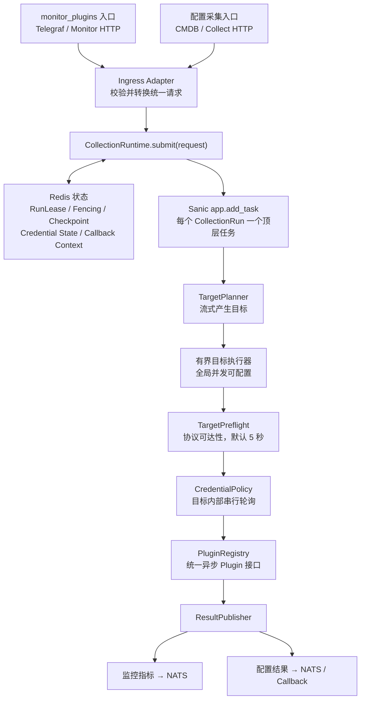
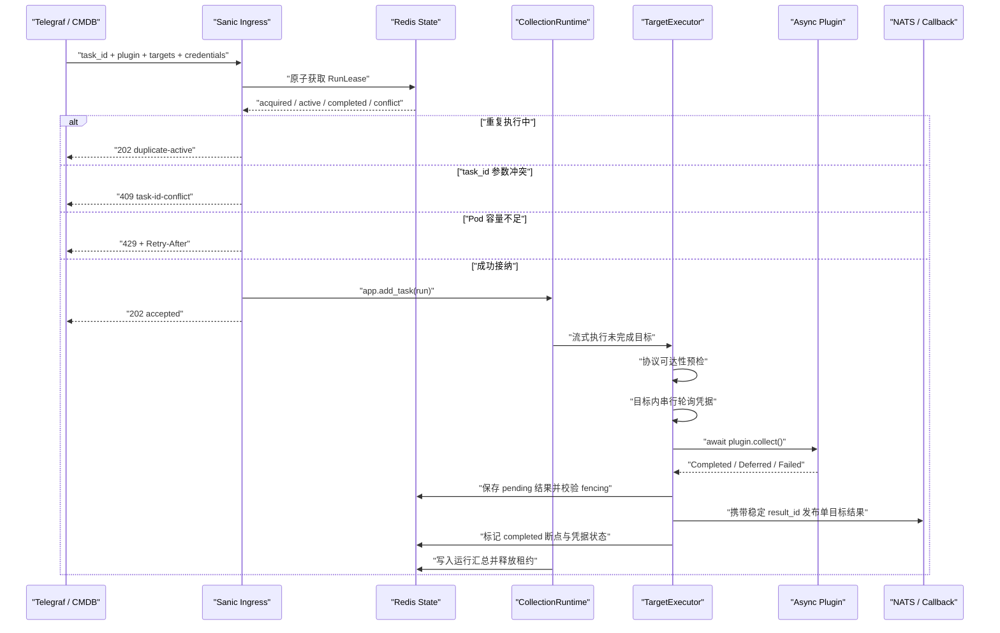
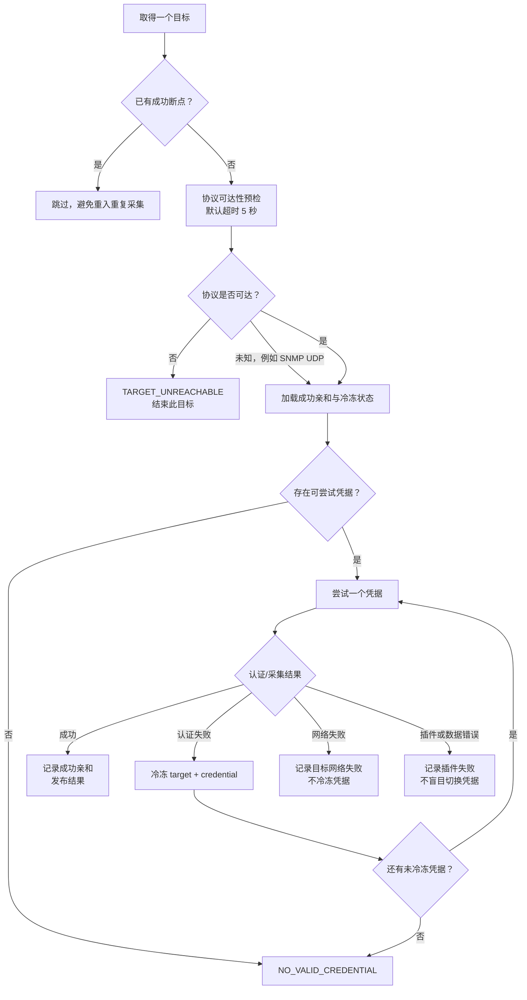

# Stargazer 无状态统一异步采集运行时

Status: implemented

## 摘要

Stargazer 移除 ARQ 队列与 Worker，改由 Sanic 承载一个统一的异步采集运行时。
配置采集插件与 `monitor_plugins` 只保留入口参数和结果契约差异，共用任务重入、目标预检、
每目标凭据轮询、有界异步并发、插件执行、结果发布和故障恢复链路。

所有插件向运行时暴露同一个异步接口。原生异步插件直接 `await`；暂时无法改造的同步插件
在插件内部用 `asyncio.to_thread()` 包装成异步插件。运行时不建立 `SyncPluginAdapter`，
不维护插件专用线程池，也不感知插件是真异步还是包装异步。

Redis 不再充当采集任务队列，但继续承担运行租约、fencing、HTTP 重入、目标断点、凭据亲和/
冷冻和异步回调上下文。结果仍通过 NATS 或既有 callback 契约发布。

## 问题陈述

当前配置采集入口先把目标拆成单 IP 任务，再提交 ARQ。ARQ Worker 默认并发数为 10；网络
等待也会长期占用 Worker 槽位。配置插件的执行器虽然定义为异步方法，但同步
`list_all_resources()` 仍可能直接运行在事件循环中。多凭据场景下，当前凭据失败后会把下一凭据
重新放回全局队尾，使一个 IP 的完整尝试被拆散，并形成接近 `IP × 凭据` 的排队压力。

相关当前实现：

- [`api/collect.py`](../../../agents/stargazer/api/collect.py)：展开目标并逐个入队；
- [`api/monitor.py`](../../../agents/stargazer/api/monitor.py)：`monitor_plugins` 入口使用同一任务队列；
- [`core/worker.py`](../../../agents/stargazer/core/worker.py)：统一 Worker 按 `monitor_type` 或
  `model_id` 分发，默认 `TASK_MAX_JOBS=10`；
- [`core/plugin_executor.py`](../../../agents/stargazer/core/plugin_executor.py)：同步插件可能直接执行；
- [`tasks/handlers/plugin_handler.py`](../../../agents/stargazer/tasks/handlers/plugin_handler.py)：
  失败后将下一凭据重新入全局队列；
- [`core/credential_state_cache.py`](../../../agents/stargazer/core/credential_state_cache.py)：
  凭据亲和和冷冻状态已经独立存在于 Redis；
- [`core/host_remote_callback.py`](../../../agents/stargazer/core/host_remote_callback.py)：
  Host Remote 等延迟完成场景已经使用 Redis 保存 callback 上下文。

堵塞的根因不是 asyncio 不适合网络采集，而是任务粒度、同步代码执行位置和 ARQ Worker 槽位
模型不适合大量并发网络等待。

## 目标

1. 移除 ARQ 队列、Worker 进程和 ARQ Redis Client 依赖。
2. 配置采集与 `monitor_plugins` 共用一个采集运行时。
3. HTTP 入口按调用方提供的 `task_id` 完成跨 Pod 重入检测。
4. 一个目标对应一个逻辑目标采集；凭据在目标内部串行轮询，不再失败后回全局队尾。
5. 目标先完成协议可达性预检，确认可以继续后再认证和正式采集。
6. 全链路以异步接口组织，任何遗留同步插件都不得直接阻塞 Sanic 事件循环。
7. 并发、超时和目标窗口均可配置，`200` 只作为验证场景，不是部署约束。
8. 服务保持无状态；Docker/Pod 扩容提升不同采集运行之间的整体吞吐。
9. 用插件契约测试和事件循环负载测试阻止阻塞实现重新进入主链路。

## 非目标

- 不为配置采集与 `monitor_plugins` 建立两套运行时、队列或容量池；
- 不引入 Celery、Joblib 或另一套持久任务框架；
- 不把 `IP × 凭据` 展开为全局任务；
- 不以 ICMP 成败作为是否采集的硬门槛；
- 首版不把同一个采集运行拆到多个 Pod；
- 不承诺 exactly-once；
- 不建立通用的插件 Session/Driver 基类；只有存在真实重复的产品插件才局部复用 Driver；
- 不把服务运行可观测性误称为 `monitor_plugins` 业务采集链路。

## 领域模型

| 名称 | 含义 |
| --- | --- |
| `CollectionRun` | 一个 `task_id` 标识的一次完整采集运行，可包含多个目标 |
| `TargetCollection` | 对一个 IP、域名、API Endpoint、云账号或远程节点的逻辑采集 |
| `CredentialAttempt` | 一个目标内部使用一个候选凭据进行的一次认证/采集尝试 |
| `PluginRef` | 运行时使用的统一插件标识；入口的 `monitor_type`、`model_id/plugin_name` 均转换为它 |
| `CollectOutcome` | 插件返回的 `Completed`、`Deferred` 或 `Failed` 结果 |
| `RunLease` | Redis 中带 owner、TTL 和 fencing token 的运行所有权 |
| `TargetCheckpoint` | 同一请求重入时用于跳过已完成目标的短期断点 |

核心不变量：

> 一个 `CollectionRun` 包含多个 `TargetCollection`；不同目标之间并行，同一目标内的凭据严格串行。

## 架构决定

### 1. 统一运行时



Sanic HTTP handler 不在请求内扫描目标，也不等待预检结果。它只负责输入校验、重入检测、
容量接纳和启动一个受注册表管理的顶层后台任务，然后立即返回接纳结果。

目标执行采用有界窗口；不能一次为任意数量的目标创建全部协程。目标通过预检后立即进入
认证和采集，不设置“等待全网段预检完成”的全局屏障。

### 2. 深模块与接口

运行时对入口只暴露一个接口：

```python
async def submit(request: CollectionRequest) -> Submission:
    ...
```

这个接口隐藏以下实现：请求摘要、Redis 租约、fencing、Pod 容量接纳、Sanic 任务注册、目标
流式调度、并发限制、凭据策略、断点、结果汇总和关闭期处理。HTTP 层不得分别编排这些步骤。

概念请求结构：

```python
CollectionRequest(
    task_id="required",
    plugin_ref="oceanstor.metrics | oceanstor.config | host.metrics",
    targets=[...],
    credentials=[...],
    execution_context={...},
    result_context={...},
    deadline=None,
)
```

两个真实的入口 Adapter 保留：

- Monitor Ingress Adapter：把 `monitor_type` 和 Telegraf Headers 转为统一请求，并按调用方要求
  返回 Prometheus 接纳响应；
- Config Ingress Adapter：把 `model_id/plugin_name`、目标范围、凭据池和 callback 参数转为统一请求。

运行时内部只有在行为确实变化的位置建立 seam：

- `PreflightProbe`：TCP、HTTP/TLS、SNMP/UDP、Cloud Endpoint、Remote Node；
- `CollectionPlugin`：不同插件实现；
- `ResultPublisher`：监控指标、配置数据、callback。

### 3. 统一异步插件契约

所有插件必须实现同一个异步接口：

```python
class CollectionPlugin:
    async def collect(
        self,
        target: Target,
        credential: Credential,
        context: CollectionContext,
    ) -> CollectOutcome:
        ...
```

运行时不再包含 `SyncPluginAdapter`，插件清单也不声明 `execution_mode`。

原生异步插件直接使用异步网络库：

```python
async def collect(self, target, credential, context):
    return await self.client.collect(target, credential)
```

暂时无法异步改造的同步插件在插件内部包装：

```python
async def collect(self, target, credential, context):
    return await asyncio.to_thread(
        self._sync_collect,
        target,
        credential,
        context,
    )
```

禁止只有 `async def` 外壳、内部仍直接执行同步函数：

```python
async def collect(self, target, credential, context):
    return self._sync_collect(target, credential, context)  # 禁止：仍会阻塞事件循环
```

`asyncio.to_thread()` 底层仍使用 asyncio 共享默认线程池，但 Stargazer 不建立或管理插件专用
线程池。目标并发窗口限制同时处于执行或等待共享线程池的目标数量，避免无限提交。

包装异步的硬约束：

- 同步 SDK 必须设置真实的连接和读取超时；
- 外层仍使用 `asyncio.timeout()` 限制等待时间；
- 取消 `to_thread()` 的等待不能杀死已运行线程，因此不能只依赖外层超时；
- 包装方式是迁移手段；可使用成熟异步库的插件应逐步改为原生异步。

### 4. HTTP 重入与接纳

入口要求调用方提供稳定 `task_id`，并对规范化请求计算摘要。摘要不得包含可恢复的凭据明文；
优先使用 `credential_id` 和凭据集合版本。确需校验秘密变化时使用服务端 HMAC，不把秘密存入
Redis 或日志。

Redis 使用原子操作实现：

| 状态 | 行为 |
| --- | --- |
| 相同 `task_id`、相同摘要、租约有效 | 返回 `202 duplicate-active`，不创建第二个任务 |
| 相同 `task_id`、不同摘要 | 返回 `409 task-id-conflict` |
| 已完成且断点仍有效 | 返回已有汇总 |
| 租约过期 | 新 Pod 取得更大的 fencing token，恢复未完成目标 |
| 本 Pod 达到接纳上限 | 返回 `429` 和 `Retry-After`，不在内存中无限排队 |

只有在取得租约和本地容量后才调用 `app.add_task`。每个顶层任务必须有名称、完成回调和异常
消费路径；不得创建无人持有的 fire-and-forget Task。

### 5. 数据流



### 6. 单目标流程



凭据失败后绝不创建新的全局任务。一个目标的所有凭据尝试必须在同一个
`TargetCollection` 内完成。

### 7. 目标预检

“IP 是否通”定义为采集协议是否具备继续执行的条件，不等同于 Ping：

| 目标类型 | 预检方式 | 失败语义 |
| --- | --- | --- |
| SSH、WinRM、数据库、TCP 协议 | `asyncio.open_connection()` 等异步 TCP connect | 目标/端口不可达，不尝试凭据 |
| HTTPS/API | 异步 DNS + TCP/TLS 或最小 HTTP 请求 | DNS、TLS、连接错误分开分类 |
| SNMP/UDP | 最小协议请求 | 无响应可能来自网络或凭据，结果为不确定而非武断离线 |
| 云账号 | 检查云 API Endpoint | 不进行 IP 扫描 |
| Remote Node | 检查节点和 responder 可用性 | 成功后可以产生 `Deferred` 结果 |

ICMP 只能作为诊断提示，不能作为硬过滤条件。所有用户可配置的出站地址必须复用统一出站
策略，在 DNS 解析、重定向和实际连接阶段校验允许范围。

### 8. 凭据亲和与冷冻

凭据状态不能只绑定 `task_id`，否则周期性 `monitor_plugins` 在每次生成新任务 ID 后无法复用
成功凭据。新作用域为：

```text
scope_id + plugin_ref + target_id + credential_set_version
```

Redis 只保存 `credential_id`、失败分类、计数和过期时间，不保存密码、Token、community 或私钥。

尝试顺序：

1. 上次成功且未冷冻的凭据；
2. 其余未冷冻凭据，保持输入的稳定顺序；
3. 已冷冻凭据跳过；
4. 全部冷冻时返回 `NO_VALID_CREDENTIAL` 和最近 `next_retry_at`。

失败分类：

| 失败 | 状态归属 | 是否尝试下一凭据 |
| --- | --- | --- |
| 明确认认证失败、权限不足 | target + credential | 是 |
| IP/端口不可达 | target | 否 |
| 服务限流或繁忙 | target/plugin endpoint | 否 |
| 插件代码、协议解析、结果格式错误 | plugin execution | 否 |
| SNMP 无响应 | 不确定 | 可尝试下一凭据，但不直接判定 IP 离线 |

初始沿用当前 `1h → 4h → 24h` 冷冻梯度并增加少量随机抖动；成功后清理该目标旧失败
状态，成功亲和默认保留 7 天。

### 9. 结果契约

配置插件和 `monitor_plugins` 共用执行运行时，但不强行合并产物：

- Metrics Result Publisher：把 `monitor_plugins` 结果转换并发布到 NATS；
- Configuration Result Publisher：发布配置采集结果或业务 callback；
- Deferred Result Publisher：保存可信执行身份和 callback 上下文，回调必须校验 task、attempt、
  fencing token 和 caller，拒绝重复、乱序或过期结果。

每个目标完成后先持久化 `pending` 结果，再校验并保护当前租约后立即发布，最后标记
`completed`，不等待整个目标集合结束。NATS 失败时重入复用 pending 结果而不重复采集。
结果幂等键包含 `task_id + target_id + plugin_ref + fencing_token`，结果写入同时校验 fencing。
发布协议是 at-least-once：进程可能在 NATS 已接收但 completed 落盘前退出，因此下游必须用
稳定的 `collection_result_id` 去重，并拒绝较小 fencing token 的迟到结果。

### 10. 并发与容量

所有上限通过部署配置提供，不在代码中硬编码 `200`：

| 参数 | 含义 |
| --- | --- |
| `MAX_ACTIVE_RUNS` | 单 Pod 同时运行的 `CollectionRun` 数量 |
| `MAX_ACTIVE_TARGETS` | 单 Pod 同时活跃的 `TargetCollection` 数量 |
| `TARGET_TASK_WINDOW` | 已创建但未完成的目标协程上限 |
| `MAX_TARGETS_PER_RUN` | 单个请求允许的目标数量上限 |
| `MAX_CREDENTIALS_PER_RUN` | 单个请求允许的候选凭据数量上限 |
| `CONNECT_TIMEOUT` | 协议预检默认超时，初始值 5 秒 |
| `PLUGIN_TIMEOUT` | 插件采集超时，由插件契约提供默认值 |
| `RUN_DEADLINE` | 整个采集运行的可选截止时间 |

`app.add_task` 只用于每个 `CollectionRun` 的顶层任务。目标并发由运行时 Semaphore 和有界
窗口控制。等待 Semaphore 的协程数量也必须受 `TARGET_TASK_WINDOW` 限制，不能把内存中的大量
等待协程当成免费队列。

验证示例：255 个 IP、5 个凭据、`MAX_ACTIVE_TARGETS=200`、预检超时 5 秒。

- 最多 200 个目标处于执行或等待插件状态；
- 不可达 IP 只做一次协议预检，不尝试 5 个凭据；
- 全部不可达时约为两轮预检，理论下限约 `ceil(255/200) × 5 ≈ 10` 秒，加调度开销；
- 可达但 5 个凭据全部各自超时，一个 IP 最坏约 25 秒，两批目标约 50 秒；
- 首个凭据成功后立即停止后续尝试。

凭据不并行尝试，避免设备认证风暴、账号锁定和多个成功 Session 的资源浪费。

### 11. Redis 职责迁移

保留：

- `task_id` 请求摘要和重入状态；
- RunLease、心跳、owner、TTL 和 fencing token；
- 单目标完成断点和运行汇总；
- 凭据成功亲和、冷冻和结果事件；
- Host Remote 等 Deferred callback 上下文；
- 必要的短期幂等状态。

移除：

- ARQ Job 队列和 Job ID；
- `enqueue_collect_task()` 及失败后重新入队；
- ARQ WorkerSettings、`max_jobs`、Worker 启动进程；
- ARQ Job retry、队列健康检查和孤儿 Job 清理；
- 非队列模块对 `arq.create_pool`、`ArqRedis`、`RedisSettings` 的依赖。

Redis 访问改用普通异步 Redis Client。Redis 不保存完整任务密钥，也不成为待执行目标清单。

### 12. 无状态、Pod 故障与水平扩容

每个 Pod 只保留当前进程内的活动 Task 注册表、Semaphore 和连接池；所有跨 Pod 正确性状态
位于 Redis，结果位于 NATS/下游。

Pod 故障后的恢复语义：

1. 当前异步执行随进程终止；
2. RunLease 到期；
3. 调用方使用同一 `task_id` 重试；
4. 新 Pod 获得更大的 fencing token；
5. 根据 `TargetCheckpoint` 跳过已完成目标；
6. 旧执行即使迟到也不能覆盖新执行结果。

必须明确：移除持久队列后，租约和断点只解决安全重入，不提供自动重新调度。配置采集和
监控调用方必须具备相同 `task_id` 的重试能力。如果业务要求调用方不重试且任务必须自动恢复，
则“彻底移除持久任务队列”这一前提不成立。

Docker/Pod 扩容提升不同 `task_id` 之间的吞吐。首版一个 `CollectionRun` 固定在接收它的 Pod
内执行，不为单次网段采集增加跨 Pod 分片。只有出现明确的单任务跨 Pod SLA 后，才评估确定性
HTTP 分片；本变更不提前实现。

### 13. Sanic 生命周期

启动：

- 初始化普通异步 Redis、NATS 和网络 Client；
- 初始化运行接纳器、目标 Semaphore 和本地 Task 注册表；
- 不扫描历史任务，不把非关键 Redis 清理或对账变成启动硬依赖；
- 启动依赖顺序必须遵守
  [`docs/operations/server-startup-dependencies.md`](../../../docs/operations/server-startup-dependencies.md)。

停止：

1. 停止接纳新运行；
2. 在可配置宽限期内等待活动异步任务；
3. 取消仍未完成的异步 Task；
4. 把运行标记为 `abandoned` 或让租约自然过期；
5. 关闭 NATS、Redis 和网络 Client。

本地 Task 注册表只负责生命周期，不是业务事实来源。

### 14. 运行可观测性

以下指标用于证明运行时没有拖慢 Sanic，不属于 `monitor_plugins` 业务产物：

- `event_loop_lag_seconds`；
- `active_runs`、`active_targets`、`target_window_size`；
- `submission_rejected_total`；
- `preflight_duration_seconds`、`target_unreachable_total`；
- `credential_attempt_total`、`credential_cooldown_total`；
- `plugin_duration_seconds`、`plugin_timeout_total`；
- `result_publish_failure_total`、`lease_takeover_total`。

不再提供插件专用线程池活跃数或队列长度，因为该线程池不存在。日志只记录 `task_id`、
`target_id`/目标哈希、`plugin_ref`、`credential_id`、fencing token 和稳定错误码，严禁输出凭据
明文或认证请求头。

## 测试方案

### 1. 运行时单元测试

- 同 `task_id`、同摘要只产生一个顶层任务；
- 同 `task_id`、不同摘要返回 409；
- 本地容量满时返回 429，不创建后台等待任务；
- 预检失败时不进入凭据轮询；
- 同一目标的凭据严格串行，首个成功后停止；
- 网络错误不冷冻凭据，认证错误正确冷冻；
- 全部凭据冷冻时返回最近 `next_retry_at`；
- 重入跳过已完成目标；
- 旧 fencing token 不能写结果；
- Deferred callback 拒绝伪造、重复、乱序和过期执行。

### 2. 插件契约测试

- 注册插件的 `collect` 必须是协程函数；
- 插件必须声明连接/采集超时和目标协议元数据；
- 注入一个 `async def` 内直接 `time.sleep()` 的坏插件，事件循环心跳测试必须失败；
- 注入一个使用 `asyncio.to_thread()` 的同步插件，心跳必须继续运行；
- 包装插件的同步 SDK 必须接收真实 timeout 参数；
- 超时后运行时返回稳定错误，且不泄露凭据；
- 配置插件与 `monitor_plugins` 必须运行同一份契约测试矩阵。

### 3. 事件循环最佳实践测试

固定场景：

```text
targets: 10.10.24.1-255
credentials: 5
MAX_ACTIVE_TARGETS: 200
CONNECT_TIMEOUT: 5s
```

采集压测期间持续请求 `/health`，验证：

- `active_targets` 始终不超过 200；
- 总 Task 数受 `TARGET_TASK_WINDOW` 控制，不随目标总数无限增长；
- 不可达目标没有凭据尝试；
- `/health` p99 相对空载劣化初始门槛不超过 20%；
- `event_loop_lag_seconds` p99 初始目标小于 100ms；
- 重复 `task_id` 只有一个结果发布者；
- 压测结束后无遗留 asyncio Task；
- 原生异步插件和 `to_thread()` 包装插件分别执行同一场景。

绝对时延门槛需在固定 CI/压测环境校准；相对空载劣化、并发上界和无 Task 泄漏是不受机器
型号影响的硬断言。

### 4. 故障测试

- Redis 短时不可用：新任务 fail-closed，不在缺失重入保护时继续执行；
- NATS 发布失败：保留目标结果状态和可重试信息，不伪报成功；
- Pod 在部分目标完成后终止：相同 task ID 接管并跳过完成目标；
- 旧 Pod/旧线程迟到：fencing 拒绝旧结果；
- Sanic 优雅停止：停止接纳、等待宽限期、取消剩余任务且无未消费异常；
- 同步 SDK 超时未及时退出：事件循环保持可用，目标窗口阻止无限堆积。

## 验收标准

- 配置采集和 `monitor_plugins` 均通过 `CollectionRuntime.submit()` 进入同一运行时；
- 仓库不再存在采集用途的 ARQ enqueue、WorkerSettings 或 Worker 启动入口；
- 非队列 Redis 状态不再依赖 ARQ Client；
- 每个 HTTP 请求最多创建一个顶层 Sanic 后台任务；
- 每个目标内部完成全部凭据轮询，不把下一凭据放回全局队列；
- 预检不通过的 TCP 目标不执行认证；
- 所有插件暴露异步 `collect`，同步实现只允许在插件内部使用 `asyncio.to_thread()` 包装；
- 运行时不存在 `SyncPluginAdapter` 和插件专用线程池；
- `255 IP × 5 凭据 × 200 目标并发 × 5s 预检超时` 压测满足事件循环、并发上界和任务泄漏门禁；
- 相同 task ID 的跨 Pod 重入、接管和 fencing 行为通过自动化测试；
- 密码、Token、community、私钥不进入 Redis 状态、日志、指标或异常上下文。

## 实施顺序

1. 建立 `CollectionRequest`、`CollectOutcome`、错误分类和统一异步插件契约；
2. 先补插件契约测试并盘点所有插件的原生异步/包装异步状态；
3. 将同步插件迁移为插件内部 `asyncio.to_thread()` 包装，禁止运行时直接调用同步入口；
4. 使用普通异步 Redis Client 实现 RunLease、fencing、目标断点和凭据状态；
5. 实现 `CollectionRuntime`、目标流式窗口、协议预检和目标内凭据轮询；
6. 将配置采集入口切换到统一运行时；
7. 将 `monitor_plugins` 入口切换到同一运行时；
8. 迁移 Host Remote 等 Deferred callback 状态和可信回调校验；
9. 删除 ARQ Worker、队列、Job 重试、启动配置和依赖；
10. 运行插件契约、255×5×200 负载、Pod 接管、NATS 失败和优雅停止测试；
11. 灰度观察事件循环 lag、目标延迟、发布失败和重入接管，再删除旧链路。

## 回滚

- 在删除 ARQ 前保留一个镜像级回滚点；不在运行时同时写新旧队列；
- Redis 新状态键使用独立前缀和版本，回滚镜像忽略新键；
- NATS 和 callback 结果契约在迁移中保持可识别的版本/幂等键；
- 回滚通过部署上一镜像完成，不迁移或删除仍可能被回滚版本使用的 Redis 数据；
- 灰度期间一旦出现事件循环阻塞、结果重复、回调乱序或大面积 429，停止放量并回滚镜像。

## 已接受的取舍

1. `asyncio.to_thread()` 是包装异步，不会让同步 SDK 本身变成异步；它只保证同步调用不直接
   阻塞事件循环。
2. 不使用专用线程池意味着包装插件与进程内其他 `to_thread()` 调用共享 asyncio 默认线程池；
   该风险通过目标窗口、SDK 真实超时、事件循环压测和逐步原生异步化控制。
3. 无持久队列意味着 Pod 崩溃后的自动恢复依赖调用方重试；Redis 租约、断点和 fencing 只保证
   重试安全。
4. 水平扩容首先提升不同采集运行之间的吞吐，不自动加速单个超大网段任务。首版不为这一未
   证实需求引入分布式分片。
